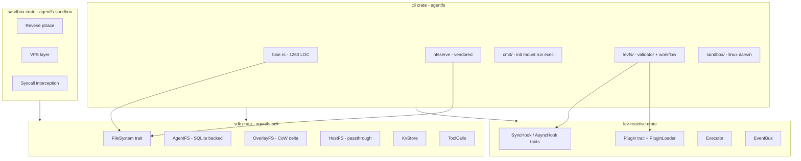
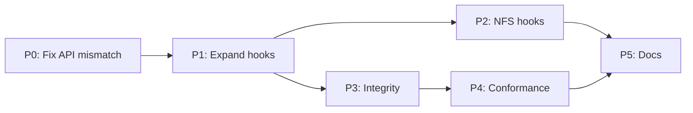

id: spec-lev-agentfs-upgrade
title: lev-agentfs upgrade plan
status: draft
created: 2026-02-11
updated: 2026-02-11
origin: cursor-plan
---

# lev-agentfs Upgrade Plan

## Current State

- **3 Rust sub-crates**: `cli` (agentfs), `sdk/rust` (agentfs-sdk), `sandbox` (agentfs-sandbox)
- **2 language SDKs**: Python, TypeScript (upstream, not Lev-specific)
- **6 example integrations**: Claude, OpenAI, Mastra, Cloudflare, Firecracker, AI SDK
- **Feature parity**: 69/81 (85%) — see [FEATURE_PARITY.md](crates/lev-agentfs/docs/FEATURE_PARITY.md)
- **Upstream**: Forked from `tursodatabase/agentfs`, branch `lev-reactive-integration`



---

## Phase 0: Fix API Mismatch (BLOCKER)

The `lev-reactive` integration in `fuse.rs` uses types and field names that don't match what `lev-reactive` actually exports. This is a compile-time or runtime mismatch that must be fixed first.

**Mismatches found:**

| Location                                               | Uses                                       | lev-reactive Actually Has                                  |
| ------------------------------------------------------ | ------------------------------------------ | ---------------------------------------------------------- |
| [fuse.rs](crates/lev-agentfs/cli/src/fuse.rs) L13      | `HookRegistry`                             | `Executor` (no `HookRegistry` type exists)                 |
| [fuse.rs](crates/lev-agentfs/cli/src/fuse.rs) L942-949 | `HookContext { event_type, source, data }` | `HookContext { event_type, payload, metadata, timestamp }` |
| [fuse.rs](crates/lev-agentfs/cli/src/fuse.rs) L952     | `HookDecision::Deny`                       | `HookDecision::Block { reason }`                           |
| [fuse.rs](crates/lev-agentfs/cli/src/fuse.rs) L952     | `HookDecision::AllowWithMessage(_)`        | Does not exist; closest is `Warn { message }`              |
| [fuse.rs](crates/lev-agentfs/cli/src/fuse.rs) L951     | `sync_hooks.execute_sync(&ctx)`            | `Executor::execute_sync_hooks(&ctx)`                       |

**Validation gate:** `cargo check --all-targets` in the workspace must pass after this phase.

---

## Phase 1: Expand Hook Coverage (P1)

Currently hooks fire on **only `write()**`. All mutating operations need hooks.

**Operations to add hooks to in [fuse.rs](crates/lev-agentfs/cli/src/fuse.rs):**

| Operation   | Event Type     | Sync (pre-op) | Async (post-op) | Context Data                               |
| ----------- | -------------- | ------------- | --------------- | ------------------------------------------ |
| `create()`  | `file:create`  | Yes           | Yes             | parent, name, mode                         |
| `unlink()`  | `file:unlink`  | Yes           | Yes             | parent, name                               |
| `rename()`  | `file:rename`  | Yes           | Yes             | old_parent, old_name, new_parent, new_name |
| `mkdir()`   | `dir:mkdir`    | Yes           | Yes             | parent, name, mode                         |
| `rmdir()`   | `dir:rmdir`    | Yes           | Yes             | parent, name                               |
| `symlink()` | `file:symlink` | Yes           | Yes             | parent, name, target                       |
| `link()`    | `file:link`    | Yes           | Yes             | ino, new_parent, new_name                  |

**Pattern to follow** (from existing write hook in fuse.rs lines 940-991):

1. Build `HookContext` with operation-specific data
2. Execute sync hooks; if `Block`, return `EPERM`
3. Perform the actual operation
4. Fire async hooks in background via `tokio::spawn`

**Validation gate:** Unit test for each hooked operation verifying that a `Block` decision prevents the operation and an `Allow` decision permits it.

---

## Phase 2: NFS Hook Support (P1)

Hooks currently only fire through the FUSE code path. macOS uses NFS and gets zero hook coverage.

**Approach:** Add a hook-aware wrapper layer between the NFS adapter and the `FileSystem` trait, rather than duplicating hook logic in both FUSE and NFS paths.

**New abstraction** (in cli or as a thin wrapper):

```rust
/// Wraps a FileSystem with hook interception
struct HookedFileSystem {
    inner: Arc<dyn FileSystem>,
    sync_hooks: Option<Executor>,
    async_hooks: Option<Executor>,
    runtime: Handle,
}

#[async_trait]
impl FileSystem for HookedFileSystem {
    async fn open(&self, ino: i64, flags: i32) -> Result<BoxedFile> {
        // sync hooks -> inner.open() -> async hooks
    }
    // ... all operations delegate with hook wrapping
}
```

Both FUSE and NFS adapters then use `HookedFileSystem` instead of raw `Arc<dyn FileSystem>`.

**Validation gate:** Same hook test suite passes when mounted via NFS on macOS.

---

## Phase 3: Data Integrity (P2)

No checksums exist on stored data. Silent corruption is undetectable.

**Approach:**

1. **Add `checksum` column to `fs_data` table** (BLAKE3 or CRC32C per chunk)
2. **Verify on read** — optional, enabled via config flag
3. `**agentfs scrub` command — validates all chunks against checksums, reports corruption
4. **Event-log recovery** — if tool_calls audit log exists, use it to identify what was written and when

**Schema change** (extends [SPEC.md](crates/lev-agentfs/docs/SPEC.md)):

```sql
ALTER TABLE fs_data ADD COLUMN checksum BLOB;
-- BLAKE3 hash of data column, computed at write time
```

**Validation gate:** Write a file, corrupt a chunk in the DB manually, verify `scrub` detects it.

---

## Phase 4: Conformance Testing (P3)

No golden fixture comparison exists. Regressions can go undetected.

**Approach:**

1. Create `cli/tests/conformance/` directory
2. Build fixtures: known filesystem states (create, write, rename, link, overlay)
3. Serialize expected state as JSON golden files
4. Compare actual DB state against golden after each operation sequence
5. Add to CI gate

**Validation gate:** `cargo test -p agentfs --test conformance` passes; any schema or behavior change that breaks goldens must update them explicitly.

---

## Phase 5: Documentation Updates

All documentation layers need updates to reflect the upgrade work.

### 5.1 Crate-local docs ([crates/lev-agentfs/docs/](crates/lev-agentfs/docs/))

| Doc                                                            | Update                                                                                                                                                                                        |
| -------------------------------------------------------------- | --------------------------------------------------------------------------------------------------------------------------------------------------------------------------------------------- |
| [LEVFS.md](crates/lev-agentfs/docs/LEVFS.md)                   | Update hook coverage table (section 2.1) to show all operations. Add `HookedFileSystem` wrapper to architecture diagram. Document NFS hook support. Fix API type names to match lev-reactive. |
| [FEATURE_PARITY.md](crates/lev-agentfs/docs/FEATURE_PARITY.md) | Update Lev Integration from 5/10 to reflect new hook coverage and NFS support. Update Integrity section. Update Testing section for conformance. Recalculate overall percentage.              |
| [SPEC.md](crates/lev-agentfs/docs/SPEC.md)                     | Add `checksum` column to `fs_data` schema. Bump spec version to 0.5. Add scrub operation documentation.                                                                                       |
| [CHANGELOG.md](crates/lev-agentfs/docs/CHANGELOG.md)           | Add entry for the upgrade release.                                                                                                                                                            |
| [TESTING.md](crates/lev-agentfs/docs/TESTING.md)               | Add conformance test instructions. Document hook test patterns.                                                                                                                               |

### 5.2 Monorepo docs ([docs/](docs/))

| Doc                                                                                      | Update                                                                                                                                                                                         |
| ---------------------------------------------------------------------------------------- | ---------------------------------------------------------------------------------------------------------------------------------------------------------------------------------------------- |
| [docs/impl/03-agentfs-virtual-filesystem.md](docs/impl/03-agentfs-virtual-filesystem.md) | Update to reflect current state — FUSE IS implemented, hooks ARE implemented, Rust crate IS accessible. Remove stale "Gaps" that are now resolved. Point at crate-local docs for current spec. |
| [docs/README.md](docs/README.md)                                                         | Crate documentation index row for lev-agentfs should note `docs/` dir exists with specs.                                                                                                       |

### 5.3 AGENTS.md

| Doc                    | Update                                                                            |
| ---------------------- | --------------------------------------------------------------------------------- |
| [AGENTS.md](AGENTS.md) | No changes needed — section 3.7 already documents the crate organization pattern. |

---

## Adversarial Validation Gates

Each phase has gates that must pass before proceeding.

| Phase | Gate                               | How to Verify                                                                                       |
| ----- | ---------------------------------- | --------------------------------------------------------------------------------------------------- |
| P0    | Workspace compiles                 | `cargo check --all-targets` in `crates/` workspace                                                  |
| P0    | Existing tests pass                | `cargo test -p agentfs`                                                                             |
| P1    | Hook block prevents each operation | Unit test per operation: register a `Block` hook, attempt operation, verify `EPERM`                 |
| P1    | Hook allow permits each operation  | Unit test per operation: register an `Allow` hook, attempt operation, verify success                |
| P1    | Async hooks fire on all operations | Test that a counter-incrementing async hook fires for create/unlink/rename/mkdir/rmdir/symlink/link |
| P2    | NFS mount with hooks on macOS      | Mount via NFS, write a file, verify sync hook fires (test with a logging hook)                      |
| P2    | Hook parity between FUSE and NFS   | Same hook test suite passes on both mount backends                                                  |
| P3    | Checksum written on every chunk    | Write file, query `fs_data.checksum`, verify non-null                                               |
| P3    | Corruption detected by scrub       | Corrupt a chunk manually, run `agentfs scrub`, verify error reported                                |
| P3    | Checksum survives overlay copy-up  | Write file in overlay mode, trigger copy-up, verify checksum preserved                              |
| P4    | Golden fixtures pass               | `cargo test --test conformance`                                                                     |
| P4    | Schema change breaks goldens       | Intentionally break a golden, verify test fails                                                     |
| P5    | Docs consistent with code          | All hook operations listed in LEVFS.md match fuse.rs implementation                                 |
| P5    | Feature parity numbers accurate    | Manual audit of FEATURE_PARITY.md against actual code                                               |
| P5    | PRD reflects current state         | `docs/impl/03-*` no longer claims FUSE/hooks are "not implemented"                                  |

---

## Execution Order



P0 is a hard blocker. P1 must come before P2 (need the hooks to exist before wrapping them for NFS). P3 and P2 can run in parallel. P4 depends on P3 (needs checksums in schema for golden fixtures). P5 is last — docs update after implementation stabilizes.

---

## Expected Outcome

| Metric            | Before         | After                |
| ----------------- | -------------- | -------------------- |
| Overall parity    | 69/81 (85%)    | ~77/85 (91%)         |
| Lev Integration   | 5/10 (50%)     | 8/10 (80%)           |
| Integrity         | 0/4 (0%)       | 2/4 (50%)            |
| Testing           | 5/6 (83%)      | 6/6 (100%)           |
| Hook operations   | 1 (write only) | 8 (all mutating ops) |
| macOS hook parity | None           | Full                 |
