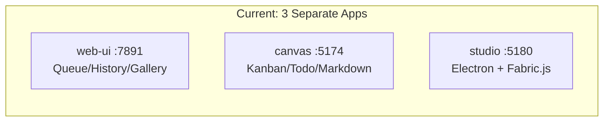
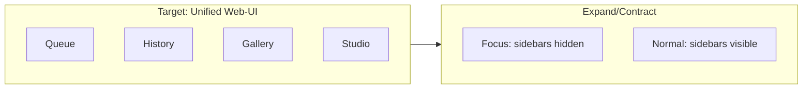

# Spec: Unify AgentPing Surfaces

**Status:** Draft
**Type:** Spec
**Created:** 2026-02-11

---

## Executive Summary

Merge the three canvas packages into one surface, add Studio as a toolbar mode, implement expand/contract with sidebar memory, and plan the Sofia component port -- all to make the UI less invasive and more cohesive.

---

## 1. Current State

Three separate canvas-like surfaces exist that should be one:



**Target:** Single web-ui with Studio as a mode, canvas components pulled in, expand/contract UX.



---

## 2. BD Epics (3 bullets each)

### lev-071f -- Kingly Flight Deck Roadmap

- Parent epic for all component migration work; defines mandatory component standards (Storybook + Playwright E2E + JSDoc)
- Contains 6 subtasks (.23-.28), all OPEN except .28 (P0 Dashboard Navigator, IN_PROGRESS)
- SDK architecture: lev-core-poly abstraction with CLI/MCP/HTTP wrappers

### lev-071f.23 -- [PROTOCOL] Keep dashboards running during migration

- Maintain 4 ports during migration: 6006 (AgentPing Storybook), 6007 (Sofia Storybook), 3001 (Clawd Dashboard), 8080 (Jarvis target)
- Ensures zero-downtime migration path by running source and target simultaneously
- Priority 2, STATUS: OPEN

### lev-071f.24 -- [P1] Theme System Foundation

- Extract and unify design tokens from all sources (Sofia skynet.css, AgentPing tokens.css, LCARS)
- DoD: ThemeProvider works, all 3 themes render
- Priority 1, STATUS: OPEN, blocks .25

### lev-071f.25 -- [P2] Component Library Merge

- Migrate Sofia primitives to AgentPing studio, delete 97 duplicates
- DoD: 90% or more test coverage, Storybook renders all components
- Priority 2, STATUS: OPEN, blocked by .24

### lev-071f.26 -- [P3] Agency Dashboard Integration

- Build SwarmView, WorkstreamBoard, ConsciousnessStream with unified theme
- DoD: 54 agents visible, real-time updates work
- Priority 2, STATUS: OPEN, blocked by .25

### lev-071f.27 -- [P4] Port Consolidation + Cleanup

- Unify ports, delete fake SDK, wire Jarvis to AgentPing
- DoD: All apps run from one surface, fake SDK deleted
- Priority 3, STATUS: OPEN

### lev-071f.28 -- [P0] Dashboard Navigator

- Visual plan validation mini-dashboard in AgentPing with live WebSocket status
- Owner: chicagowebdev@gmail.com, IN_PROGRESS
- HTML/React component, highest priority

---

## 3. Sofia Component Port Status

**Not yet ported.** Sofia has ~80 components at `~/digital/kingly/apps/production/Sofia/packages/ui/`:

- 23 UI primitives (Button, Badge, Card, Dialog, Input, Switch, etc.)
- 22 Dashboard components (DashboardWidget, ResponsiveDashboard, WidgetWrapper, GraphView, DocCard, SpecPanel, 6 skeletons)
- 15 Recipe components (CRUD system with TileView, TableView, FilterBar, EntityForm)
- 20+ Base UI re-exports (Radix-based headless primitives)

AgentPing gallery has 150+ independently-built components. The Sofia theme CSS is applied to Studio (`theme-sofia.css`), but no actual Sofia component code was ported.

---

## 4. Implementation Plan

### Phase 1: Expand/Contract + Sidebar Memory (web-ui)

**Target file:** `community/agentping/packages/adapters/web-ui/src/App.tsx`

Add state:

```typescript
const [expanded, setExpanded] = useState(false)
const [sidebarManuallyCollapsed, setSidebarManuallyCollapsed] = useState(false)
const [rightSidebarManuallyCollapsed, setRightSidebarManuallyCollapsed] = useState(false)
```

Behavior:

- **Expand icon** (top-right of toolbar): toggles `expanded`
- When `expanded = true`: left sidebar and right panels/modals hide via CSS transition (width to 0, opacity to 0)
- When `expanded = false`: left sidebar returns UNLESS `sidebarManuallyCollapsed` is true; right sidebar returns UNLESS `rightSidebarManuallyCollapsed` is true
- Sidebar close/collapse button sets `*ManuallyCollapsed = true`
- Sidebar open button sets `*ManuallyCollapsed = false`
- Keyboard shortcut: `Cmd+.` to toggle expand

**CSS changes in** `community/agentping/packages/adapters/web-ui/src/styles/Layout.css`:

- Add `.app-sidebar.collapsed` with `width: 0; overflow: hidden; opacity: 0; transition: all 0.2s ease`
- Add `.app-layout.expanded .app-sidebar` that collapses
- Add expand/contract icon button to header

### Phase 2: Studio as a Toolbar Mode

Add "Studio" as a fourth view mode in the web-ui toolbar alongside Queue, History, Gallery.

**Changes to** `community/agentping/packages/adapters/web-ui/src/App.tsx`:

- Add `'studio'` to the view union type: `'queue' | 'history' | 'gallery' | 'studio' | 'landing'`
- Add Studio button to toolbar nav (after Gallery)
- When `view === 'studio'`: render the canvas components (CanvasRenderer, KanbanBoard, TodoList, MarkdownCard) from the canvas package
- Import canvas components directly -- no separate app needed

### Phase 3: Canvas Merge

Move canvas package components into web-ui and deprecate the standalone canvas app.

**Source:** `community/agentping/packages/canvas/src/components/`

- `CanvasRenderer.tsx` -> web-ui `src/components/canvas/CanvasRenderer.tsx`
- `KanbanBoard.tsx` -> web-ui `src/components/canvas/KanbanBoard.tsx`
- `TodoList.tsx` -> web-ui `src/components/canvas/TodoList.tsx`
- `MarkdownCard.tsx` -> web-ui `src/components/canvas/MarkdownCard.tsx`
- `ConnectionStatus.tsx` -> web-ui `src/components/canvas/ConnectionStatus.tsx`
- Polymorph system (`canvas/src/polymorph/`) -> web-ui `src/polymorph/`

**Source:** `canvas/src/hooks/useAgentPing.ts` -> merge with web-ui's existing hooks

Studio's ComponentGallery categories (Layout, Intelligence, System and Ops, Navigation, Financial, Forms) become sub-tabs or a palette within the Studio mode view.

### Phase 4: Sofia Component Port (maps to lev-071f.25)

Port Sofia components from `~/digital/kingly/apps/production/Sofia/packages/ui/src/components/` into web-ui gallery. Priority order:

1. **Dashboard primitives first** (highest reuse): `DashboardWidget`, `ResponsiveDashboard`, `WidgetWrapper`, `LoadingStateProvider`, `StreamingIndicator`, `CollapseButton`
2. **UI primitives** (overlaps with existing, reconcile): `GlowOrb`, `ShimmerText`, `StatusDot`, `FilteredDropdown`, `OverlayFooter`, `TabBar`
3. **CRUD recipe system** (unique to Sofia): `CrudListPage`, `CrudDetailPage`, `EntityForm`, `FilterBar`, `ViewSwitcher`
4. **Skeletons** (quick wins): `ChartSkeleton`, `GaugeSkeleton`, `GridSkeleton`, `StatGridSkeleton`, `StatusBarSkeleton`, `TableSkeleton`

Each ported component must meet the lev-071f standards:

- `.stories.tsx` file
- `.spec.ts` Playwright test
- JSDoc on exports

---

## 5. Validation Gates

### Acceptance Criteria

- [ ] Expand/contract toggle works with sidebar memory
- [ ] Studio mode renders canvas components in web-ui
- [ ] Canvas package deprecated (components moved)
- [ ] Sofia component port follows lev-071f standards
- [ ] Zero-downtime during migration (lev-071f.23)

### Success Metrics

- Single web-ui serves all AgentPing surfaces
- No standalone canvas app running
- 80+ Sofia components ported with Storybook stories
