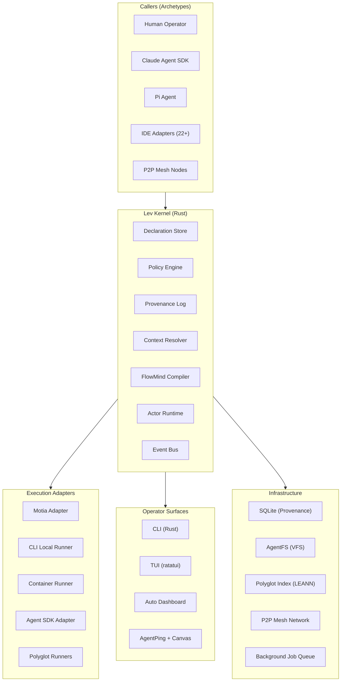
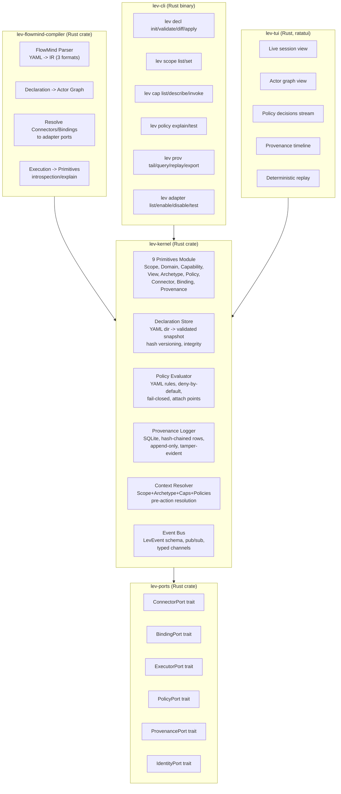
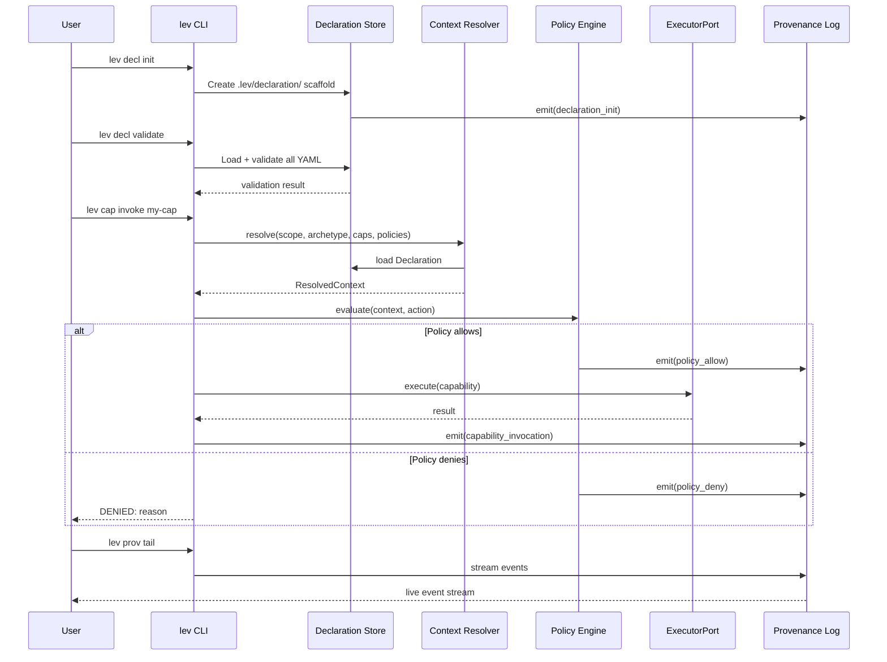

id: spec-lev-kernel
title: Lev Kernel
status: draft
created: 2026-01-26
updated: 2026-02-11
group: lev-kernel
sources:
  - spec-lev-kernel-prd-sections.md (base)
  - spec-lev-kernel-rust-prd.md
  - spec-lev-kernel-runtime-plan.md
  - spec-lev-kernel-feature-inventory.md
  - spec-kernel-substrate-prototype.md
  - spec-lev-kernel-prd-sections-v1.md (superseded)
supersedes:
  - spec-lev-kernel-prd-sections.md
  - spec-lev-kernel-rust-prd.md
  - spec-lev-kernel-runtime-plan.md
  - spec-lev-kernel-feature-inventory.md
  - spec-kernel-substrate-prototype.md
  - spec-lev-kernel-prd-sections-v1.md
todos:
  - id: save-template
    content: Save PRD template to docs/impl/_template.md with alignment sections (Vernacular Bridge, Missing Layer Mapping, Graph Primitives Mapping)
    status: pending
  - id: prd-01-kernel
    content: Write docs/impl/01-kernel-core.md -- Missing Layer 9 primitives, Declaration, policy, provenance, context resolution, enforcement boundaries. Extends docs/01-architecture.md. Maps graph primitives (Claim/Evidence/TruthState/Proposal/Gate) as domain model ON TOP of enforcement substrate.
    status: pending
  - id: prd-02-flowmind
    content: Write docs/impl/02-flowmind-runtime.md -- Two backends (flowmind-ts existing + flowmind-rs new actor graphs). Extends docs/06-core-flowmind.md. Locked principle preserved -- FlowMind DECLARES, Triggers EXECUTES, Events is SPINE.
    status: pending
  - id: prd-03-agentfs
    content: Write docs/impl/03-agentfs-virtual-filesystem.md -- AgentFS as ConnectorPort/BindingPort. Extends docs/08-core-other.md. L1-L6 shearing layers from community/lev-portable.
    status: pending
  - id: prd-04-agentping
    content: Write docs/impl/04-agentping-human-loop.md -- Review queue, approval flows, polymorph canvas, voice. Extends docs/01-architecture.md ActionSurface/Interface/Gate primitives.
    status: in_progress
  - id: prd-05-platforms
    content: Write docs/impl/05-platform-adapters.md -- 30+ adapters as ExecutorPort implementations. Extends docs/05-core-sdk.md locked vernacular (Platform, Provider, Harness).
    status: pending
  - id: prd-06-polyglot
    content: Write docs/impl/06-polyglot-indexing.md -- Index as durable service with governed ConnectorPort/BindingPort. Extends docs/04-core-index.md.
    status: pending
  - id: prd-07-daemons
    content: Write docs/impl/07-daemon-background-jobs.md -- Daemon core, schedulers, queues. Extends docs/08-core-other.md daemon SRP.
    status: pending
  - id: prd-08-skills
    content: Write docs/impl/08-skills-ecosystem.md -- Skills ARE Capabilities in Declaration. Extends docs/08-core-other.md plugin architecture.
    status: pending
  - id: prd-09-cli-tui
    content: Write docs/impl/09-cli-tui-dashboard.md -- Hybrid Rust+TS CLI. Extends docs/08-core-other.md CLI routing. Auto-dashboard from Declaration+provenance.
    status: pending
  - id: prd-10-enterprise
    content: Write docs/impl/10-enterprise-p2p.md -- Mothership/Satellite modes, P2P mesh, inference marketplace. Extends config MODE-SYSTEM.md.
    status: pending
  - id: prd-11-timetravel
    content: Write docs/impl/11-timetravel-research.md -- 10 adapters, 6 strategies, scheduling, paper intake. Extends docs/08-core-other.md plugins.
    status: pending
  - id: prd-12-shadow
    content: Write docs/impl/12-shadow-llm-context.md -- Shadow LLM weaver, classifier cascade, JIT instructions. Extends docs/06-core-flowmind.md parser-at-tip.
    status: pending
  - id: prd-13-community
    content: Write docs/impl/13-community-ecosystem.md -- AgentPing, agentguard, lev-portable, ClawCast, KinglyAssistant submodules.
    status: pending
  - id: prd-14-selflearn
    content: Write docs/impl/14-self-learning-os.md -- 7-phase pipeline from .lev/pm/designs/. Extends docs/07-core-lifecycle.md event system.
    status: pending
  - id: prd-15-memory
    content: Write docs/impl/15-memory-systems.md -- Memory as governed Connector/Binding. Extends docs/04-core-index.md search backends.
    status: pending
isProject: false
---

# Spec: Lev Kernel

250+ features discovered across 10 parallel agents. Organized into 15 implementation PRDs.

All PRDs follow the template at `docs/impl/_template.md` and are aligned with:

- `docs/01-architecture.md` -- locked vernacular, ownership map, core system contract, C1-C4 diagrams
- `docs/_inbox/00-vision.md` -- UX 7-stage pipeline, action surfaces, graph patching, expand/collapse
- `docs/04-08` -- locked module deep dives (current TS codebase)
- Missing Layer RFC -- 9 primitives, 8 invariants, enforcement boundaries

---

## Alignment Architecture

Two primitive layers, one system:

```
ENFORCEMENT LAYER (Missing Layer RFC -- new, Rust)
  9 primitives: Scope, Domain, Capability, View, Archetype,
                Policy, Connector, Binding, Provenance
  8 invariants: deny-by-default, fail-closed, etc.
  3 enforcement boundaries: pre-action, policy eval, provenance emit
        |
        | constrains
        v
DOMAIN LAYER (Lev graph primitives -- existing, from _inbox/05 + 01-architecture.md)
  View (materialized projection -- SHARED with enforcement View)
  Claim (atomic assertion = Capability invocation producing truth)
  Evidence (proof = Connector read providing support)
  TruthState (system stance = computed from Policy evaluation)
  Proposal (candidate mutation = Binding write, policy-gated)
  Gate (evaluator = Policy evaluation at enforcement boundary)
  Tick (scheduler heartbeat = session lifecycle in context resolver)
```

### Vernacular Bridge (kernel ports to existing locked terms)

| Kernel Port (Rust trait) | Existing Locked Term          | Relationship                                         |
| ------------------------ | ----------------------------- | ---------------------------------------------------- |
| ExecutorPort             | Harness + Provider            | Kernel wraps harness; provider implements executor   |
| ConnectorPort            | Index backends                | Governed reads through index                         |
| BindingPort              | AgentFS writes, BD mutations  | Governed writes to any target                        |
| PolicyPort               | ValidationGate + SafetyConfig | Kernel unifies existing gate/safety into RFC policy  |
| ProvenancePort           | EventLog (events.jsonl)       | Kernel adds hash-chain + integrity to existing JSONL |
| IdentityPort             | (new)                         | Maps to Archetype; no existing equivalent            |

### Parent Doc Mapping

| PRD              | Extends (locked doc)                    | New Layer                   |
| ---------------- | --------------------------------------- | --------------------------- |
| 01 Kernel Core   | 01-architecture.md, inbox/05-primitives | Enforcement substrate       |
| 02 FlowMind      | 06-core-flowmind.md                     | Actor graph compilation     |
| 03 AgentFS       | 08-core-other.md                        | Governed virtual FS         |
| 04 AgentPing     | 01-architecture.md (ActionSurface/Gate) | HITL enforcement            |
| 05 Platforms     | 05-core-sdk.md                          | ExecutorPort adapters       |
| 06 Polyglot      | 04-core-index.md                        | Governed index access       |
| 07 Daemons       | 08-core-other.md (daemon SRP)           | Background provenance       |
| 08 Skills        | 08-core-other.md (plugins)              | Skills = Capabilities       |
| 09 CLI/TUI       | 08-core-other.md (CLI routing)          | Kernel commands + auto-dash |
| 10 Enterprise    | config/MODE-SYSTEM.md                   | Distributed enforcement     |
| 11 Timetravel    | 08-core-other.md (plugins)              | Research as Connectors      |
| 12 Shadow LLM    | 06-core-flowmind.md                     | Context intelligence        |
| 13 Community     | 01-architecture.md (community/)         | Ecosystem packages          |
| 14 Self-Learning | 07-core-lifecycle.md                    | Autonomous improvement      |
| 15 Memory        | 04-core-index.md                        | Governed memory access      |

---

## PRD 1: `docs/impl/01-kernel-core.md` -- Missing Layer Primitives & Enforcement

**TypeScript prototype first (`core/flowmind/src/kernel/`), Rust port later (`crates/lev-kernel/`).**

- 9 Missing Layer primitives: Scope, Domain, Capability, View, Archetype, Policy, Connector, Binding, Provenance
- Declaration store (directory-as-declaration: `.lev/declaration/`)
- Context resolver (pre-action: scope + archetype + capabilities + policies + connectors/bindings + views)
- 8 invariants: deny-by-default, fail-closed, single-source-of-truth, scope-anchoring, domain-ownership, provenance-required, provenance-integrity, view-direction
- 3 enforcement boundaries: pre-action resolution, policy evaluation, provenance emission
- 4 error semantics: policy eval failure, provenance write failure, scope resolution failure, archetype resolution failure
- Temporal properties (expiration, validity windows)
- **Kernel FlowMind substrate**: restricted FlowMind subset (IF_THEN_ELSE + ROUTE only) that becomes part of the kernel -- everything flows through it, not optional gates. Ratchet constraint system loads as kernel FlowMind declarations.
- **Ratchet integration**: Thread B bootpack rules map to kernel FlowMind. Admission gates (schema, term fence, near-duplicate, immutability) govern what enters the kernel. Campaign tape for deterministic replay.
- **LLM/kernel boundary**: classifier cascade produces typed intents; translator converts to EvaluationContext; kernel evaluates deterministically (NO_INFERENCE).
- **Rust port path**: TS prototype proves interfaces; port to `crates/lev-kernel/` when stable. Codegen: Rust types -> ts-rs -> `@lev-os/kernel-types`
- **Existing to bridge**: `core/domain/` (Route, Target, FractalOwner, Manifest) -- parallel model with deprecation path

**Test gates**: G01-G07 (invariant tests), G05 (declaration integrity), adversarial gates A-01 through A-30

---

## PRD 2: `docs/impl/02-flowmind-runtime.md` -- FlowMind Compiler + Execution

**Extends existing. New Rust crate for actor graph compilation.**

- **Existing (TS, complete)**: Parser (845 LOC, 3 formats), Compiler (6 targets), Executor (exec/intake/parallel), Router (8-factor), Schema (700+ LOC)
- **Existing (TS, complete)**: Memory-as-program (memory compiler, satisfaction detector, executable memories)
- **Existing (TS, complete)**: Transpiler (7 opcodes: TRIGGER/EXEC/PROMPT/LOAD/EMIT/STORE/RECALL)
- **Existing (TS, complete)**: Decompiler (NL -> FlowMind YAML), Assembler (concept -> FlowMind)
- **Existing (TS, complete)**: Bi-directional context switcher (`[plugins/workflow-orchestrator/](plugins/workflow-orchestrator/)`)
- **New (Rust)**: Declaration -> ActorGraph compilation, actor graph scheduler (immediate/batched/stable)
- **New**: Two graphs: durable system graph + ephemeral session graph
- **New**: Decompile: explain execution back into primitives + provenance
- **Gaps**: ValidationGateExecutor (~300 LOC missing), LLM reasoning in router (placeholder), Lua transpiler backend
- **FlowMind lifecycle**: intake -> workshop/POC -> poly bindings -> integration trial -> full poly
- **Parser-at-tip**: Real-time intent detection, tiered classifier cascade (T0 structural, T1 keyword, T2 embedding, T3 fine-tuned LLM)
- **Lazy conversation scanning**: IDE-specific transcript watchers emit LevEvents

**Test gates**: G09 (parser/compiler/router), existing 144+ tests

---

## PRD 3: `docs/impl/03-agentfs-virtual-filesystem.md` -- AgentFS + L1-L6 Layers

**Extends existing. Critical subsystem.**

- **Existing**: CLI integration (`.lev/agentfs/` with gather/exec/deploy areas, JSONL events)
- **Existing**: LevFS SDK (`[sdk/typescript/levfs.ts](sdk/typescript/levfs.ts)`) -- reactive hooks, validation gates
- **Existing**: Deploy integration (`levd` -- plans, status, rollback)
- **Existing (submodule)**: `crates/lev-agentfs` Rust crate (lev-os/lev-agentfs.git)
- **Existing (reference)**: 6 shearing layers model (`[community/lev-portable/references/layers.md](community/lev-portable/references/layers.md)`)
- **Planned**: FUSE integration (documented, not implemented)
- **Planned**: File watchers with reactive hooks (production ready per handoff but in separate repo)
- **New (kernel)**: AgentFS as ConnectorPort (governed reads) + BindingPort (governed writes)
- **New**: Per-node L1-L6 level-of-detail; regenerate on changes
- **New**: Brand layers x L0-L3 depth x persistence (System Graph/CDO Graph) classification
- **Gaps**: Base AgentFS class missing from exports, FUSE not implemented, hooks config stub, Rust crate inaccessible

**Test gates**: G16 (ConnectorPort contract), AgentFS event integrity

---

## PRD 4: `docs/impl/04-agentping-human-loop.md` -- AgentPing + Review Queue + Voice

**Extends existing. Mature system (production ready).**

- **Existing (22 production features)**: 12 ping types, ApprovalQueue, step approval, MCP server (6 tools), polymorph canvas (12 primitives, 3 renderers, 4 templates), CanvasRenderer, WebSocket streaming, dashboard runner, dashboard manager
- **Existing**: Review queue CLI (`lev review queue` with BD-backed filtering)
- **Existing**: VoiceConsole (UI only, no backend)
- **Existing**: Notification system (levels: info/success/warning/error)
- **Planned**: NTM x AgentPing bridge (spec crystallized, not implemented)
- **Planned**: Auto-UI generation from ASCII/schemas (playground proposal)
- **Planned**: Voice backend (Whisper STT + Piper TTS, decision made, not integrated)
- **Planned**: render_custom_ui MCP tool (defined, incomplete)
- **Gaps**: No ASCII-to-UI parser, voice backend not connected, Slack/Discord/webhook adapters are stubs, Electron integration has ESM issues

**Test gates**: G14 (port contract for approval flows)

---

## PRD 5: `docs/impl/05-platform-adapters.md` -- IDE & Agent Support

**Extends existing. 30+ adapters production ready.**

- **Existing (30 adapters)**: Cursor, Claude Code, Cline, Windsurf, Codex, Gemini, OpenCode, Antigravity, Auggie, Crush, GitHub Copilot, Roo, Rovo Dev, Trae, IFlow, Kilo, Kiro CLI, Qwen, Clawdbot, AgentPing + Docker deploy, Coolify deploy, OpenClaw bridge
- **Existing**: BaseAdapter (template resolution, variable substitution, file generation)
- **Existing**: DeployAdapter (deterministic plan/apply/verify/rollback)
- **Existing**: 22 test files in `plugins/platforms/tests/`
- **New (kernel)**: Adapters become ExecutorPort implementations; policy-gated, provenance-emitting
- **New**: Motia adapter stub (map Capability = Motia workflow, route through Motia, record in Lev provenance)
- **New**: Claude Agent SDK adapter (tool calls -> Capability invocations + Connector reads + Binding writes)

**Test gates**: G12 (adapter generate()), G14 (ExecutorPort contract)

---

## PRD 6: `docs/impl/06-polyglot-indexing.md` -- Poly Runners + Search + LEANN

**Extends existing. 40 features, 80% production.**

- **Existing (production)**: Registry system, lev-watch binary (Go), gRPC bridge
- **Existing (daemons)**: Rust daemon (:9850, CK + AST-grep), Python daemon (:9851, LEANN + serena + Graphiti + agi-memory), CK-lite (:9850, ripgrep HTTP), Mgrep-lite (:9852, multimodal search)
- **Existing (search backends)**: CK semantic, LEANN vector, QMD quantized, BD tasks, AutoMem episodic, Ideas, Sessions, AST-grep structural
- **Existing**: RRF fusion (k=60), query analyzer (intent classification), scope mapper, streaming search
- **New (kernel)**: Index as first-class durable service in durable graph; governed via ConnectorPort (reads) and BindingPort (writes)
- **Gaps**: LEANN cold start (10s), gRPC orchestrator incomplete, weight tuning automation

**Test gates**: G08 (config cascade), G10 (harness providers), existing 144 tests

---

## PRD 7: `docs/impl/07-daemon-background-jobs.md` -- Daemon Subsystem

**Extends existing.**

- **Existing**: Daemon core (heartbeat 30s, queue poll 1s, BD sync 60s)
- **Existing**: FlowMind scheduler (cron-based hook execution)
- **Existing**: Queue system (BD-based, XDG-compliant)
- **Existing**: lev-learner (daily analysis, weekly proposals)
- **Existing**: Parallel research daemon
- **Existing**: Desktop background processing (ADR)
- **Gaps**: Actual task execution (TODO in daemon-core), priority queues, rate limiting, retry logic

---

## PRD 8: `docs/impl/08-skills-ecosystem.md` -- Skills as First-Class Citizens

**Extends existing. 30 features, 12 implemented.**

- **Existing**: 4-tier resolution chain, hybrid search (TF-IDF + semantic), protocol-based discovery (`skillsdb://`), external sync (SHA-256 hashing, TTL), skill injector (runtime loading + caching), build-time emission (Claude marketplace, Gemini), index builder
- **Planned**: Phase 2 indexing (BM25 + LEANN + SQLite metadata), skill-as-capability mapping (Missing Layer), progressive disclosure, versioning, skill package validation, marketplace publish
- **Planned**: Skills consolidation (78 duplicates -> single `~/.agents/skills/`)
- **New (kernel)**: Skills ARE Capabilities in the Declaration; discovered, versioned, policy-gated
- **Lifecycle**: Intake -> Analysis -> POC -> Poly integration -> Production
- **Gaps**: No version management, no schema validation, marketplace incomplete, Phase 2 indexing not implemented

---

## PRD 9: `docs/impl/09-cli-tui-dashboard.md` -- Operator Experience

**Extends existing. Hybrid Rust+TS approach.**

- **Existing CLI (TS)**: 30+ commands across 10 modules (work, review, gather, find, deploy, daemon, flowmind, poly, build, validate), alias resolution, command discovery
- **Existing TUI (Rust)**: 4 widgets (card, event_log, status_badge, spinner), cyberpunk theme, LevEvent parsing, JSONL source reader
- **Existing Dashboard**: Old-dash (8 pages: overview, tasks, agents, workstreams, knowledge, system, config, audit), knowledge graph viz, trace viewer, kanban, agent feed, timeline
- **Existing**: AgentPing 78 primitives gallery, dashboard runner/manager
- **New (Rust CLI)**: `lev decl` (init/validate/diff/apply), `lev scope`, `lev domain`, `lev cap`, `lev policy`, `lev prov` (tail/query/replay/export), `lev adapter`
- **New (TUI)**: Live session view, graph view (durable + session), policy decisions stream, provenance timeline, replay mode
- **New**: Auto-dashboard from Declaration + provenance (no manual wiring)
- **Gaps**: TUI main loop incomplete, no real-time file watching, policy debugger missing, replay mode missing, dashboard auto-generation missing

**Test gates**: G17 (E2E golden path), G19-G21 (manual QA)

---

## PRD 10: `docs/impl/10-enterprise-p2p.md` -- Enterprise, Cloud, P2P Mesh

**Mostly planned/research.**

- **Existing**: Mothership/Satellite/Standalone mode detection + feature gating
- **Existing**: Agent-lease (production v3.3.0, git hook validation, proof protocol)
- **Existing**: Shell adapter supports SSH/tmux/remote execution
- **Existing**: Docker/Podman detection + sandbox management
- **Research complete**: Hybrid P2P arch (Nostr control + direct data), SwarmOS semantics
- **Planned (ADR)**: libp2p-based P2P mesh, job marketplace, capability discovery, NAT traversal
- **Planned**: Cloud coordination (Tailscale mesh, shared registries, audit logs)
- **Planned (Phase 3, months 12-24)**: Distributed inference network, GPU sharing, fair billing, trust/reputation
- **Planned**: K8s runner, enterprise compliance/audit, private networks, SLA enforcement
- **Gaps**: libp2p integration, k8s runner, inference marketplace, billing, reputation system

---

## PRD 11: `docs/impl/11-timetravel-research.md` -- Timetravel + Content Intake

**Extends existing. Fully implemented adapter suite.**

- **Existing (10 adapters)**: Arxiv, Brave, Exa, Firecrawl, Grok, HackerNews, Oracle (GPT-4o), Perplexity, Tavily, Valyu
- **Existing**: 6 strategies (quick, full, deep, max, academic, social), 3 modes (parallel, sequential, first-success)
- **Existing**: Job management (persistent, XDG-compliant), scheduler (cron: hourly/daily/weekly/6h/12h), CLI (search/job/schedule/status/adapters)
- **Existing**: Full test suite (unit + integration)
- **Gaps**: No timezone support, basic cron only

---

## PRD 12: `docs/impl/12-shadow-llm-context.md` -- Shadow LLM + Context Intelligence

**Mostly planned/spec. Critical for "weaver" pattern.**

- **Existing**: Hybrid query classifier (pattern + LLM), stream router classifier (intent/entity/affect)
- **Spec**: Lifecycle statusline Ollama classifier (qwen3:30b-a3b for prompt classification)
- **Spec**: FlowMind parser-at-tip v2 (tiered classifier: T0 structural -> T1 keyword -> T2 embedding -> T3 fine-tuned LLM)
- **Planned**: Shadow executor (L3 harness -- spawn N agents, proposal-only, budget-limited)
- **New (user vision)**: Shadow LLM as "weaver" -- summarizes as we go, snapshot of graph + entity structure, pulls L0/L1 context of related graph nodes, ensures FSM snapshot currency
- **New**: Just-in-time system instructions for FlowMind + dynamic context injection
- **New**: Bidirectional whisper (agent <-> workflow) -- referenced in architecture
- **Gaps**: No dedicated weaver daemon, no shadow summarizer, classifier implementations sparse

---

## PRD 13: `docs/impl/13-community-ecosystem.md` -- Community Packages

**Extends existing.**

- **Existing**: AgentPing v2 (production, 865 files), agentguard v3.3.0, lev-portable v1.0.0, template-community-package
- **Action**: Add ClawCast as submodule -> `community/clawcast/`
- **Action**: Add KinglyAssistant as submodule -> `community/kingly-assistant/`
- **From ClawCast**: Human agent representation patterns (leaderboard, inference, collaborative)
- **From lev-portable**: 5 capabilities (guard, layers, think, find, work) -- zero-dependency architectural toolkit

---

## PRD 14: `docs/impl/14-self-learning-os.md` -- Self-Learning Pipeline

**Comprehensive 7-phase design (18 weeks). All design-phase.**

- Phase 1: Telemetry Foundation (trace extraction)
- Phase 2: Skill Indexing (hybrid BM25 + LEANN + SQLite)
- Phase 3: JobType Recognition (multi-signal classifier)
- Phase 4: Weight System (outcome-based skill selection)
- Phase 5: Agentic Compiler (traces -> FlowMind workflows via PM4Py)
- Phase 6: Overlay System (safe skill evolution via strategic merge patches)
- Phase 7: Hot Zone Validation
- **Additional**: Agent Lightning integration (TraceAdapter, Reward Emission, APO), 5-tier memory upgrade for `work` skill
- **Gaps**: Entire pipeline is design-only; no implementation

---

## PRD 15: `docs/impl/15-memory-systems.md` -- Memory Architecture

**Extends existing. Multiple backends, SOTA targeting.**

- **Existing**: AutoMem (episodic, multi-instance HTTP), graph memory (Personalized PageRank, FalkorDB), memory compiler (FlowMind executable memories)
- **Existing**: Memory search provenance tracking
- **Proposed**: SOTA 95%+ LoCoMo benchmark (12-week epic), OpenMem + Five-fold + AGI Memory + Semantic Hooks
- **Proposed**: Poly/daemon architecture fix (XDG compliance, persistent working memory)
- **Proposed**: Shared memory for distributed mesh (distributed SQLite, mothership memory API, git-synced files)
- **New (kernel)**: Memory as governed Connector (read) + Binding (write), policy-gated, provenance-emitting

---

## Feature Count Summary

| PRD              | Features Found | Implemented | Partial | Planned |
| ---------------- | -------------- | ----------- | ------- | ------- |
| 01 Kernel Core   | 20             | 0           | 0       | 20      |
| 02 FlowMind      | 20             | 13          | 5       | 2       |
| 03 AgentFS       | 12             | 4           | 3       | 5       |
| 04 AgentPing     | 30             | 22          | 5       | 3       |
| 05 Platforms     | 35             | 30          | 2       | 3       |
| 06 Polyglot      | 27             | 24          | 3       | 0       |
| 07 Daemons       | 10             | 7           | 1       | 2       |
| 08 Skills        | 30             | 12          | 8       | 10      |
| 09 CLI/TUI/Dash  | 37             | 26          | 3       | 8       |
| 10 Enterprise    | 15             | 4           | 2       | 9       |
| 11 Timetravel    | 17             | 17          | 0       | 0       |
| 12 Shadow LLM    | 8              | 2           | 2       | 4       |
| 13 Community     | 6              | 4           | 0       | 2       |
| 14 Self-Learning | 12             | 0           | 0       | 12      |
| 15 Memory        | 8              | 4           | 1       | 3       |
| **TOTAL**        | **287**        | **169**     | **35**  | **83**  |

---

## PRD Template (saved to docs/impl/\_template.md)

````markdown
# XX - <Title>

**Status**: DRAFT (Kernel PRD)
**Extends**: docs/0N-<parent>.md
**Missing Layer Primitives**: <which of 9 this PRD touches>
**Created**: 2026-02-10
**Last Updated**: 2026-02-10

---

## Executive Summary

<2-3 sentences: what this subsystem does, why it matters, high-level approach>

<Bullet list of key deliverables>

---

## Relationship to Existing Architecture

**Parent doc**: `docs/0N-<name>.md` (LOCKED decisions preserved)

**What this PRD adds**: <1 sentence on what's new vs what exists>

### Vernacular Bridge

| Kernel Term      | Existing Locked Term                    | Notes             |
| ---------------- | --------------------------------------- | ----------------- |
| <port/primitive> | <existing term from 01-architecture.md> | <how they relate> |

### Locked Decisions Preserved

- <List of relevant LOCKED decisions from parent doc that this PRD respects>

---

## C2/C3: Architecture

<ASCII diagrams following 01-architecture.md C1-C4 pattern>

---

## Missing Layer Mapping

**Primitives touched**:

**Invariants enforced**:

- <which of 8 invariants apply and how>

**Enforcement boundaries**:

- <which of pre-action / policy eval / provenance emit apply>

**Error semantics**:

- <which of 4 error modes apply>

---

## Graph Primitives Mapping

How Lev's existing graph primitives (from inbox/05-primitives) relate:

| Lev Primitive | Kernel Mapping | Example |
| ------------- | -------------- | ------- |
| Claim         |                |         |
| Evidence      |                |         |
| Proposal      |                |         |
| Gate          |                |         |
| View          |                |         |

---

## Features (Inventory)

| Feature | File Path | Status                      | Description | Gaps |
| ------- | --------- | --------------------------- | ----------- | ---- |
|         |           | implemented/partial/planned |             |      |

---

## Implementation Specification

### Rust Crate Structure (if applicable)

    crates/lev-<name>/
    +-- src/
    |   +-- lib.rs
    |   +-- ...
    +-- Cargo.toml
    +-- tests/

### Key Types

```rust
// Core trait/struct definitions
```
````

### TypeScript Integration (if applicable)

```typescript
// Generated types or bridge code
```

---

## Validation Gates

### Positive Gates (prove it works)

| Gate ID | Command                             | What It Proves | TDD?   |
| ------- | ----------------------------------- | -------------- | ------ |
| G-XX    | `cargo test ...` or `pnpm test ...` |                | yes/no |

### Adversarial Gates (prove it resists attack)

Each PRD MUST include adversarial gates that actively try to BREAK the system.
These are red-team tests -- they attempt the thing that should be impossible and verify it fails correctly.

| Gate ID | Attack Vector | Expected Behavior                            | Severity             |
| ------- | ------------- | -------------------------------------------- | -------------------- |
| A-XX    |               | <how the system rejects/denies/fails-closed> | critical/high/medium |

**Adversarial gate categories:**

1. **Bypass gates** -- attempt to skip enforcement
2. **Escalation gates** -- attempt privilege elevation
3. **Tampering gates** -- attempt to corrupt truth
4. **Leakage gates** -- attempt to extract protected data
5. **Denial gates** -- attempt to degrade availability
6. **Drift gates** -- attempt to create inconsistency

---

## TDD Critical Path

**Test-first (security/integrity invariants + adversarial)**:

- <what MUST be TDD -- includes ALL adversarial gates>

**Test-after (plumbing/UI)**:

- ***

## Open Questions

- <max 3>

---

## Session Notes

<Living updates section -- append as work progresses>

### YYYY-MM-DD --

-
-
-

````

---

## Adversarial Validation Gates (Master Inventory)

These are red-team tests. Every gate actively tries to BREAK the system and verifies correct failure.
Each PRD inherits relevant gates from this master list + adds domain-specific adversarial tests.

### BYPASS (skip enforcement -- should be impossible)

| Gate | Attack | Expected | PRD | Severity |
|---|---|---|---|---|
| A-01 | Invoke Capability without calling context resolver first | DENY + provenance event emitted recording the attempt | 01 | critical |
| A-02 | Execute Binding (write) without policy evaluation | DENY (fail-closed, Invariant 2) | 01 | critical |
| A-03 | Complete a significant action without provenance emission | ACTION BLOCKED (Invariant 6 -- provenance required) | 01 | critical |
| A-04 | Read Connector with PolicyPort unavailable | DENY (fail-closed) + error provenance event | 01, 06 | critical |
| A-05 | Run FlowMind step that bypasses ExecutorPort (direct shell) | Step rejected -- all execution routes through port | 02 | high |
| A-06 | Write to AgentFS area without BindingPort governance | Write rejected, provenance records attempt | 03 | high |
| A-07 | Approve action in AgentPing without corresponding PolicyPort check | Approval has no effect -- LEV re-evaluates policy independently | 04 | high |

### ESCALATION (privilege elevation -- should be denied)

| Gate | Attack | Expected | PRD | Severity |
|---|---|---|---|---|
| A-08 | Assume Archetype "admin" when resolved Archetype is "operator" | DENY + provenance records escalation attempt | 01 | critical |
| A-09 | Access Capability in Scope B when caller is anchored to Scope A | DENY (Invariant 4 -- scope anchoring) | 01 | critical |
| A-10 | Invoke Capability owned by Domain X from Archetype with no Domain X access | DENY (Invariant 5 -- domain ownership enforced) | 01 | high |
| A-11 | Platform adapter invokes Capability it wasn't granted | ExecutorPort rejects -- adapter Archetype checked | 05 | high |
| A-12 | Skill self-registers as Capability bypassing Declaration | Registration rejected -- Declaration is sole authority | 08 | high |

### TAMPERING (corrupt truth -- should be detected)

| Gate | Attack | Expected | PRD | Severity |
|---|---|---|---|---|
| A-13 | Modify a row in provenance SQLite log directly | Hash chain verification fails on next read (Invariant 7) | 01 | critical |
| A-14 | Delete a provenance event from the log | Gap in hash chain detected, system alerts | 01 | critical |
| A-15 | Modify Declaration YAML without going through `lev decl apply` | Integrity check detects tampering (DEC-1) | 01 | critical |
| A-16 | Forge a LevEvent with spoofed source/timestamp | Event validation rejects malformed provenance envelope | 01 | high |
| A-17 | Inject false completion status into AgentFS deploy events | BindingPort validates event schema before write | 03 | high |
| A-18 | Tamper with FlowMind YAML after compilation but before execution | Runtime re-validates against Declaration hash | 02 | high |

### LEAKAGE (data exfiltration -- should be blocked)

| Gate | Attack | Expected | PRD | Severity |
|---|---|---|---|---|
| A-19 | Read index results from Scope B through Scope A Connector | ConnectorPort enforces scope boundary -- results filtered | 06 | high |
| A-20 | View projects implementation details through a View (Invariant 3 violation) | View returns projection only -- no logic duplication | 01 | medium |
| A-21 | Extract memory content across scope boundaries via AutoMem query | ConnectorPort policy gates memory reads by scope | 15 | high |
| A-22 | Leak resolved context (model names, tool IDs) to runtime output | Context resolver strips implementation details (RFC 5) | 01 | medium |

### DENIAL (availability degradation -- should be bounded)

| Gate | Attack | Expected | PRD | Severity |
|---|---|---|---|---|
| A-23 | Flood provenance log with millions of events per second | Write throttling engages, backpressure signal to caller | 01 | medium |
| A-24 | Create policy evaluation that takes infinite time (regex bomb) | Policy evaluation timeout triggers fail-closed DENY | 01 | high |
| A-25 | Spawn unlimited session graphs to exhaust memory | Session graph pool has bounded size, oldest evicted | 02 | medium |
| A-26 | Submit infinite recursive Declaration (Scope contains itself) | Declaration validator rejects cycles | 01 | medium |

### DRIFT (inconsistency -- should be detected/prevented)

| Gate | Attack | Expected | PRD | Severity |
|---|---|---|---|---|
| A-27 | Runtime behavior diverges from Declaration (code does X, Declaration says Y) | Declaration is authoritative -- runtime re-resolves, drift alert emitted | 01 | high |
| A-28 | Policy cache returns stale allow after policy was updated to deny | Cache invalidation on Declaration apply -- stale entries rejected | 01 | high |
| A-29 | Capability exists in code but has no Domain in Declaration | Invariant 5 violation detected at validation time (domain ownership) | 01 | high |
| A-30 | Temporal constraint expired but policy still evaluated as active | Temporal enforcement rejects expired policies (TEMP-2) | 01 | medium |
| A-31 | FlowMind compilation target drifts from Declaration intent | Decompiler can explain any execution back to primitives -- unexplainable = drift | 02 | medium |
| A-32 | Shadow LLM weaver injects stale L0/L1 context from previous session | Context injection validates freshness against provenance timestamps | 12 | medium |

### Gate Count Per PRD

| PRD | Positive Gates | Adversarial Gates | Total |
|---|---|---|---|
| 01 Kernel Core | 7 | 18 (A-01 thru A-04, A-08 thru A-10, A-13 thru A-16, A-19 thru A-20, A-22 thru A-24, A-26 thru A-30) | 25 |
| 02 FlowMind | 1 | 4 (A-05, A-18, A-25, A-31) | 5 |
| 03 AgentFS | 1 | 2 (A-06, A-17) | 3 |
| 04 AgentPing | 1 | 1 (A-07) | 2 |
| 05 Platforms | 1 | 1 (A-11) | 2 |
| 06 Polyglot | 3 | 1 (A-19) | 4 |
| 08 Skills | 0 | 1 (A-12) | 1 |
| 12 Shadow LLM | 0 | 1 (A-32) | 1 |
| 15 Memory | 0 | 1 (A-21) | 1 |
| **TOTAL** | **14** | **32** | **46** |

All 32 adversarial gates are TDD-required (test-first). No exceptions.

---

## Open Design Questions (from kernel-substrate-prototype)

Three design questions are unresolved. TypeScript prototype (`core/flowmind/src/kernel/`) is the fastest path to answers. Rust port follows when interfaces stabilize.

1. **Kernel vs evaluated FlowMind**: What does it mean for a FlowMind to _become part of_ the kernel vs merely _be evaluated by_ it? The kernel FlowMind substrate (IF_THEN_ELSE + ROUTE only) is a restricted subset that loads as constraint declarations -- it is the kernel, not optional gates. Userland FlowMind is the full language, evaluated against kernel constraints before execution.

2. **Ratchet manifold loading**: How does the ratchet constraint manifold load into the kernel runtime? Thread B bootpack rules map to kernel FlowMind declarations. Admission gates (schema validation, term fence, near-duplicate check, immutability check) govern what enters the kernel. Campaign tape enables deterministic replay of the full constraint evolution.

3. **LLM/no-inference boundary**: Where does the LLM classification layer meet the no-inference constraint layer? A classifier cascade produces typed intents; a translator converts intents to EvaluationContext; the kernel evaluates deterministically with NO_INFERENCE. The kernel never infers -- it pattern-matches or denies.

---

## Consolidated From: spec-lev-kernel-rust-prd.md

The following sections are unique to the Rust kernel PRD and not covered in the base PRD sections above.

### Rust Kernel Vision

lev-kernel is a Rust crate that implements a constraint enforcement kernel modeled on the Ratchet system's Thread B architecture. It is the single source of truth for policy evaluation, provenance, and simulation recording in Leviathan.

**Why Rust (eventual port target):**
- The kernel's invariants (deny-by-default, fail-closed, immutability, hash-chain integrity) are safety properties. Rust's type system encodes these at compile time.
- DCG (destructive_command_guard) proves the pattern: 170K lines of Rust for policy evaluation with sub-millisecond latency, dual regex engine, SIMD-accelerated filtering.
- The existing crates/lev-reactive/ provides HookDecision, EventBus, and HookContext as building blocks.
- NAPI-RS bindings expose the kernel to the TypeScript FlowMind executor with zero-copy JSON passing.

**Long-Term: Universal Constraint Engine:**
- Phase 1: ABAC policy enforcement for FlowMind
- Phase 2: Simulation execution recording with cryptographic provenance
- Phase 3: Physics, biology, consciousness, and society models as constraint manifolds
- Phase 4: Universal world engine -- all models share the same kernel, same ratchet, same hash verification

### Ratchet-Kernel Mapping (Thread B Properties)

| Ratchet Thread B Property | lev-kernel Implementation |
|--------------------------|---------------------------|
| NO_INFERENCE TRUE | No heuristics in policy evaluation. Pattern match or deny. |
| NO_REPAIR TRUE | Malformed policy YAML -> reject, don't fix. Fail-closed. |
| NO_SMOOTHING TRUE | No fuzzy matching in kernel. Exact pattern or deny. |
| COMMIT_ON_PASS_ONLY | Provenance events only committed for completed evaluations. |
| SURVIVOR_LEDGER | Policy registry: Map PolicyId -> {status, declaration, provenance} |
| TERM_REGISTRY | Capability/Archetype registry with admission states |
| REJECT_LOG | Deny log: List {batch_id, tag, detail} |
| PARK_SET | Pending policies awaiting evidence or dependency resolution |
| CAMPAIGN_TAPE | Provenance chain: append-only, hash-chained JSONL |
| EXPORT_BLOCK | Policy declaration submission (YAML) |
| SIM_EVIDENCE | Simulation execution records with hash verification |
| SHA256SUMS | Integrity verification of all state |
| ACTIVE_RULESET_SHA256 | Hash of current policy set for deterministic replay |

### Two-Tier FlowMind

**Kernel FlowMind** (Thread B equivalent):
- Constraint declarations (policies, archetypes, capabilities)
- Admission rules (ratchet: what enters the kernel)
- Enforcement rules (invariants 1-8)
- Immutable once admitted
- Hash-verified state

**Userland FlowMind** (Thread A/M equivalent):
- Application workflows (when X do Y)
- Skill definitions, agent configurations
- Mutable, versioned
- Evaluated AGAINST kernel constraints before execution

Kernel FlowMind is a restricted subset:
- Only IF_THEN_ELSE (policy conditions) and ROUTE (archetype dispatch)
- No LOOP, no PARALLEL, no EXECUTE (kernel doesn't execute, it evaluates)
- No side effects during evaluation
- All state changes are append-only (ledger model)

The constraint-driven processor enables progressive constraint tightening:
1. Kernel starts with base policy set
2. Sim evidence + user corrections admit new policies through the ratchet
3. Constraint manifold grows, model becomes more refined
4. Campaign tape enables deterministic replay of entire constraint evolution
5. Same progression as Thread B: axioms -> probes -> specs

### Core Primitives (Rust Types)

#### Constraint Manifold

```rust
pub struct ConstraintManifold {
    policies: PolicyRegistry,
    archetypes: ArchetypeRegistry,
    capabilities: CapabilityRegistry,
    scopes: ScopeTree,
    ruleset_sha256: [u8; 32],
    accepted_batch_count: u64,
    unchanged_ledger_streak: u64,
}
````

#### Policy (with Admission States)

```rust
#[derive(Debug, Clone, PartialEq, Eq)]
pub enum PolicyStatus {
    Pending,
    Active,
    Parked { tag: ParkTag, reason: String },
    Rejected { tag: RejectTag, detail: String },
}

#[derive(Debug, Clone, Serialize, Deserialize)]
pub struct PolicyDeclaration {
    pub id: PolicyId,
    pub api_version: String,
    pub metadata: PolicyMetadata,
    pub spec: PolicySpec,
    pub provenance: ItemProvenance,
}

#[derive(Debug, Clone, Serialize, Deserialize)]
pub struct PolicyMetadata {
    pub name: String,
    pub scope: ScopeId,
    #[serde(default)]
    pub keywords: Vec<String>,  // Aho-Corasick quick-reject
}

#[derive(Debug, Clone, Serialize, Deserialize)]
pub struct PolicySpec {
    pub attaches_to: Vec<AttachPoint>,
    pub effect: Effect,
    pub condition: PolicyCondition,
    #[serde(default = "default_priority")]
    pub priority: u32,
}

#[derive(Debug, Clone, Copy, Serialize, Deserialize, PartialEq, Eq)]
#[serde(rename_all = "snake_case")]
pub enum Effect { Allow, Deny }

#[derive(Debug, Clone, Serialize, Deserialize)]
#[serde(tag = "type", rename_all = "snake_case")]
pub enum PolicyCondition {
    Denylist { patterns: Vec<String> },
    Allowlist { prefixes: Vec<String> },
    Pattern { regex: String },
    Schema { schema_path: String },
}

#[derive(Debug, Clone, Serialize, Deserialize)]
#[serde(rename_all = "snake_case")]
pub enum AttachPoint {
    Archetype(String),
    Capability(String),
    Scope(String),
}
```

#### Archetype and Capability

```rust
pub struct Archetype {
    pub id: ArchetypeId,
    pub name: String,
    pub trust_level: TrustLevel,
    pub status: AdmissionStatus,
    pub provenance: ItemProvenance,
}

#[derive(Debug, Clone, Copy, PartialEq, Eq, PartialOrd, Ord)]
pub enum TrustLevel {
    Untrusted = 0,
    Low = 1,
    Medium = 2,
    High = 3,
    Kernel = 4,
}

pub struct Capability {
    pub id: CapabilityId,
    pub name: String,
    pub domain: DomainId,
    pub risk_level: RiskLevel,
    pub status: AdmissionStatus,
}

pub enum RiskLevel { Safe, Guarded, Dangerous, Critical }
```

#### Provenance (Hash-Chained)

```rust
pub struct ProvenanceEvent {
    pub event_id: String,
    pub timestamp_utc: String,
    pub event_type: ProvenanceEventType,
    pub archetype: String,
    pub capability: String,
    pub scope: String,
    pub decision: Decision,
    pub evaluated_policies: Vec<PolicyEvaluation>,
    pub reason: String,
    pub prev_hash: String,
    pub event_hash: String,
}

pub enum ProvenanceEventType {
    PolicyEvaluation,
    PolicyAdmission,
    PolicyRejection,
    SimulationRecording,
    StateSnapshot,
}

impl ProvenanceEvent {
    pub fn compute_hash(&self, prev_hash: &str) -> String {
        use sha2::{Sha256, Digest};
        let mut hasher = Sha256::new();
        hasher.update(prev_hash.as_bytes());
        hasher.update(self.timestamp_utc.as_bytes());
        hasher.update(self.archetype.as_bytes());
        hasher.update(self.capability.as_bytes());
        hasher.update(self.decision_str().as_bytes());
        format!("{:x}", hasher.finalize())
    }
}
```

### Policy Evaluator Pipeline

```
Input: EvaluationContext { archetype, capability, scope, command, environment }

[Stage 0] Deadline init (200ms max -> DENY on exceed)
[Stage 1] Keyword gating (Aho-Corasick, O(n))
[Stage 2] Scope resolution (project -> user -> system; fail -> DENY)
[Stage 3] Archetype filtering (collect applicable policies)
[Stage 4] Policy evaluation (priority-ordered; deny first; any deny -> DENY)
[Stage 5] Default decision (no applicable policy -> DENY; Invariant 1)
[Stage 6] Provenance emission (hash-chained JSONL)

Output: PolicyResult { decision, evaluated_policies, provenance_event, trace, elapsed }
```

Dual regex engine: linear (regex crate, O(n)) for ~85% of patterns, backtracking (fancy-regex) for lookahead/lookbehind patterns. Automatic selection via needs_backtracking() heuristic.

Performance budget: fail-CLOSED (not fail-open like DCG). Budget exceeded = DENY.

### ENGINE_EXECUTION_RECORDING v1

**Rules:**

1. Every simulation execution MUST produce an ExecutionRecord containing: input_hash, environment_hash, output_hash, and lineage_hash.
2. input_hash MUST be the SHA-256 hash of the complete serialized simulation input parameters.
3. environment_hash MUST be the SHA-256 hash of the execution environment descriptor (runtime version, platform, seed, timestamp).
4. output_hash MUST be the SHA-256 hash of the complete serialized simulation output.
5. lineage_hash MUST be the SHA-256 hash of (input_hash || environment_hash || output_hash || parent_lineage_hash).
6. All hashes and raw artifacts MUST be stored as immutable records in the provenance chain.
7. Any simulation record missing required hashes or provenance MUST be refused by the kernel.
8. A simulation MUST be replayable given its input_hash, environment_hash, and a matching execution environment.
9. Compositional simulations (micro to macro to mega) MUST chain lineage_hash from child to parent, forming a Merkle-like tree.
10. The kernel MUST NOT perform semantic interpretation during recording; recording is structural only.
11. Failed, partial, or invalid simulation runs MUST be recorded with a FAIL status and linked to the reject log (graveyard).
12. Nondeterministic simulations MUST declare an explicit seed in their environment descriptor; simulations without a declared seed MUST be refused.
13. The kernel MUST verify input_hash, environment_hash, output_hash, and lineage_hash consistency before accepting a simulation record.

**Rust Types:**

```rust
pub struct ExecutionRecord {
    pub sim_id: String,
    pub timestamp_utc: String,
    pub status: SimStatus,
    pub input_hash: [u8; 32],
    pub environment_hash: [u8; 32],
    pub output_hash: [u8; 32],
    pub lineage_hash: [u8; 32],
    pub parent_lineage_hash: Option<[u8; 32]>,
    pub environment: SimEnvironment,
    pub input_artifact: ArtifactRef,
    pub output_artifact: ArtifactRef,
}

pub struct SimEnvironment {
    pub runtime_version: String,
    pub platform: String,
    pub seed: u64,          // REQUIRED: no seed = refuse
    pub timestamp_utc: String,
    pub extra: HashMap<String, String>,
}

pub enum SimStatus { Pass, Fail, Partial, Invalid }
```

### Ratchet Admission Protocol

How policies enter the kernel:

```
EXPORT_BLOCK (policy YAML)
  -> [Gate 1] Schema validation (REJECT on fail: TAG SCHEMA_FAIL)
  -> [Gate 2] Term fence (all referenced archetypes/capabilities must be admitted; PARK on fail: TAG FORWARD_DEPEND)
  -> [Gate 3] Near-duplicate check (Jaccard > 0.80 -> PARK: TAG NEAR_REDUNDANT)
  -> [Gate 4] Immutability check (same ID, different content -> REJECT: TAG SHADOW_ATTEMPT)
  -> [Admitted] ACTIVE status, PolicyRegistry appended, ruleset_sha256 recomputed, ProvenanceEvent emitted
```

Ratchet properties:

- Append-only: admitted policies are immutable
- Hash-verified: ruleset_sha256 recomputed after every admission
- Replayable: campaign tape replays all admissions deterministically
- No deletion: policies can be superseded but never removed from ledger

### NAPI-RS Bridge

```rust
#[napi]
pub fn evaluate(ctx_json: String) -> napi::Result<String>;

#[napi]
pub fn load_policies(declaration_dir: String) -> napi::Result<String>;

#[napi]
pub fn record_simulation(record_json: String) -> napi::Result<String>;

#[napi]
pub fn get_provenance_chain(limit: u32) -> napi::Result<String>;

#[napi]
pub fn verify_ruleset_hash() -> napi::Result<String>;
```

### Rust Crate Structure (Monolithic)

<!-- CONFLICT: This monolithic crate structure (from spec-lev-kernel-rust-prd.md) places all modules
     under a single crates/lev-kernel/ crate. The runtime plan (spec-lev-kernel-runtime-plan.md)
     proposes a multi-crate workspace (lev-primitives, lev-declaration, lev-policy, lev-provenance,
     lev-context, lev-ports, lev-event-bus, lev-flowmind-compiler, lev-kernel, lev-cli, lev-tui,
     lev-codegen). See "Consolidated From: spec-lev-kernel-runtime-plan.md" for the multi-crate
     alternative. Decision needed before Rust port begins. -->

```
crates/lev-kernel/
  Cargo.toml
  src/
    lib.rs
    error.rs
    primitives/
      mod.rs, scope.rs, archetype.rs, capability.rs, policy.rs, provenance.rs
    manifold/
      mod.rs, registry.rs, admission.rs
    evaluator/
      mod.rs, context.rs, confidence.rs, trace.rs
    loader/
      mod.rs, schema.rs
    regex_engine/
      mod.rs
    budget/
      mod.rs
    sim/
      mod.rs, record.rs, environment.rs
    napi.rs
  tests/
    invariants.rs       (G1-G3)
    policies.rs         (G4-G6)
    provenance.rs       (G7, G-R4-R5)
    archetype.rs        (G8)
    admission.rs        (G-R1-R3)
    sim_recording.rs    (G-S1-S4)
    corpus/
      true_positives/
      false_positives/
      bypass_attempts/
```

### Phased Delivery (Rust, Day-Based)

<!-- CONFLICT: This day-based phased delivery assumes Rust-first implementation.
     Per the TS-first pivot (2026-02), TypeScript prototype at core/flowmind/src/kernel/
     comes first. Rust port begins when TS interfaces are stable for 2+ weeks.
     This timeline applies to the EVENTUAL Rust port, not immediate work.
     Base PRD 1 says: "TypeScript prototype first, Rust port later." -->

- Phase 1 (Day 1-2): Primitives + ConstraintManifold + PolicyEvaluator. TDD: G1-G3. Dual regex. Budget.
- Phase 2 (Day 2-3): Policy loader + 5 YAML declarations + admission gates (ratchet). TDD: G4-G8, G-R1-R3.
- Phase 3 (Day 3-4): Provenance chain (hash-chained JSONL) + ruleset hash. TDD: G7, G-R4-R5.
- Phase 4 (Day 4-5): NAPI-RS bindings. Wire into FlowMind executor.ts. Integration tests.
- Phase 5 (Day 5-6): Simulation recording (ENGINE_EXECUTION_RECORDING v1). TDD: G-S1-S4.
- Phase 6 (Day 6-7): Fine-tuning pipeline + tip infrastructure.
- Phase 7 (Day 7-8): E2E golden path + security regression corpus.

### Rust PRD Open Questions

1. Should kernel policies support ROUTE for multi-archetype dispatch, or only IF_THEN_ELSE?
2. Sim artifact storage: .lev/sims/ or embedded in provenance chain?
3. Should the kernel expose a `lev kernel evaluate` CLI for non-TypeScript consumers?
4. Can existing ratchet bootpacks (BOOTPACK_THREAD_B_v3.9.13) compile into kernel policy YAML?
5. Auto-promotion: should parked policies auto-promote when dependencies are admitted?

---

## Consolidated From: spec-lev-kernel-runtime-plan.md

The runtime plan is the **Rust port target** (not immediate). Blocked on TypeScript prototype in `core/flowmind/src/kernel/` proving the interfaces. Port begins when TS prototype interfaces are stable for 2+ weeks.

### Architecture Diagrams

#### C1: System Context



#### C2: Container Architecture



### Rust Crate Map (Multi-Crate Workspace)

<!-- CONFLICT: This multi-crate workspace design (from spec-lev-kernel-runtime-plan.md) splits the kernel
     into 12 independent crates. The Rust PRD (spec-lev-kernel-rust-prd.md) proposes a monolithic
     crate with subdirectories. See "Rust Crate Structure (Monolithic)" above for the alternative.
     Decision needed before Rust port begins. -->

| Crate                   | Purpose                                                                  | Dependencies                                      |
| ----------------------- | ------------------------------------------------------------------------ | ------------------------------------------------- |
| `lev-primitives`        | 9 Missing Layer types + invariant checks                                 | `serde`, `uuid`                                   |
| `lev-declaration`       | Declaration store, validation, diffing, versioning                       | `lev-primitives`, `serde_yaml`, `sha2`            |
| `lev-policy`            | YAML rule evaluator, deny-by-default, fail-closed                        | `lev-primitives`, `serde_yaml`                    |
| `lev-provenance`        | SQLite append-only log, hash-chain, query                                | `lev-primitives`, `rusqlite`, `sha2`              |
| `lev-context`           | Pre-action context resolver                                              | `lev-primitives`, `lev-declaration`, `lev-policy` |
| `lev-ports`             | Port traits (Connector, Binding, Executor, Policy, Provenance, Identity) | `lev-primitives`, `async-trait`                   |
| `lev-event-bus`         | Typed event pub/sub, LevEvent schema                                     | `lev-primitives`, `tokio`                         |
| `lev-flowmind-compiler` | Declaration -> actor graph compilation                                   | `lev-primitives`, `lev-declaration`, `serde_yaml` |
| `lev-kernel`            | Orchestrator: wires everything together                                  | all above                                         |
| `lev-cli`               | CLI binary (clap)                                                        | `lev-kernel`                                      |
| `lev-tui`               | TUI binary (ratatui) - extends existing                                  | `lev-kernel`, `ratatui`                           |
| `lev-codegen`           | ts-rs type generation for TS bridge                                      | `lev-primitives`, `ts-rs`                         |

### Codegen Bridge (ts-rs)

Rust primitives derive `ts_rs::TS` to generate TypeScript types consumed by:

- Existing TS CLI (`core/cli/bin/lev`) during migration
- AgentPing dashboard
- Plugin adapters
- OpenClaw bridge

### Existing Infrastructure Preserved

| Component            | Location                 | Status | Kernel Integration                             |
| -------------------- | ------------------------ | ------ | ---------------------------------------------- |
| FlowMind TS compiler | `core/flowmind/`         | Keep   | Prompt/schedule compilation (not actor graphs) |
| Harness              | `core/harness/`          | Keep   | ExecutorPort adapter wrapping SDKHarness       |
| Platform adapters    | `plugins/platforms/`     | Keep   | Config generation unchanged                    |
| Config loader        | `core/config/`           | Keep   | Feeds Declaration bootstrap                    |
| Trigger system       | `core/triggers/`         | Keep   | EventProvider -> Event Bus bridge              |
| Polyglot runners     | `core/polyglot-runners/` | Keep   | ConnectorPort adapters for search              |
| Index/Find           | `core/index/`            | Keep   | ConnectorPort for governed reads               |
| AgentPing            | `apps/agentping/`        | Keep   | IdentityPort for review queue                  |
| AgentFS              | `crates/lev-agentfs/`    | Extend | VFS nodes get L0-L6 detail levels              |

### Actor Graph Model

- **Durable graph**: services, indexes, long-running watchers (persistent)
- **Ephemeral graph**: per-session/run (garbage collected)
- **Schedulers**: Immediate (low latency), Batched (throughput), Stable (deterministic/replay)
- **Session lifecycle**: start -> resolve -> plan -> execute -> commit -> finalize

### Overlay System

- Strategic merge patches for Declaration
- Conflict detection + auto-fork policy
- Atomic IDs for overlay tracking
- Validator approval workflow

### Golden Path Vertical Slice



### Detailed Positive Validation Gates

#### Tier 1: Rust Kernel Unit Tests (cargo test) -- TDD CRITICAL PATH

| Gate                                                | What It Proves                                                                  | TDD? | Deterministic? |
| --------------------------------------------------- | ------------------------------------------------------------------------------- | ---- | -------------- |
| G01: `primitives::invariant_scope_anchoring`        | Every primitive (except Scope) must declare its Scope                           | YES  | YES            |
| G02: `primitives::invariant_domain_ownership`       | Every Capability belongs to exactly 1 Domain; every Domain owns >= 1 Capability | YES  | YES            |
| G03: `primitives::invariant_view_direction`         | Views reference Capabilities; Capabilities never reference Views                | YES  | YES            |
| G04: `policy::deny_by_default`                      | No matching policy = action denied                                              | YES  | YES            |
| G05: `policy::fail_closed`                          | Policy evaluation error = action denied + provenance emitted                    | YES  | YES            |
| G06: `policy::explicit_deny_overrides_allow`        | Deny wins over allow when both match                                            | YES  | YES            |
| G07: `provenance::append_only`                      | Cannot update or delete existing provenance records                             | YES  | YES            |
| G08: `provenance::hash_chain_integrity`             | Tampering with any row breaks the chain; detected by verify                     | YES  | YES            |
| G09: `provenance::significant_action_coverage`      | All 5 significant action types emit provenance                                  | YES  | YES            |
| G10: `declaration::validate_complete`               | Invalid YAML, missing required fields, broken references all fail validation    | YES  | YES            |
| G11: `declaration::diff_deterministic`              | Same two declarations always produce the same diff                              | YES  | YES            |
| G12: `context::pre_action_resolution`               | Cannot invoke capability without resolved context                               | YES  | YES            |
| G13: `context::scope_resolution_failure_denies`     | Unknown scope = action denied                                                   | YES  | YES            |
| G14: `context::archetype_resolution_failure_denies` | Unknown archetype = action denied                                               | YES  | YES            |

#### Tier 2: Integration Tests (Vitest + cargo test)

| Gate                                    | What It Proves                                                             | TDD? | Deterministic? |
| --------------------------------------- | -------------------------------------------------------------------------- | ---- | -------------- |
| G15: `adapter::executor_port_contract`  | CLI local runner implements ExecutorPort correctly (invoke, result, error) | NO   | YES            |
| G16: `adapter::connector_port_contract` | Filesystem connector reads files with policy gating                        | NO   | YES            |
| G17: `cli::golden_path_e2e`             | `decl init -> validate -> cap invoke -> prov tail` works end-to-end        | NO   | YES            |
| G18: `codegen::ts_types_match_rust`     | Generated TS types compile and match Rust struct shapes                    | NO   | YES            |

#### Tier 3: System / QA Tests

| Gate                                           | What It Proves                                              | TDD? | Deterministic? |
| ---------------------------------------------- | ----------------------------------------------------------- | ---- | -------------- |
| G19: `system::provenance_survives_crash`       | Kill process mid-write; provenance is consistent on restart | NO   | YES (scripted) |
| G20: `system::declaration_version_attribution` | Every Declaration version is attributable to a caller       | NO   | YES            |

#### Manual QA (Last Step)

- MQ1: Run `lev decl init` in a fresh project, inspect output
- MQ2: Create a Declaration with intentional errors, run `lev decl validate`, verify error messages are clear
- MQ3: Invoke a capability, tail provenance, verify the event stream is human-readable
- MQ4: Open TUI, navigate session view / provenance timeline, verify responsiveness
- MQ5: Open auto-dashboard in browser, verify Declaration navigation works

### TDD Strategy with Example

TDD (Red-Green-Refactor) for Gates G01-G14. Each gate follows this cycle:

1. **RED**: Write failing test that encodes the invariant from the RFC
2. **GREEN**: Implement minimum code to pass
3. **REFACTOR**: Clean up, extract shared types

Example for G04 (deny-by-default):

```rust
#[test]
fn deny_by_default_when_no_policy_matches() {
    let engine = PolicyEngine::new(vec![]); // no policies
    let ctx = ResolvedContext::default();
    let action = Action::invoke_capability("cap-1");
    let result = engine.evaluate(&ctx, &action);
    assert_eq!(result.decision, Decision::Deny);
    assert_eq!(result.reason, "No matching policy (deny-by-default)");
}
```

Not TDD (test-after) for Gates G15-G20: these involve I/O, adapters, and system-level behavior.

### MVP Phasing (Rust Port Roadmap)

<!-- CONFLICT: This week-based phasing assumes Rust work begins immediately.
     Per the TS-first pivot (2026-02), this roadmap is DEFERRED until the TypeScript prototype
     interfaces are stable for 2+ weeks. The runtime plan's own frontmatter acknowledges this:
     "RUST PORT TARGET (not immediate). BLOCKED ON: TypeScript prototype [...] proving the interfaces."
     Timeline applies to the EVENTUAL Rust port. -->

- **Phase 0 (Week 1)**: Rust workspace setup, crate stubs, ts-rs codegen pipeline, CI
- **Phase 1 (Weeks 2-4)**: Kernel primitives + policy + provenance (TDD: G01-G09)
- **Phase 2 (Weeks 5-6)**: Declaration + context resolver (TDD: G10-G14)
- **Phase 3 (Weeks 7-9)**: CLI golden path + adapters (G15-G18)
- **Phase 4 (Weeks 10-13)**: TUI + dashboard + FlowMind compiler (G19-G20, MQ1-MQ5)
- **Phase 5 (Weeks 14-16)**: Claude Agent SDK adapter, Motia stub, AgentPing integration
- **Phase 6+ (Ongoing)**: FlowMind native execution, polyglot index, AgentFS L0-L6, P2P mesh, enterprise features, overlay system, self-learning pipeline

### Runtime Plan Open Questions

- **Motia integration surface**: Zero Motia references exist in the codebase today. Need to evaluate Motia's actual API before designing the adapter. Recommend a spike in Phase 5.
- **P2P transport**: Nostr protocol research exists but no implementation. This is V2+ scope.
- **Dashboard framework**: Tauri (existing `lev-desktop`) vs standalone web server? Tauri reuses Rust crates but adds complexity.
- **Provenance write failure strategy**: RFC requires declaring Strategy A (suspend) or B (fallback). Recommend Strategy A for MVP (simplest, safest), with Strategy B for V2 (high-throughput scenarios).
- **Declaration integrity at Core Conformance**: RFC says "detectable tampering" -- SHA-256 content hash per version is sufficient for Core. Signatures required only for Verifiable Conformance (V2).

---

## Consolidated From: spec-lev-kernel-feature-inventory.md

The following sections are unique to the feature inventory and not covered in the base PRD sections or other consolidated sources above.

### 6 Shearing Layers Model (from lev-portable)

| Layer         | Brand   | Lev depth    | Software analog                  |
| ------------- | ------- | ------------ | -------------------------------- |
| L1 Site       | Decades | L0 Overview  | Domain model, schema             |
| L2 Structure  | 30-50y  | L1 Structure | Module boundaries, API contracts |
| L3 Skin       | 20y     | L2 Details   | UI framework, design system      |
| L4 Services   | 7-15y   | L3 Runtime   | CI/CD, deployment                |
| L5 Space Plan | 3-7y    | --           | Routes, feature config           |
| L6 Stuff      | Daily   | --           | Copy, logs, env vars             |

Virtual file system L1-L6: Each node gets a level-of-detail; regenerate on changes. Reference: `community/lev-portable/references/layers.md`.

### Domain Model -- Codegen for Shared Types

Per design decision ("codegen for shared types"):

- **Rust**: Canonical definitions in `lev-kernel/primitives`
- **TypeScript**: Generated via `ts-rs` or OpenAPI/JSON Schema from Rust
- **Flow**: Rust types -> `cargo build` -> codegen step -> `@lev-os/kernel-types` package
- **Scope**: Scope, Domain, Capability, View, Archetype, Policy, Connector, Binding, ProvenanceEvent

### Features to Extrapolate from beads + ~/claw

_(Requires access to beads CLI output and ~/claw directory; user to run `bd ready`, `bd list` and provide claw structure.)_

Likely additional features from beads:

- BD epic/task lifecycle
- BD sync, status, tags
- Handoff templates
- Validation gate triggers on BD events

From ~/claw (Clawd):

- Jarvis dashboard (Whisper + Piper)
- Voice backend patterns
- Production app layouts

### QA/Test Plan Summary

```
Phase 1: Unit (Rust)
  - cargo test for kernel crate
  - All 7 invariant tests must pass

Phase 2: Integration (TS)
  - pnpm test for core + plugins
  - Contract tests for ports

Phase 3: E2E
  - Golden path (5 commands)
  - Provenance replay

Phase 4: Manual QA
  - CLI as user
  - TUI as user
  - Dashboard as user

Phase 5: Edge Cases
  - Policy evaluation failure
  - Provenance write failure
  - Scope/Archetype resolution failure
```

### TDD Critical vs Non-Critical Paths

**Critical Path (TDD Required):**

| Component              | Rationale                                            |
| ---------------------- | ---------------------------------------------------- |
| Policy evaluation      | Deny-by-default, fail-closed are security invariants |
| Provenance emission    | Every significant action must emit; chain integrity  |
| Context resolution     | Wrong context -> wrong policy -> wrong allow/deny    |
| Declaration validation | Invalid declaration -> corrupted runtime             |
| Port contracts         | Adapters must not bypass enforcement                 |

**Non-Critical Path (Test-After OK):**

| Component         | Strategy          | Rationale                                |
| ----------------- | ----------------- | ---------------------------------------- |
| CLI commands      | Test-after        | Plumbing; invariants enforced by kernel  |
| TUI widgets       | Snapshot + manual | Visual; determinism hard                 |
| Dashboard         | E2E + manual      | Auto-generated; contract at API boundary |
| FlowMind compiler | Existing tests    | Already has coverage; extend as needed   |
| Adapter templates | Regression        | Low risk; template substitution          |

### Consolidated Action Items (Priority Order)

1. **Freeze kernel contract** -- Rust crate API for 9 primitives + 6 ports; lock LevEvent/Provenance schema
2. **Provenance log first** -- SQLite + hash-chain envelope; `lev prov tail/query`
3. **Declaration v0** -- Validator, context resolver; `lev decl init/validate/diff/apply`
4. **Codegen shared types** -- Rust -> TS for primitives
5. **Claude Agent SDK adapter** -- Vertical slice: invoke -> connector read -> binding write -> provenance
6. **AgentFS integration** -- Wire lev-agentfs as ConnectorPort; `.lev/agentfs/` as governed store
7. **AgentPing + review queue** -- Human-in-the-loop as first-class; Jarvis UI progression (beeper -> projector)
8. **L1-L6 virtual FS** -- Per-node LOD; regenerate on change; layers.md as spec
9. **Shadow LLM / Weaver** -- Summarizer + FSM snapshot + L0/L1 context injection
10. **FlowMind parser + lazy scan** -- Parser at tip; IDE-specific conversation scanning
11. **Skills first-class** -- Skills in Declaration; workshop, intake, maintenance flows
12. **Add ClawCast + KinglyAssistant** -- Submodules under community/
13. **Timetravel + background jobs** -- Integrate with daemon; ticketing (BD) linkage
14. **Run validation gates** -- Execute G1-G21; document pass/fail

---

## Open Questions (Consolidated)

1. **beads CLI output** -- `bd ready` / `bd list` for remaining task extraction
2. **Shadow LLM daemon vs compilation target** -- where does the weaver live?
3. **P2P mesh timeline** -- MVP or V2?
4. **Motia adapter priority** -- ship with MVP or defer?
5. **Crate structure** -- monolithic (spec-lev-kernel-rust-prd) vs multi-crate workspace (spec-lev-kernel-runtime-plan)?
6. **Motia integration surface** -- Zero references in codebase; needs API evaluation spike
7. **Dashboard framework** -- Tauri (existing lev-desktop) vs standalone web server?
8. **Provenance write failure strategy** -- Strategy A (suspend) vs B (fallback)?
9. **Declaration integrity level** -- SHA-256 for Core Conformance; signatures for Verifiable (V2)?
10. **Kernel FlowMind ROUTE** -- Should kernel policies support ROUTE for multi-archetype dispatch, or only IF_THEN_ELSE?
11. **Sim artifact storage** -- `.lev/sims/` or embedded in provenance chain?
12. **Ratchet bootpack compilation** -- Can BOOTPACK_THREAD_B_v3.9.13 compile into kernel policy YAML?
13. **Auto-promotion** -- Should parked policies auto-promote when dependencies are admitted?
14. **ClawCast/KinglyAssistant Git URLs** -- needed for submodule adds

---

<details><summary>Superseded: spec-lev-kernel-prd-sections-v1 (325 lines, earlier version)</summary>

---

name: Lev Kernel PRD Sections
overview: Complete feature inventory from 10 parallel agents discovering 250+ features. Maps each feature to a PRD implementation doc at docs/impl/\*.md. 15 PRD sections covering kernel core, FlowMind, AgentFS, AgentPing, platforms, polyglot/indexing, daemons, skills, CLI/TUI/dashboard, enterprise/P2P, timetravel, shadow LLM, community, self-learning OS, and memory systems.
todos:

- id: prd-01-kernel
  content: Write docs/impl/01-kernel-core.md -- Missing Layer 9 primitives, Declaration, policy, provenance, context resolution, enforcement boundaries
  status: pending
- id: prd-02-flowmind
  content: Write docs/impl/02-flowmind-runtime.md -- Compiler pipeline, actor graphs, memory-as-program, parser-at-tip, lifecycle, bi-directional MCP
  status: pending
- id: prd-03-agentfs
  content: Write docs/impl/03-agentfs-virtual-filesystem.md -- AgentFS, L1-L6 layers, FUSE, file watchers, ConnectorPort/BindingPort integration
  status: pending
- id: prd-04-agentping
  content: Write docs/impl/04-agentping-human-loop.md -- Review queue, approval flows, polymorph canvas, voice (Whisper/Piper), auto-UI
  status: pending
- id: prd-05-platforms
  content: Write docs/impl/05-platform-adapters.md -- 30+ IDE adapters, deploy adapters, Motia adapter, Claude Agent SDK adapter
  status: pending
- id: prd-06-polyglot
  content: Write docs/impl/06-polyglot-indexing.md -- LEANN, RRF fusion, 8 search backends, gRPC bridge, governed index access
  status: pending
- id: prd-07-daemons
  content: Write docs/impl/07-daemon-background-jobs.md -- Daemon core, FlowMind scheduler, queue system, learner, parallel research
  status: pending
- id: prd-08-skills
  content: Write docs/impl/08-skills-ecosystem.md -- Discovery, workshop lifecycle, marketplace, versioning, skill-as-Capability mapping
  status: pending
- id: prd-09-cli-tui
  content: Write docs/impl/09-cli-tui-dashboard.md -- Hybrid Rust+TS CLI, TUI views, auto-generated dashboard, 78 primitives
  status: pending
- id: prd-10-enterprise
  content: Write docs/impl/10-enterprise-p2p.md -- Mothership/Satellite modes, P2P mesh, inference marketplace, k8s runner, agent-lease
  status: pending
- id: prd-11-timetravel
  content: Write docs/impl/11-timetravel-research.md -- 10 adapters, 6 strategies, scheduling, paper intake
  status: pending
- id: prd-12-shadow
  content: Write docs/impl/12-shadow-llm-context.md -- Shadow LLM weaver, classifier cascade, JIT instructions, bidirectional whisper
  status: pending
- id: prd-13-community
  content: Write docs/impl/13-community-ecosystem.md -- AgentPing, agentguard, lev-portable, ClawCast submodule, KinglyAssistant submodule
  status: pending
- id: prd-14-selflearn
  content: Write docs/impl/14-self-learning-os.md -- 7-phase pipeline, telemetry, indexing, JobType, weights, agentic compiler, overlays
  status: pending
- id: prd-15-memory
  content: Write docs/impl/15-memory-systems.md -- AutoMem, Graphiti, graph memory, SOTA pipeline, distributed mesh memory
  status: pending
  isProject: false

---

# Lev Kernel -- PRD Section Map (docs/impl/.md)

250+ features discovered across 10 parallel agents. Organized into 15 implementation PRDs.

---

## PRD 1: `docs/impl/01-kernel-core.md` -- Missing Layer Primitives & Enforcement

**New system (Rust). No existing implementation for 9-primitive model.**

- 9 Missing Layer primitives: Scope, Domain, Capability, View, Archetype, Policy, Connector, Binding, Provenance
- Declaration store (directory-as-declaration: `.lev/declaration/`)
- Context resolver (pre-action: scope + archetype + capabilities + policies + connectors/bindings + views)
- 8 invariants: deny-by-default, fail-closed, single-source-of-truth, scope-anchoring, domain-ownership, provenance-required, provenance-integrity, view-direction
- 3 enforcement boundaries: pre-action resolution, policy evaluation, provenance emission
- 4 error semantics: policy eval failure, provenance write failure, scope resolution failure, archetype resolution failure
- Temporal properties (expiration, validity windows)
- Codegen pipeline: Rust types -> ts-rs -> `@lev-os/kernel-types` npm package
- **Existing to bridge**: `core/domain/` (Route, Target, FractalOwner, Manifest) -- parallel model with deprecation path

**Test gates**: G01-G07 (invariant tests), G05 (declaration integrity)

---

## PRD 2: `docs/impl/02-flowmind-runtime.md` -- FlowMind Compiler + Execution

**Extends existing. New Rust crate for actor graph compilation.**

- **Existing (TS, complete)**: Parser (845 LOC, 3 formats), Compiler (6 targets), Executor (exec/intake/parallel), Router (8-factor), Schema (700+ LOC)
- **Existing (TS, complete)**: Memory-as-program (memory compiler, satisfaction detector, executable memories)
- **Existing (TS, complete)**: Transpiler (7 opcodes: TRIGGER/EXEC/PROMPT/LOAD/EMIT/STORE/RECALL)
- **Existing (TS, complete)**: Decompiler (NL -> FlowMind YAML), Assembler (concept -> FlowMind)
- **Existing (TS, complete)**: Bi-directional context switcher (`[plugins/workflow-orchestrator/](plugins/workflow-orchestrator/)`)
- **New (Rust)**: Declaration -> ActorGraph compilation, actor graph scheduler (immediate/batched/stable)
- **New**: Two graphs: durable system graph + ephemeral session graph
- **New**: Decompile: explain execution back into primitives + provenance
- **Gaps**: ValidationGateExecutor (~300 LOC missing), LLM reasoning in router (placeholder), Lua transpiler backend
- **FlowMind lifecycle**: intake -> workshop/POC -> poly bindings -> integration trial -> full poly
- **Parser-at-tip**: Real-time intent detection, tiered classifier cascade (T0 structural, T1 keyword, T2 embedding, T3 fine-tuned LLM)
- **Lazy conversation scanning**: IDE-specific transcript watchers emit LevEvents

**Test gates**: G09 (parser/compiler/router), existing 144+ tests

---

## PRD 3: `docs/impl/03-agentfs-virtual-filesystem.md` -- AgentFS + L1-L6 Layers

**Extends existing. Critical subsystem.**

- **Existing**: CLI integration (`.lev/agentfs/` with gather/exec/deploy areas, JSONL events)
- **Existing**: LevFS SDK (`[sdk/typescript/levfs.ts](sdk/typescript/levfs.ts)`) -- reactive hooks, validation gates
- **Existing**: Deploy integration (`levd` -- plans, status, rollback)
- **Existing (submodule)**: `crates/lev-agentfs` Rust crate (lev-os/lev-agentfs.git)
- **Existing (reference)**: 6 shearing layers model (`[community/lev-portable/references/layers.md](community/lev-portable/references/layers.md)`)
- **Planned**: FUSE integration (documented, not implemented)
- **Planned**: File watchers with reactive hooks (production ready per handoff but in separate repo)
- **New (kernel)**: AgentFS as ConnectorPort (governed reads) + BindingPort (governed writes)
- **New**: Per-node L1-L6 level-of-detail; regenerate on changes
- **New**: Brand layers x L0-L3 depth x persistence (System Graph/CDO Graph) classification
- **Gaps**: Base AgentFS class missing from exports, FUSE not implemented, hooks config stub, Rust crate inaccessible

**Test gates**: G16 (ConnectorPort contract), AgentFS event integrity

---

## PRD 4: `docs/impl/04-agentping-human-loop.md` -- AgentPing + Review Queue + Voice

**Extends existing. Mature system (production ready).**

- **Existing (22 production features)**: 12 ping types, ApprovalQueue, step approval, MCP server (6 tools), polymorph canvas (12 primitives, 3 renderers, 4 templates), CanvasRenderer, WebSocket streaming, dashboard runner, dashboard manager
- **Existing**: Review queue CLI (`lev review queue` with BD-backed filtering)
- **Existing**: VoiceConsole (UI only, no backend)
- **Existing**: Notification system (levels: info/success/warning/error)
- **Planned**: NTM x AgentPing bridge (spec crystallized, not implemented)
- **Planned**: Auto-UI generation from ASCII/schemas (playground proposal)
- **Planned**: Voice backend (Whisper STT + Piper TTS, decision made, not integrated)
- **Planned**: render_custom_ui MCP tool (defined, incomplete)
- **Gaps**: No ASCII-to-UI parser, voice backend not connected, Slack/Discord/webhook adapters are stubs, Electron integration has ESM issues

**Test gates**: G14 (port contract for approval flows)

---

## PRD 5: `docs/impl/05-platform-adapters.md` -- IDE & Agent Support

**Extends existing. 30+ adapters production ready.**

- **Existing (30 adapters)**: Cursor, Claude Code, Cline, Windsurf, Codex, Gemini, OpenCode, Antigravity, Auggie, Crush, GitHub Copilot, Roo, Rovo Dev, Trae, IFlow, Kilo, Kiro CLI, Qwen, Clawdbot, AgentPing + Docker deploy, Coolify deploy, OpenClaw bridge
- **Existing**: BaseAdapter (template resolution, variable substitution, file generation)
- **Existing**: DeployAdapter (deterministic plan/apply/verify/rollback)
- **Existing**: 22 test files in `plugins/platforms/tests/`
- **New (kernel)**: Adapters become ExecutorPort implementations; policy-gated, provenance-emitting
- **New**: Motia adapter stub (map Capability = Motia workflow, route through Motia, record in Lev provenance)
- **New**: Claude Agent SDK adapter (tool calls -> Capability invocations + Connector reads + Binding writes)

**Test gates**: G12 (adapter generate()), G14 (ExecutorPort contract)

---

## PRD 6: `docs/impl/06-polyglot-indexing.md` -- Poly Runners + Search + LEANN

**Extends existing. 40 features, 80% production.**

- **Existing (production)**: Registry system, lev-watch binary (Go), gRPC bridge
- **Existing (daemons)**: Rust daemon (:9850, CK + AST-grep), Python daemon (:9851, LEANN + serena + Graphiti + agi-memory), CK-lite (:9850, ripgrep HTTP), Mgrep-lite (:9852, multimodal search)
- **Existing (search backends)**: CK semantic, LEANN vector, QMD quantized, BD tasks, AutoMem episodic, Ideas, Sessions, AST-grep structural
- **Existing**: RRF fusion (k=60), query analyzer (intent classification), scope mapper, streaming search
- **New (kernel)**: Index as first-class durable service in durable graph; governed via ConnectorPort (reads) and BindingPort (writes)
- **Gaps**: LEANN cold start (10s), gRPC orchestrator incomplete, weight tuning automation

**Test gates**: G08 (config cascade), G10 (harness providers), existing 144 tests

---

## PRD 7: `docs/impl/07-daemon-background-jobs.md` -- Daemon Subsystem

**Extends existing.**

- **Existing**: Daemon core (heartbeat 30s, queue poll 1s, BD sync 60s)
- **Existing**: FlowMind scheduler (cron-based hook execution)
- **Existing**: Queue system (BD-based, XDG-compliant)
- **Existing**: lev-learner (daily analysis, weekly proposals)
- **Existing**: Parallel research daemon
- **Existing**: Desktop background processing (ADR)
- **Gaps**: Actual task execution (TODO in daemon-core), priority queues, rate limiting, retry logic

---

## PRD 8: `docs/impl/08-skills-ecosystem.md` -- Skills as First-Class Citizens

**Extends existing. 30 features, 12 implemented.**

- **Existing**: 4-tier resolution chain, hybrid search (TF-IDF + semantic), protocol-based discovery (`skillsdb://`), external sync (SHA-256 hashing, TTL), skill injector (runtime loading + caching), build-time emission (Claude marketplace, Gemini), index builder
- **Planned**: Phase 2 indexing (BM25 + LEANN + SQLite metadata), skill-as-capability mapping (Missing Layer), progressive disclosure, versioning, skill package validation, marketplace publish
- **Planned**: Skills consolidation (78 duplicates -> single `~/.agents/skills/`)
- **New (kernel)**: Skills ARE Capabilities in the Declaration; discovered, versioned, policy-gated
- **Lifecycle**: Intake -> Analysis -> POC -> Poly integration -> Production
- **Gaps**: No version management, no schema validation, marketplace incomplete, Phase 2 indexing not implemented

---

## PRD 9: `docs/impl/09-cli-tui-dashboard.md` -- Operator Experience

**Extends existing. Hybrid Rust+TS approach.**

- **Existing CLI (TS)**: 30+ commands across 10 modules (work, review, gather, find, deploy, daemon, flowmind, poly, build, validate), alias resolution, command discovery
- **Existing TUI (Rust)**: 4 widgets (card, event_log, status_badge, spinner), cyberpunk theme, LevEvent parsing, JSONL source reader
- **Existing Dashboard**: Old-dash (8 pages: overview, tasks, agents, workstreams, knowledge, system, config, audit), knowledge graph viz, trace viewer, kanban, agent feed, timeline
- **Existing**: AgentPing 78 primitives gallery, dashboard runner/manager
- **New (Rust CLI)**: `lev decl` (init/validate/diff/apply), `lev scope`, `lev domain`, `lev cap`, `lev policy`, `lev prov` (tail/query/replay/export), `lev adapter`
- **New (TUI)**: Live session view, graph view (durable + session), policy decisions stream, provenance timeline, replay mode
- **New**: Auto-dashboard from Declaration + provenance (no manual wiring)
- **Gaps**: TUI main loop incomplete, no real-time file watching, policy debugger missing, replay mode missing, dashboard auto-generation missing

**Test gates**: G17 (E2E golden path), G19-G21 (manual QA)

---

## PRD 10: `docs/impl/10-enterprise-p2p.md` -- Enterprise, Cloud, P2P Mesh

**Mostly planned/research.**

- **Existing**: Mothership/Satellite/Standalone mode detection + feature gating
- **Existing**: Agent-lease (production v3.3.0, git hook validation, proof protocol)
- **Existing**: Shell adapter supports SSH/tmux/remote execution
- **Existing**: Docker/Podman detection + sandbox management
- **Research complete**: Hybrid P2P arch (Nostr control + direct data), SwarmOS semantics
- **Planned (ADR)**: libp2p-based P2P mesh, job marketplace, capability discovery, NAT traversal
- **Planned**: Cloud coordination (Tailscale mesh, shared registries, audit logs)
- **Planned (Phase 3, months 12-24)**: Distributed inference network, GPU sharing, fair billing, trust/reputation
- **Planned**: K8s runner, enterprise compliance/audit, private networks, SLA enforcement
- **Gaps**: libp2p integration, k8s runner, inference marketplace, billing, reputation system

---

## PRD 11: `docs/impl/11-timetravel-research.md` -- Timetravel + Content Intake

**Extends existing. Fully implemented adapter suite.**

- **Existing (10 adapters)**: Arxiv, Brave, Exa, Firecrawl, Grok, HackerNews, Oracle (GPT-4o), Perplexity, Tavily, Valyu
- **Existing**: 6 strategies (quick, full, deep, max, academic, social), 3 modes (parallel, sequential, first-success)
- **Existing**: Job management (persistent, XDG-compliant), scheduler (cron: hourly/daily/weekly/6h/12h), CLI (search/job/schedule/status/adapters)
- **Existing**: Full test suite (unit + integration)
- **Gaps**: No timezone support, basic cron only

---

## PRD 12: `docs/impl/12-shadow-llm-context.md` -- Shadow LLM + Context Intelligence

**Mostly planned/spec. Critical for "weaver" pattern.**

- **Existing**: Hybrid query classifier (pattern + LLM), stream router classifier (intent/entity/affect)
- **Spec**: Lifecycle statusline Ollama classifier (qwen3:30b-a3b for prompt classification)
- **Spec**: FlowMind parser-at-tip v2 (tiered classifier: T0 structural -> T1 keyword -> T2 embedding -> T3 fine-tuned LLM)
- **Planned**: Shadow executor (L3 harness -- spawn N agents, proposal-only, budget-limited)
- **New (user vision)**: Shadow LLM as "weaver" -- summarizes as we go, snapshot of graph + entity structure, pulls L0/L1 context of related graph nodes, ensures FSM snapshot currency
- **New**: Just-in-time system instructions for FlowMind + dynamic context injection
- **New**: Bidirectional whisper (agent <-> workflow) -- referenced in architecture
- **Gaps**: No dedicated weaver daemon, no shadow summarizer, classifier implementations sparse

---

## PRD 13: `docs/impl/13-community-ecosystem.md` -- Community Packages

**Extends existing.**

- **Existing**: AgentPing v2 (production, 865 files), agentguard v3.3.0, lev-portable v1.0.0, template-community-package
- **Action**: Add ClawCast as submodule -> `community/clawcast/`
- **Action**: Add KinglyAssistant as submodule -> `community/kingly-assistant/`
- **From ClawCast**: Human agent representation patterns (leaderboard, inference, collaborative)
- **From lev-portable**: 5 capabilities (guard, layers, think, find, work) -- zero-dependency architectural toolkit

---

## PRD 14: `docs/impl/14-self-learning-os.md` -- Self-Learning Pipeline

**Comprehensive 7-phase design (18 weeks). All design-phase.**

- Phase 1: Telemetry Foundation (trace extraction)
- Phase 2: Skill Indexing (hybrid BM25 + LEANN + SQLite)
- Phase 3: JobType Recognition (multi-signal classifier)
- Phase 4: Weight System (outcome-based skill selection)
- Phase 5: Agentic Compiler (traces -> FlowMind workflows via PM4Py)
- Phase 6: Overlay System (safe skill evolution via strategic merge patches)
- Phase 7: Hot Zone Validation
- **Additional**: Agent Lightning integration (TraceAdapter, Reward Emission, APO), 5-tier memory upgrade for `work` skill
- **Gaps**: Entire pipeline is design-only; no implementation

---

## PRD 15: `docs/impl/15-memory-systems.md` -- Memory Architecture

**Extends existing. Multiple backends, SOTA targeting.**

- **Existing**: AutoMem (episodic, multi-instance HTTP), graph memory (Personalized PageRank, FalkorDB), memory compiler (FlowMind executable memories)
- **Existing**: Memory search provenance tracking
- **Proposed**: SOTA 95%+ LoCoMo benchmark (12-week epic), OpenMem + Five-fold + AGI Memory + Semantic Hooks
- **Proposed**: Poly/daemon architecture fix (XDG compliance, persistent working memory)
- **Proposed**: Shared memory for distributed mesh (distributed SQLite, mothership memory API, git-synced files)
- **New (kernel)**: Memory as governed Connector (read) + Binding (write), policy-gated, provenance-emitting

---

## Feature Count Summary (v1)

| PRD              | Features Found | Implemented | Partial | Planned |
| ---------------- | -------------- | ----------- | ------- | ------- |
| 01 Kernel Core   | 20             | 0           | 0       | 20      |
| 02 FlowMind      | 20             | 13          | 5       | 2       |
| 03 AgentFS       | 12             | 4           | 3       | 5       |
| 04 AgentPing     | 30             | 22          | 5       | 3       |
| 05 Platforms     | 35             | 30          | 2       | 3       |
| 06 Polyglot      | 27             | 24          | 3       | 0       |
| 07 Daemons       | 10             | 7           | 1       | 2       |
| 08 Skills        | 30             | 12          | 8       | 10      |
| 09 CLI/TUI/Dash  | 37             | 26          | 3       | 8       |
| 10 Enterprise    | 15             | 4           | 2       | 9       |
| 11 Timetravel    | 17             | 17          | 0       | 0       |
| 12 Shadow LLM    | 8              | 2           | 2       | 4       |
| 13 Community     | 6              | 4           | 0       | 2       |
| 14 Self-Learning | 12             | 0           | 0       | 12      |
| 15 Memory        | 8              | 4           | 1       | 3       |
| **TOTAL**        | **287**        | **169**     | **35**  | **83**  |

---

## Open Questions (v1)

1. **ClawCast/KinglyAssistant Git URLs** -- needed for submodule adds
2. **beads CLI output** -- `bd ready` / `bd list` for remaining task extraction
3. **Shadow LLM daemon vs compilation target** -- where does the weaver live?
4. **P2P mesh timeline** -- MVP or V2?
5. **Motia adapter priority** -- ship with MVP or defer?

</details>
