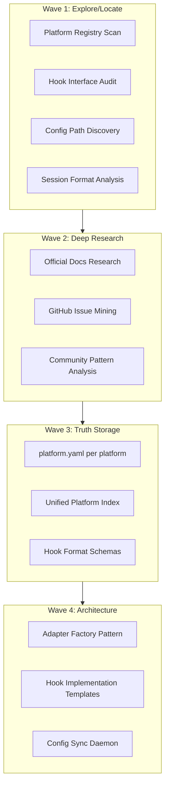
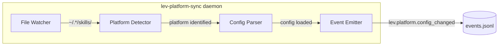

id: spec-platform-integration
title: Platform Integration Layer
status: draft
created: 2026-02-11
updated: 2026-02-13
group: platform-integration
sources:
  - spec-platform-integration-layer.md (base)
  - spec-platform-config-automation.md (superseded)
supersedes:
  - spec-platform-integration-layer.md
  - spec-platform-config-automation.md
---

# Platform Integration Layer: Registry, Hooks, Deploy Split, and Conformance

## Current State

- **30+ adapters** in flat `plugins/platforms/src/adapters/` (all extend BaseAdapter)
- **4 deploy adapters** + `DeterministicDeployAdapter` base now live in `plugins/deploy/`
- **OpenClaw bridge** with PlatformBridge (gateway sessions)
- **levd** is owned by `plugins/deploy/bin/levd` (core CLI no longer owns deploy binary)
- **Deploy status contract** is strict: `apply=dry_run|executed|failed`, `verify=verified|failed`, `rollback=rolled_back|failed`
- **Abstract hooks**: only `ClaudeCodeHooks` implemented (Cursor, Windsurf, OpenCode, Continue are TODO)
- **Tests**: only verify "file generates" - nothing checks tools actually accept configs
- **AGENTS.md**: emerging universal standard, 60k+ repos, 18+ tools support it
- **Poly framework**: designed for CLI/API/MCP exposure but only scans `core/*/config.yaml`, not plugins

## Architecture Decisions

### 1. Deploy Splits Out (`plugins/deploy/`, `ships-with: false`)

Deploy is opt-in. Ephemeral worker boxes and child Lev instances should not have deploy access. The poly framework handles CLI exposure via `config.yaml` declarations.

### 2. Coding + Gateways Stay Together (`plugins/platforms/`, `ships-with: true`)

All coding adapters do the same job: extend BaseAdapter, generate platform-specific config. No meaningful split between "editors" vs "terminals" vs "agents" - most tools now have both CLI and IDE modes.

### 3. Flat `adapters/` Splits to `coding/` + `gateways/`

Two directories based on what the code does (config gen vs bridge pattern), not what the platform is.

---

## Proposed Layout

```
plugins/platforms/                 # ships-with: true
├── config.yaml
├── package.json
├── registry/                      # Per-platform structured YAML
│   ├── _schema.yaml
│   ├── claude-code.yaml           # paths, surfaces, format, AGENTS.md support
│   ├── cursor.yaml
│   └── ... (30+ files)
├── templates/                     # (exists)
├── src/
│   ├── index.ts
│   ├── shared/
│   │   └── base-adapter.ts        # Subpath-exported for third-party use
│   ├── coding/                    # ALL coding tool config generators
│   │   ├── claude-code.ts
│   │   ├── cursor.ts
│   │   ├── windsurf.ts
│   │   ├── codex.ts, cline.ts, opencode.ts, antigravity.ts
│   │   ├── github-copilot.ts, roo.ts, auggie.ts, crush.ts
│   │   ├── trae.ts, iflow.ts, kilo.ts, kiro-cli.ts, qwen.ts, rovo-dev.ts
│   │   └── (future: any new coding tool)
│   └── gateways/                  # Platform bridges (different pattern)
│       ├── openclaw/
│       │   ├── bridge.ts
│       │   └── index.ts
│       ├── clawdbot.ts
│       └── agentping.ts
└── tests/
    ├── coding/
    ├── gateways/
    └── shared/

plugins/deploy/                    # NEW - ships-with: false
├── config.yaml                    # poly.sdk + poly.cli for levd
├── package.json                   # leviathan.type: plugin, ships-with: false
├── bin/levd                       # Moved from core/cli/bin/levd
├── src/
│   ├── shared/
│   │   └── deploy-adapter.ts      # DeterministicDeployAdapter base
│   └── adapters/
│       ├── docker.ts
│       ├── coolify.ts
│       ├── dokku.ts
│       └── heroku.ts
└── tests/
```

---

## Registry YAML Schema

```yaml
# plugins/platforms/registry/claude-code.yaml
platform:
  id: claude-code
  name: Claude Code
  vendor: Anthropic
  status: supported

surfaces:
  emit: true # BaseAdapter config gen
  sync: true # ConversationAdapter transcript ingest
  hooks: true # AbstractHooks lifecycle events
  bridge: false
  deploy: false

paths:
  skills: ~/.claude/skills/
  commands: ~/.claude/commands/
  hooks: ~/.claude/hooks/
  sessions: ~/.claude/projects/*/*.jsonl
  config: ~/.claude/
  rules: .claude/rules/
  agents_md: CLAUDE.md # vendor-specific canonical file

standards:
  agents_md: true # supports AGENTS.md
  mcp: true
  acp: true # Agent Client Protocol

research:
  last_verified: 2026-02-11
  confidence: high
```

---

## Files to Create/Move/Modify

### Create

- `plugins/deploy/` (entire new plugin)
- `plugins/deploy/config.yaml` (poly declarations)
- `plugins/platforms/registry/_schema.yaml`
- `plugins/platforms/registry/{platform}.yaml` (30+ files)
- `core/agent-adapter/src/hooks/{cursor,windsurf,opencode,continue}-hooks.ts`

### Move

- `core/cli/bin/levd` -> `plugins/deploy/bin/levd`
- `plugins/platforms/src/shared/deploy-adapter.ts` -> `plugins/deploy/src/shared/deploy-adapter.ts`
- `plugins/platforms/src/adapters/{docker,coolify,dokku,heroku}.ts` -> `plugins/deploy/src/adapters/`
- `plugins/platforms/src/adapters/*.ts` -> `plugins/platforms/src/coding/`
- `plugins/platforms/src/adapters/{clawdbot,agentping}.ts` -> `plugins/platforms/src/gateways/`

### Modify

- `plugins/platforms/src/index.ts` - re-export from `coding/` and `gateways/`
- `plugins/platforms/package.json` - remove deploy exports
- `core/cli/package.json` - remove `levd` from bin
- `core/polyglot-runners/src/registry-builder.js` - extend to scan `plugins/*/config.yaml`
- `docs/impl/05-platform-adapters.md` - update with taxonomy + deploy split
- `context/schemas/abstract-hooks.yaml` - trim: keep adapters + lifecycle_events only

---

## Testing Strategy Design (Future Epic)

### Three-Tier Conformance Architecture

**Tier 1: Schema Gates (CI: every PR)**

- JSON Schema for marketplace.json, mcp.json
- MDC frontmatter parse for .cursorrules
- YAML/TOML lint for Gemini, Rovo Dev configs
- Content section assertions (required sections present)
- Idempotency: same input = same output
- Extend `deploy-contract.shared.ts` pattern to `platform-contract.shared.ts`

**Tier 2: CLI Parser Gates (CI: nightly, Docker)**

- Docker container per CLI tool
- Install tool, generate config via adapter, run tool validation command
- Assert: exit code 0, no parse errors in stderr

| Platform    | Image            | Install                            | Validate         |
| ----------- | ---------------- | ---------------------------------- | ---------------- |
| claude-code | node:22-alpine   | npm i -g @anthropic-ai/claude-code | claude --help    |
| codex       | node:22-alpine   | npm i -g @openai/codex             | codex --version  |
| crush       | golang:1.22      | go install                         | crush --help     |
| aider       | python:3.12-slim | pip install aider-chat             | aider --help     |
| auggie      | node:22-alpine   | npm i -g @augmentcode/auggie       | auggie --help    |

**Tier 3: IDE Integration Gates (CI: weekly/manual, Docker + Xvfb + Computer-Use)**

- Cursor, Windsurf, VS Code + Copilot, Kiro, Trae
- Docker + Xvfb headless desktop
- Playwright or accessibility automation
- Open project with generated config, verify rules loaded, no error banners
- Screenshot diff for regression

### Adversarial Contract (`platform-contract.shared.ts`)

```typescript
assertFileGenerated(adapter, options): void;
assertSchemaConformance(output, schema): void;
assertContentSections(output, required: string[]): void;
assertIdempotent(adapter, options): void;
assertMalformedInputHandled(adapter): void;
assertNoRejectedTokens(output): void;
assertMaxLength(output, limit): void;
assertToolAccepts(platform, configPath): Promise<void>;  // Tier 2+
```

### Future Epic Breakdown

```
T1:  Define JSON schemas per platform output format
T2:  Create platform-contract.shared.ts (Tier 1 assertions)
T3:  Add schema tests to each adapter test file
T4:  Build Docker test matrix (YAML config + runner)
T5:  Create Dockerfiles for Tier 2 CLI tools
T6:  Implement Tier 2 runner (parallel containers)
T7:  Research computer-use for Tier 3 (Playwright + Xvfb)
T8:  Custom Docker images for IDE tools
T9:  Implement Tier 3 smoke tests
T10: Wire into CI (Tier 1: PR, Tier 2: nightly, Tier 3: weekly)
T11: Add platform-conformance.gates.yaml to ValidationGateExecutor
```

---

## Consolidated: Architecture & Implementation (from spec-platform-config-automation)

> The following sections contain unique content from the superseded `spec-platform-config-automation.md` that was not present in the base spec.

### Platform Taxonomy (Extended)

| Category                 | Examples                                    | Integration Pattern                |
| ------------------------ | ------------------------------------------- | ---------------------------------- |
| **Editors**              | Cursor, Windsurf, Cline, GitHub Copilot     | Config files (.cursorrules, etc.)  |
| **Terminal agents**      | Claude Code, Codex, OpenCode, Aider         | AGENTS.md, hooks, session sync     |
| **Agent frameworks**     | Auggie, Crush, Roo, Trae, iFlow, Kiro, Qwen | Config generation, protocol        |
| **Gateways**             | OpenClaw/Clawdbot                           | PlatformBridge (sessions, routing) |
| **Interaction surfaces** | AgentPing (11 sub-systems)                  | Protocol, MCP, CLI, HTTP, UI       |
| **Deploy targets**       | Docker, Coolify, Dokku, Heroku              | Plan/apply/verify/rollback         |
| **Protocols**            | A2A, AG-UI, MCP                             | Agent communication standards      |
| **Search/AI ecosystems** | Gemini, Antigravity                         | Brain artifacts, protobuf          |
| **Memory systems**       | (from workshop: mem0, graphiti, OpenViking) | Knowledge persistence              |
| **SaaS/productivity**    | (future: Notion, Linear, Slack)             | API integration                    |

### Surface Matrix

| Surface    | What it does          | Where it lives                       |
| ---------- | --------------------- | ------------------------------------ |
| **emit**   | Generate config files | `plugins/platforms/` (BaseAdapter)   |
| **sync**   | Ingest conversations  | `core/agent-adapter/src/sync/`       |
| **hooks**  | Lifecycle events      | `core/agent-adapter/src/hooks/`      |
| **bridge** | Gateway sessions      | `plugins/platforms/src/openclaw/`    |
| **deploy** | Infrastructure push   | `plugins/platforms/` (DeployAdapter) |

### Architecture Flow (Wave-based)



### Wave 1 Findings (Complete)

- **30+ adapters** exist, **84+ apps analyzed** in workshop
- **Hook format patterns**: bash (Claude), JSON (Cursor/Windsurf), YAML (OpenCode)
- **Config locations mapped** for skills, agents, commands, sessions
- **docs/impl/05-platform-adapters.md** already defines platform PRD
- **AgentPing** is 11 sub-systems, not a simple adapter
- **Plugin architecture** decision: one plugin, many adapters, `ships-with: true`

### Extend PlatformType

Update `core/agent-adapter/src/sync/types.ts`:

```typescript
export type PlatformType =
  // Tier 1: Ship-with
  | 'claude-code'
  | 'cursor'
  | 'codex'
  // Tier 2: High Priority
  | 'windsurf'
  | 'continue'
  | 'opencode'
  | 'aider'
  // Tier 3: Community
  | 'antigravity'
  | 'cline'
  | 'github-copilot'
  | 'roo'
  | 'auggie'
  // Tier 4: Emerging
  | 'kiro'
  | 'trae'
  | 'iflow'
  | 'kilo'
  | 'crush'
  | 'qwen'
  | 'rovo-dev'
```

### Hook Implementation Templates

```
core/agent-adapter/src/hooks/
├── abstract-hooks.ts      # (exists)
├── claude-code-hooks.ts   # (exists)
├── cursor-hooks.ts        # NEW - JSON format
├── windsurf-hooks.ts      # NEW - JSON format
├── opencode-hooks.ts      # NEW - YAML format
├── continue-hooks.ts      # NEW - JSON format (tool events only)
└── index.ts               # Factory (update to route all platforms)
```

### Config Sync Daemon Design



**Daemon responsibilities:**

1. Watch known config directories for changes
2. Detect which platform a config belongs to
3. Parse and validate against platform schema
4. Emit events for downstream consumers (index updates, etc.)

### Research Template Per Platform

```yaml
# plugins/platforms/registry/{platform}.yaml (extended schema)
platform:
  id: { platform-id }
  name: { Human Name }
  vendor: { Company }
  status: supported | experimental | planned

paths:
  skills:
    global: ~/.{platform}/skills/
    local: .{platform}/skills/
    format: SKILL.md | yaml | json
  agents:
    global: ~/.{platform}/agents/
    local: .{platform}/agents/
    format: md | yaml
  commands:
    global: ~/.{platform}/commands/
    local: .{platform}/commands/
    format: md | yaml
  sessions:
    global: ~/.{platform}/sessions/*.jsonl
    local: null
    format: jsonl | sqlite | json | markdown
  hooks:
    global: ~/.{platform}/hooks/
    local: .{platform}/hooks/
    format: bash | json | yaml

hooks:
  supported_events: [session, tool, task, validation]
  format: bash_script | json_config | yaml_config
  installation_method: directory | config_file | plugin

storage:
  primary_format: jsonl | sqlite | json | markdown
  schema_version: null | known
  documentation_url: https://...

research:
  last_updated: 2026-02-03
  sources:
    - type: official_docs
      url: https://...
    - type: github_issue
      url: https://...
  confidence: high | medium | low
  notes: |
    Any special considerations...
```

### Research Execution Strategy

For Wave 2 deep research, use lev-research skill with:

```bash
# Per-platform research (parallel where possible)
lev-research "{platform} IDE configuration paths skills hooks" --deep

# Sources to query:
# - Official documentation
# - GitHub repos and issues
# - Community forums (Reddit, Discord)
# - npm/pip package configs
```

### Platform Research Priority Tiers

**Tier 1 (Ship-with)**: Claude Code, Cursor, Codex

**Tier 2 (High Priority)**: Windsurf, Continue, OpenCode, Aider

**Tier 3 (Community)**: Antigravity, Cline, GitHub Copilot, Roo, Auggie

**Tier 4 (Emerging)**: Kiro, Trae, iFlow, Kilo, Crush, Qwen, Rovo-Dev

---

## Success Criteria

1. **Deploy plugin**: `plugins/deploy/` created with levd + 4 deploy adapters, `ships-with: false`
2. **Platforms reorganized**: `plugins/platforms/src/` split to `coding/` + `gateways/`
3. **Registry**: `plugins/platforms/registry/*.yaml` with per-platform structured data (30+ files)
4. **Poly extended**: `registry-builder.js` scans `plugins/*/config.yaml`
5. **PRD updated**: `docs/impl/05-platform-adapters.md` reflects taxonomy + deploy split
6. **4 new hook implementations** (Cursor, Windsurf, OpenCode, Continue)
7. **Schema trim**: `abstract-hooks.yaml` reduced to adapters + lifecycle_events
8. **Core/cli cleaned**: `levd` removed from `core/cli/bin/`, no core->plugin dependency
9. **Testing strategy**: 3-tier conformance architecture documented
10. **Adversarial contract**: `platform-contract.shared.ts` pattern defined

---

<details><summary>Superseded: spec-platform-config-automation (subset of this spec)</summary>

---

name: Platform Config Automation
overview: Reorganize the platform integration layer - split deploy into its own plugin (levd), restructure coding adapters with registry YAML, research all 30+ platforms, implement missing hook adapters, and extend poly to scan plugins.
todos:

- id: wave2-research-tier1
  content: Deep research Tier 1 platforms (Claude Code, Cursor, Codex) - official docs, GitHub, community
  status: pending
- id: wave2-research-tier2
  content: Deep research Tier 2 platforms (Windsurf, Continue, OpenCode, Aider)
  status: pending
- id: wave2-research-tier3-4
  content: Deep research Tier 3-4 platforms (Antigravity, Cline, Copilot, Kiro, etc.)
  status: pending
- id: wave3-schema
  content: Create minimal platform config schema; trim abstract-hooks.yaml (keep adapters + lifecycle_events)
  status: pending
- id: wave3-yaml-files
  content: Create {platform}.yaml truth files for all 19+ platforms
  status: pending
- id: wave3-index
  content: Create 10-platforms.md in ~/lev/docs with platform registry
  status: pending
- id: wave4-expand-types
  content: Expand PlatformType in types.ts to include all platforms
  status: pending
- id: wave4-cursor-hooks
  content: Implement CursorHooks class (JSON format)
  status: pending
- id: wave4-windsurf-hooks
  content: Implement WindsurfHooks class (JSON format)
  status: pending
- id: wave4-opencode-hooks
  content: Implement OpenCodeHooks class (YAML format)
  status: pending
- id: wave4-continue-hooks
  content: Implement ContinueHooks class (JSON format, tool events only)
  status: pending
- id: wave4-sync-daemon
  content: Design and implement platform config sync daemon
  status: pending
- id: schema-trim
  content: Trim abstract-hooks.yaml - remove interface, payloads, integration; keep adapters + lifecycle_events
  status: pending
  isProject: false

---

# Platform Integration Layer: Registry, Hooks, and Automation

## Current State Analysis

### What Exists

- **30+ adapters** in `plugins/platforms/src/adapters/` (all extend BaseAdapter for config generation)
- **4 deploy adapters** (Docker, Coolify, Dokku, Heroku) extending DeployAdapter
- **OpenClaw bridge** with PlatformBridge interface (gateway sessions)
- **Abstract hooks** in `core/agent-adapter/src/hooks/` (only ClaudeCodeHooks implemented)
- **Sync registry** in `core/agent-adapter/src/sync/registry.ts` (7 platforms for transcript ingestion)
- **PRD already exists**: `docs/impl/05-platform-adapters.md` (30+ adapters, ExecutorPort kernel direction)
- **84+ analyzed apps** in `workshop/analysis/` and 36 POCs in `workshop/pocs/`

### The Core Problem: Taxonomy

`plugins/platforms/` treats everything as an "adapter" in a flat `adapters/` directory, but the integrations span fundamentally different categories:

**By what they ARE:**

| Category                 | Examples                                    | Integration Pattern                |
| ------------------------ | ------------------------------------------- | ---------------------------------- |
| **Editors**              | Cursor, Windsurf, Cline, GitHub Copilot     | Config files (.cursorrules, etc.)  |
| **Terminal agents**      | Claude Code, Codex, OpenCode, Aider         | AGENTS.md, hooks, session sync     |
| **Agent frameworks**     | Auggie, Crush, Roo, Trae, iFlow, Kiro, Qwen | Config generation, protocol        |
| **Gateways**             | OpenClaw/Clawdbot                           | PlatformBridge (sessions, routing) |
| **Interaction surfaces** | AgentPing (11 sub-systems)                  | Protocol, MCP, CLI, HTTP, UI       |
| **Deploy targets**       | Docker, Coolify, Dokku, Heroku              | Plan/apply/verify/rollback         |
| **Protocols**            | A2A, AG-UI, MCP                             | Agent communication standards      |
| **Search/AI ecosystems** | Gemini, Antigravity                         | Brain artifacts, protobuf          |
| **Memory systems**       | (from workshop: mem0, graphiti, OpenViking) | Knowledge persistence              |
| **SaaS/productivity**    | (future: Notion, Linear, Slack)             | API integration                    |

**By what surfaces they need:**

| Surface    | What it does          | Where it lives                       |
| ---------- | --------------------- | ------------------------------------ |
| **emit**   | Generate config files | `plugins/platforms/` (BaseAdapter)   |
| **sync**   | Ingest conversations  | `core/agent-adapter/src/sync/`       |
| **hooks**  | Lifecycle events      | `core/agent-adapter/src/hooks/`      |
| **bridge** | Gateway sessions      | `plugins/platforms/src/openclaw/`    |
| **deploy** | Infrastructure push   | `plugins/platforms/` (DeployAdapter) |

### Decision: Split Deploy Out, Keep Coding + Gateways Together

`**plugins/platforms/**` stays as one plugin (`ships-with: true`) for coding tool config gen + gateways. The flat `adapters/` directory splits into `coding/` and `gateways/`.

`**plugins/deploy/**` becomes a NEW plugin (`ships-with: false`) owning levd CLI + deploy adapters. Deploy is a capability, not a default - ephemeral worker boxes and child Lev instances should not have deploy access. The poly framework handles CLI/API/MCP exposure via `config.yaml` declarations.

**Prerequisite**: Extend `core/polyglot-runners/src/registry-builder.js` to scan `plugins/*/config.yaml` (already planned per `plugins/README.md`).

### Config/Schema Alignment

- **Format**: YAML, with schema enforcement via `core/build` compose/schema pattern
- **Truth**: `docs/impl/05-platform-adapters.md` exists; add `registry/` for structured per-platform YAML
- **Trim fat**: Remove unused fields from `abstract-hooks.yaml` (interface, payloads, integration stubs)

---

## Architecture


---

## Wave 1: Explore/Locate (Complete)

Found:

- **30+ adapters** exist, **84+ apps analyzed** in workshop
- **Hook format patterns**: bash (Claude), JSON (Cursor/Windsurf), YAML (OpenCode)
- **Config locations mapped** for skills, agents, commands, sessions
- **docs/impl/05-platform-adapters.md** already defines platform PRD
- **AgentPing** is 11 sub-systems, not a simple adapter
- **Plugin architecture** decision: one plugin, many adapters, `ships-with: true`

---

## Wave 2: Deep Research - Per-Platform Investigation

Research each platform for:

1. **Official config paths** (skills, agents, commands, hooks)
2. **Session/history storage format** (JSONL, SQLite, Markdown, JSON)
3. **Hook/plugin API** (if exposed)
4. **Version-specific differences** (breaking changes between versions)

### Platforms to Research (Priority Order)

**Tier 1 (Ship-with)**: Claude Code, Cursor, Codex

**Tier 2 (High Priority)**: Windsurf, Continue, OpenCode, Aider

**Tier 3 (Community)**: Antigravity, Cline, GitHub Copilot, Roo, Auggie

**Tier 4 (Emerging)**: Kiro, Trae, iFlow, Kilo, Crush, Qwen, Rovo-Dev

### Research Template Per Platform

```yaml
# ~/lev/plugins/platforms/platforms/{platform}.yaml
platform:
  id: { platform-id }
  name: { Human Name }
  vendor: { Company }
  status: supported | experimental | planned

paths:
  skills:
    global: ~/.{platform}/skills/
    local: .{platform}/skills/
    format: SKILL.md | yaml | json
  agents:
    global: ~/.{platform}/agents/
    local: .{platform}/agents/
    format: md | yaml
  commands:
    global: ~/.{platform}/commands/
    local: .{platform}/commands/
    format: md | yaml
  sessions:
    global: ~/.{platform}/sessions/*.jsonl
    local: null
    format: jsonl | sqlite | json | markdown
  hooks:
    global: ~/.{platform}/hooks/
    local: .{platform}/hooks/
    format: bash | json | yaml

hooks:
  supported_events: [session, tool, task, validation]
  format: bash_script | json_config | yaml_config
  installation_method: directory | config_file | plugin

storage:
  primary_format: jsonl | sqlite | json | markdown
  schema_version: null | known
  documentation_url: https://...

research:
  last_updated: 2026-02-03
  sources:
    - type: official_docs
      url: https://...
    - type: github_issue
      url: https://...
  confidence: high | medium | low
  notes: |
    Any special considerations...
```

---

## Wave 3: Truth Storage and Reorganization

### Truth Locations

- `**docs/impl/05-platform-adapters.md**` - PRD (already exists, update with categories)
- `**plugins/platforms/registry/**` - Per-platform YAML (structured data, next to code)

### Proposed Layout: Two Plugins

```
plugins/platforms/                 # ships-with: true
├── config.yaml
├── package.json
├── registry/                      # NEW - Per-platform structured YAML
│   ├── _schema.yaml               # Validation schema
│   ├── claude-code.yaml
│   ├── cursor.yaml
│   └── ... (30+ files)
├── templates/                     # (exists)
├── src/
│   ├── index.ts
│   ├── shared/
│   │   └── base-adapter.ts        # Config gen base (zero deps, subpath exported)
│   │
│   ├── coding/                    # ALL coding tool config generators
│   │   ├── claude-code.ts         #   Every tool does the same job:
│   │   ├── cursor.ts              #   extend BaseAdapter, generate
│   │   ├── windsurf.ts            #   platform-specific config files
│   │   ├── codex.ts
│   │   ├── cline.ts
│   │   ├── opencode.ts
│   │   ├── antigravity.ts
│   │   ├── github-copilot.ts
│   │   ├── roo.ts
│   │   ├── auggie.ts
│   │   ├── crush.ts
│   │   ├── trae.ts
│   │   ├── iflow.ts
│   │   ├── kilo.ts
│   │   ├── kiro-cli.ts
│   │   ├── qwen.ts
│   │   └── rovo-dev.ts
│   │
│   └── gateways/                  # Platform bridges (different pattern)
│       ├── openclaw/
│       │   ├── bridge.ts
│       │   └── index.ts
│       ├── clawdbot.ts
│       └── agentping.ts
│
└── tests/
    ├── coding/
    ├── gateways/
    └── shared/

plugins/deploy/                    # NEW - ships-with: false (opt-in)
├── config.yaml                    # poly.sdk + poly.cli declarations
│                                  #   levd exposed via poly, not hardcoded in core/cli
├── package.json                   # leviathan.type: plugin, ships-with: false
├── bin/
│   └── levd                       # Moved from core/cli/bin/levd
├── src/
│   ├── index.ts
│   ├── deploy-adapter.ts          # DeterministicDeployAdapter base
│   ├── docker.ts
│   ├── coolify.ts
│   ├── dokku.ts
│   └── heroku.ts
└── tests/
    ├── docker.test.ts
    ├── coolify.test.ts
    ├── dokku.test.ts
    └── heroku.test.ts
```

### Schema Trim: abstract-hooks.yaml

**Keep** (used by code):

- `adapters` - hook_location, format, events_supported
- `lifecycle_events` - event names

**Remove** (not used):

- `interface` - redundant with TypeScript IAbstractHooks
- `payloads` - not validated anywhere
- `integration` - bd/ralph/flowmind stubs not implemented

### registry/ YAML Schema (Minimal)

```yaml
# registry/claude-code.yaml
platform:
  id: claude-code
  name: Claude Code
  vendor: Anthropic
  type: terminal # editor | terminal | agent | gateway | search
  status: supported

surfaces:
  emit: true # BaseAdapter config gen
  sync: true # ConversationAdapter transcript ingest
  hooks: true # AbstractHooks lifecycle events
  bridge: false
  deploy: false

paths:
  skills: ~/.claude/skills/
  commands: ~/.claude/commands/
  hooks: ~/.claude/hooks/
  sessions: ~/.claude/projects/*/*.jsonl
  config: ~/.claude/

research:
  last_verified: 2026-02-11
  confidence: high
```

---

## Wave 4: Architecture Implementation

### 4.1 Extend PlatformType

Update `core/agent-adapter/src/sync/types.ts`:

```typescript
export type PlatformType =
  // Tier 1: Ship-with
  | 'claude-code'
  | 'cursor'
  | 'codex'
  // Tier 2: High Priority
  | 'windsurf'
  | 'continue'
  | 'opencode'
  | 'aider'
  // Tier 3: Community
  | 'antigravity'
  | 'cline'
  | 'github-copilot'
  | 'roo'
  | 'auggie'
  // Tier 4: Emerging
  | 'kiro'
  | 'trae'
  | 'iflow'
  | 'kilo'
  | 'crush'
  | 'qwen'
  | 'rovo-dev'
```

### 4.2 Hook Implementation Templates

Create per-platform hook classes extending `AbstractHooks`:

```
core/agent-adapter/src/hooks/
├── abstract-hooks.ts      # (exists)
├── claude-code-hooks.ts   # (exists)
├── cursor-hooks.ts        # NEW - JSON format
├── windsurf-hooks.ts      # NEW - JSON format
├── opencode-hooks.ts      # NEW - YAML format
├── continue-hooks.ts      # NEW - JSON format (tool events only)
└── index.ts               # Factory (update to route all platforms)
```

### 4.3 Config Sync Daemon Design


**Daemon responsibilities:**

1. Watch known config directories for changes
2. Detect which platform a config belongs to
3. Parse and validate against platform schema
4. Emit events for downstream consumers (index updates, etc.)

---

## Implementation Files to Create/Modify

### New Files

| File                                             | Purpose                                                      |
| ------------------------------------------------ | ------------------------------------------------------------ |
| `plugins/deploy/`                                | NEW plugin: levd CLI + deploy adapters (`ships-with: false`) |
| `plugins/deploy/config.yaml`                     | Poly declarations (sdk, cli) for levd                        |
| `plugins/platforms/registry/_schema.yaml`        | Minimal platform config schema                               |
| `plugins/platforms/registry/{platform}.yaml`     | Per-platform YAML (30+ files)                                |
| `core/agent-adapter/src/hooks/cursor-hooks.ts`   | Cursor hook implementation                                   |
| `core/agent-adapter/src/hooks/windsurf-hooks.ts` | Windsurf hook implementation                                 |
| `core/agent-adapter/src/hooks/opencode-hooks.ts` | OpenCode hook implementation                                 |
| `core/agent-adapter/src/hooks/continue-hooks.ts` | Continue hook implementation                                 |

### Files to Move

| From                                                     | To                                     | Reason                     |
| -------------------------------------------------------- | -------------------------------------- | -------------------------- |
| `core/cli/bin/levd`                                      | `plugins/deploy/bin/levd`              | Deploy is opt-in, not core |
| `plugins/platforms/src/shared/deploy-adapter.ts`         | `plugins/deploy/src/shared/deploy-adapter.ts` | Owned by deploy plugin     |
| `plugins/platforms/src/adapters/docker.ts`               | `plugins/deploy/src/adapters/docker.ts`        | Deploy adapter             |
| `plugins/platforms/src/adapters/coolify.ts`              | `plugins/deploy/src/adapters/coolify.ts`       | Deploy adapter             |
| `plugins/platforms/src/adapters/dokku.ts`                | `plugins/deploy/src/adapters/dokku.ts`         | Deploy adapter             |
| `plugins/platforms/src/adapters/heroku.ts`               | `plugins/deploy/src/adapters/heroku.ts`        | Deploy adapter             |
| `plugins/platforms/src/adapters/*.ts`                    | `plugins/platforms/src/coding/*.ts`    | Coding adapters            |
| `plugins/platforms/src/adapters/{clawdbot,agentping}.ts` | `plugins/platforms/src/gateways/`      | Gateway adapters           |

### Files to Modify

| File                                            | Changes                                               |
| ----------------------------------------------- | ----------------------------------------------------- |
| `plugins/platforms/src/index.ts`                | Re-export from `coding/` and `gateways/`              |
| `plugins/platforms/package.json`                | Remove deploy-related exports                         |
| `core/cli/package.json`                         | Remove `levd` from bin                                |
| `core/polyglot-runners/src/registry-builder.js` | Extend scan to `plugins/*/config.yaml`                |
| `docs/impl/05-platform-adapters.md`             | Update with taxonomy + deploy split                   |
| `context/schemas/abstract-hooks.yaml`           | **Trim fat**: remove interface, payloads, integration |

---

## Research Execution Strategy

For Wave 2 deep research, use lev-research skill with:

```bash
# Per-platform research (parallel where possible)
lev-research "{platform} IDE configuration paths skills hooks" --deep

# Sources to query:
# - Official documentation
# - GitHub repos and issues
# - Community forums (Reddit, Discord)
# - npm/pip package configs
```

---

## Success Criteria

1. **Deploy plugin**: `plugins/deploy/` created with levd + 4 deploy adapters, `ships-with: false`
2. **Platforms reorganized**: `plugins/platforms/src/` split to `coding/` + `gateways/`
3. **Registry**: `plugins/platforms/registry/*.yaml` with per-platform structured data (30+ files)
4. **Poly extended**: `registry-builder.js` scans `plugins/*/config.yaml`
5. **PRD updated**: `docs/impl/05-platform-adapters.md` reflects taxonomy + deploy split
6. **4 new hook implementations** (Cursor, Windsurf, OpenCode, Continue)
7. **Schema trim**: `abstract-hooks.yaml` reduced to adapters + lifecycle_events
8. **Core/cli cleaned**: `levd` removed from `core/cli/bin/`, no core->plugin dependency

</details>
