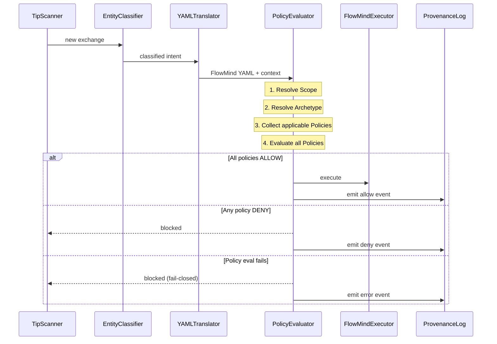
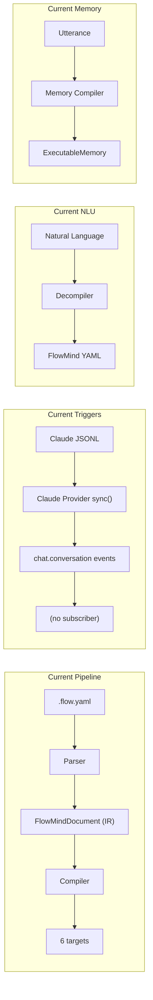
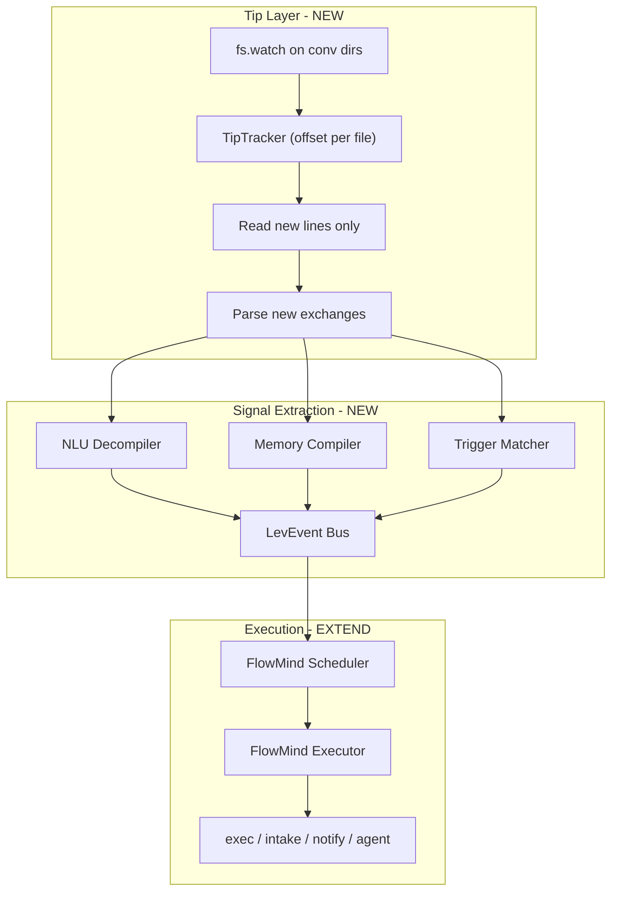

# Spec: FlowMind Parser-at-Tip

**Owner:** Lev Core / FlowMind
**Type:** Feature Spec + Architecture Spike

**REVISION NOTE (2026-02-11):** Kernel governance layer changed from ad-hoc AVAC to ABAC via kernel FlowMind substrate. TypeScript prototype first (`core/flowmind/src/kernel/`), Rust port (`crates/lev-kernel/`) when interfaces stabilize. Kernel FlowMind = restricted FlowMind subset that becomes part of the substrate (everything flows through it). Ratchet constraint system loads INTO the kernel as kernel FlowMind declarations. See plans: `parser-at-tip_with_abac`, `kernel_substrate_prototype`, `lev_kernel_runtime_plan`.

---

## 1. Business Case

### Problem Statement

FlowMind has a full compilation pipeline (YAML -> 6 targets), an NLU decompiler (NL -> YAML), a memory compiler (satisfaction -> executable memory), and a trigger system that parses Claude Code JSONL. But these pieces are **not wired together at the conversation tip**. The daemon scheduler only handles cron. The Claude provider does batch `sync()` with no incremental tracking. The NLU decompiler uses keyword regex. There is no live loop from "user says something in IDE" to "FlowMind reacts."

**Core question:** What is the user's intent? What commands do we need to run? What is he telling us to do?

This is **entity classification** — and we need a fine-tuned model, not keyword matching.

### User Value

1. **Real-time intent detection** -- FlowMind reacts to conversation, not just YAML files
2. **Learned classification** -- Fine-tuned model beats keyword regex on accuracy and generalization
3. **Safe by default** -- ABAC governance prevents prompt injection in generated YAML
4. **Fast by default** -- Tiered triage handles large content without blocking

### Strategic Alignment

- **FlowMind Kernel Item #10:** "FlowMind parser + lazy scan -- Parser at tip; IDE-specific conversation scanning"
- **Self-Learning Pipeline:** Training data extraction from bench fixtures + conversation history
- **Memory as Program:** Executable memories detected at the tip feed the memory compiler
- **Kernel ABAC:** Policy-based governance extends the kernel's 9-primitive model

---

## 2. Architecture Overview

### The Full Pipeline

```
Conversation Tip (JSONL)
    |
    v
[T0] Structural Triage (<0.1ms)
    |-- size bucket, media detection, tool-call extraction
    |-- large content -> async chunker
    |-- short text -> inline classification
    |
    v
[T1] Keyword Fast-Path (<1ms, ~70% accuracy)
    |-- regex patterns from existing decompiler
    |-- clear signals: "when X do Y", "remember that", "every day at"
    |-- HIT -> emit signal + skip T2/T3
    |
    v
[T2] Embedding Centroid (~3ms, ~85% accuracy)
    |-- all-MiniLM-L6-v2 (1.1ms on Apple Silicon via CoreML)
    |-- cosine similarity against pre-computed intent vectors
    |-- 8 FlowMind construct centroids + 8 lifecycle state centroids
    |
    v
[T3] Fine-Tuned Model (~200ms, ~95% accuracy) [ASYNC]
    |-- flowmind-compiler (Qwen2.5-Coder-7B + MLX LoRA)
    |-- NL -> structured FlowMind JSON
    |-- emit provisional signal from T1/T2, correct if T3 disagrees
    |
    v
[ABAC] Policy Evaluator
    |-- Scope resolution
    |-- Archetype filtering
    |-- Policy evaluation (deny-by-default, fail-closed)
    |-- Provenance emission
    |
    v
FlowMind Executor
```

### Component Diagram

```
                    +-----------------+
                    | Conversation    |
                    | Files (JSONL)   |
                    +--------+--------+
                             |
                    +--------v--------+
                    |   TipTracker    |
                    | (byte offset    |
                    |  persistence)   |
                    +--------+--------+
                             |
                    +--------v--------+
                    |   TipReader     |
                    | (read from tip) |
                    +--------+--------+
                             |
                    +--------v--------+
                    |  TipParser      |
                    | (exchange       |
                    |  grouping)      |
                    +--------+--------+
                             |
              +--------------+--------------+
              |              |              |
     +--------v---+  +------v------+  +----v---------+
     | T0: Triage |  | Chunker     |  | Media        |
     | (size,type)|  | (sliding    |  | Detector     |
     +--------+---+  |  window)    |  | (async)      |
              |      +------+------+  +--------------+
              |             |
     +--------v-------------v--------+
     |    Entity Classifier Cascade  |
     |  T1: Keyword -> T2: Embed    |
     |       -> T3: Fine-tuned LLM  |
     +--------+----------------------+
              |
     +--------v--------+
     |  YAML Translator |
     | (intent -> YAML) |
     +--------+---------+
              |
     +--------v--------+
     | ABAC Policy     |
     | Evaluator       |
     +--------+---------+
              |
     +--------v--------+
     | FlowMind        |
     | Executor        |
     +-----------------+
```

---

## 3. Component Specifications

### 3.1 TipTracker -- Incremental File Position Tracking

**Location:** `core/flowmind/src/tip/tracker.ts`

Tracks byte offset per conversation file. Persists to `.lev/tip-state.json`. On daemon restart, resumes from last position.

```typescript
interface TipState {
  filePath: string
  byteOffset: number
  lineNumber: number
  lastExchangeId?: string
  lastScanTime: string
}

interface TipStore {
  get(filePath: string): TipState | undefined
  set(filePath: string, state: TipState): void
  persist(): Promise<void> // .lev/tip-state.json
  load(): Promise<void>
}
```

### 3.2 TipReader -- Read New Lines from Offset

**Location:** `core/flowmind/src/tip/reader.ts`

Opens file at stored byte offset, reads forward. Same `createReadStream` + `readline` pattern as Claude provider but with `{ start: offset }`.

### 3.3 TipParser -- Incremental Exchange Grouping

**Location:** `core/flowmind/src/tip/parser.ts`

Extracts from Claude provider's exchange-grouping logic. Holds partial exchanges until assistant response arrives.

### 3.4 Input Triage (T0)

**Location:** `core/flowmind/src/tip/triage.ts`

Deterministic routing based on structural properties:

```typescript
interface TriageResult {
  route: 'inline' | 'chunked' | 'media' | 'skip'
  contentType: 'text' | 'code' | 'image' | 'tool_call' | 'mixed'
  textLength: number
  hasMedia: boolean
  hasCode: boolean
  chunks?: string[] // if route === 'chunked'
}

function triage(exchange: ParsedExchange): TriageResult {
  // 1. Tool-call only exchanges -> extract file ops, skip NLU
  // 2. Image/media references -> async media pipeline
  // 3. > 2000 chars -> chunk into sliding windows (500 char, 100 overlap)
  // 4. <= 2000 chars -> inline classification
  // 5. Code-heavy (>60% code blocks) -> extract prose, classify separately
}
```

**Chunking strategy:**

- Turn-based boundaries (user + assistant = 1 exchange)
- First-N window (500 chars) for quick classification of long exchanges
- Code block extraction as separate metadata
- Sliding window (500 char, 100 overlap) for full analysis of chunked content

### 3.5 Entity Classifier Cascade (T1 -> T2 -> T3)

**Location:** `core/flowmind/src/tip/classifier.ts`

#### T1: Keyword Fast-Path

Reuses existing decompiler patterns from `core/flowmind/src/decompiler/index.ts`:

- "when X do Y" -> trigger intent
- "remember that X" -> memory intent
- "every day at X" -> schedule intent
- Clear command prefixes -> execution intent

If confidence > 0.8 from keyword match, emit immediately and skip T2/T3.

#### T2: Embedding Centroid

Pre-computed intent centroids using all-MiniLM-L6-v2:

```typescript
interface IntentCentroid {
  label: string // e.g., 'trigger', 'memory', 'schedule'
  vector: Float32Array // 384-dim embedding
  threshold: number // cosine similarity threshold
  examples: string[] // training examples for this centroid
}

// Pre-compute from bench fixtures:
// - 6 FlowMind construct centroids (IF_THEN_ELSE, EXECUTE, LOAD, ROUTE, PARALLEL, LOOP)
// - 8 lifecycle state centroids (brainstorm, refinement, execution, etc.)
// - 3 meta-intents (trigger, memory, no_signal)
```

Latency: ~3ms total (1.1ms embed + 1.9ms centroid comparison).

#### T3: Fine-Tuned Model (Async)

**Model:** `flowmind-compiler` (Qwen2.5-Coder-7B-Instruct + MLX LoRA)
**Training data:** 50 bench fixtures -> augmented to 250+ examples
**Inference:** Ollama with structured output constraint (JSON schema)
**Latency:** ~200ms via Ollama local

Emits provisional classification from T1/T2 immediately. T3 runs async and corrects if it disagrees. Disagreements logged as training data for centroid refinement.

### 3.6 YAML Translator

**Location:** `core/flowmind/src/tip/translator.ts`

Converts classified intent + extracted entities to FlowMind YAML. Two paths:

1. **Pattern-based** (from T1/T2 classification): Uses existing decompiler output
2. **LLM-generated** (from T3): Uses fine-tuned model's structured JSON output directly

### 3.7 Governance Layer -- ABAC Policy Evaluator

**Location:** `core/flowmind/src/kernel/` (TypeScript prototype)

<!-- CONFLICT: The original v2 spec described an "AVAC Scanner" with three layers (L1: Schema Validation, L2: Pattern Scanning, L3: Semantic Analysis). The ABAC revision replaces this with a PolicyEvaluator using Attribute-Based Access Control. The AVAC layer concepts are preserved below for reference, but the ABAC model is the active design direction.

AVAC Scanner (original v2 design):
- L1: Schema Validation (< 1ms) -- YAML size limit, safe parse, JSON Schema, prototype pollution check
- L2: Pattern Scanning (< 10ms) -- Command denylist/allowlist, path traversal, variable expansion denylist, YARA-style prompt injection, ChatML detection
- L3: Semantic Analysis (100-500ms, async, LLM-generated only) -- DeBERTa classifier, vector similarity against known-attack embeddings, optional LLM judge, canary token detection

The AVAC checks map to ABAC policies as follows (see "What Stays vs What Changes" in consolidated sections).
-->

The governance layer uses **ABAC** (Attribute-Based Access Control), implementing the kernel's 9-primitive model. The existing AVAC checks (command denylist, variable guard, prompt injection scanning) become **Policies** evaluated by an ABAC engine.

Kernel invariants:

- **Invariant 1 (Deny by Default):** If no Policy explicitly allows an action, deny
- **Invariant 2 (Fail-Closed):** If Policy cannot be evaluated, deny
- **Invariant 6 (Provenance Required):** All policy evaluations emit Provenance events

**Integration:** The PolicyEvaluator is called pre-action in the executor. Policies are declared in `.lev/declaration/policies/`.

```yaml
# .lev/declaration/policies/shell-exec-guard.yaml
apiVersion: lev.dev/v1
kind: Policy
metadata:
  name: shell-exec-guard
  scope: project
  keywords: [rm, sudo, eval, curl] # Aho-Corasick quick-reject
spec:
  attachesTo:
    - capability: shell-exec
  effect: deny
  condition:
    type: denylist
    patterns:
      - 'rm\s+(-rf?|--recursive)'
      - 'curl.*\|\s*(sh|bash)'
      - '\bsudo\b'
      - '\beval\s*\('
  priority: 100
```

**CRITICAL P0 FIX:** The existing `executeExec` in `core/flowmind/src/executor.ts` passes commands directly to `/bin/bash -c` with zero sanitization. The `substituteVariables` function falls back to `process.env[name]`, enabling secret exfiltration. These need guards before any conversation-driven execution.

---

## 4. Fine-Tuning Pipeline

### Training Data Preparation

Source: `core/flowmind/bench/fixtures/flowmind-eval-suite.yaml` (50 fixtures)

1. Convert YAML fixtures to `mlx-lm` chat JSONL format
2. Augment from 50 -> 250+ examples:
   - Paraphrase augmentation (3-5 rephrasings per fixture)
   - Schema-aware synthesis for underrepresented constructs
   - Negative examples (10-20% invalid/ambiguous inputs)
3. Split 90/10 train/validation

### MLX LoRA Training

```bash
# Model: Qwen2.5-Coder-7B-Instruct (NOT Qwen3-30B MoE -- broken LoRA)
# Hardware: M3 Studio 512GB, bf16 precision (no quantization needed)
# Time: ~15 minutes

mlx_lm.lora \
  --model mlx-community/Qwen2.5-Coder-7B-Instruct-bf16 \
  --train --data ./data \
  --iters 600 --batch-size 4 \
  --lora-layers 16 --learning-rate 1e-5 \
  --adapter-path ./adapters
```

### Export to Ollama

```bash
# Fuse adapters
mlx_lm.fuse --model ... --adapter-path ./adapters --save-path ./fused-model --de-quantize

# Convert to GGUF
python llama.cpp/convert_hf_to_gguf.py ./fused-model --outtype f16 --outfile flowmind-7b-f16.gguf

# Quantize Q5_K_M (best quality/size for structured output)
llama-quantize flowmind-7b-f16.gguf flowmind-7b-Q5_K_M.gguf Q5_K_M

# Deploy
ollama create flowmind-compiler -f Modelfile
```

### Evaluation

Run against existing bench harness:

```bash
python eval_flowmind.py --model flowmind-compiler
```

**Targets:**

- Schema compliance > 95% (currently 90% with base Qwen2.5-coder)
- Semantic accuracy > 70% (currently 24%)
- Construct selection > 80% (currently 57%)
- Weighted score > 0.85 (currently 0.52)

---

## 5. Validation Strategy -- Test Triads

Each gate is a triad: Unit (isolated), Integration (wired), E2E (full pipeline).

Test methods baked in:

- AAA (Arrange-Act-Assert) -- every test case
- ABAC Triples (Subject/Archetype, Resource/Capability, Action) -> Verdict
- Input-Policy-Verdict (input YAML, policy evaluated, allow/deny) -> decision trace
- TDD (Red-Green-Refactor) -- critical-path gates written test-first

### Gate Summary

| Gate                     | Unit                                | Integration                      | E2E                                                |
| ------------------------ | ----------------------------------- | -------------------------------- | -------------------------------------------------- |
| G1: Deny by Default      | Empty policy set -> deny            | No policy dir -> step blocked    | No allow policy -> conversation intent denied      |
| G2: Fail-Closed          | Loader throws -> deny               | Corrupt YAML -> deny all         | Policy dir corrupted mid-session -> deny           |
| G3: Deny Overrides Allow | Mixed allow+deny -> deny wins       | Both policy files loaded -> deny | "lev exec --force" -> allowlist + denylist -> deny |
| G4: Shell Injection      | Denylist patterns -> deny           | Executor never calls spawnSync   | Injected rm -rf -> full pipeline block             |
| G5: Secret Exfiltration  | Secret var patterns -> deny         | Env var never expanded           | "show API key" -> full pipeline block              |
| G6: Happy Path           | Allow triple -> allow               | Executor calls spawnSync         | "run linter" -> executed + provenance              |
| G7: Provenance           | Event populated per eval            | 3 evals -> 3 JSONL events        | Full session -> complete audit trail               |
| G8: Archetype Routing    | human-authored skips injection-scan | Trusted YAML skips scan policy   | Manual .flow.yaml -> reduced policy set            |
| G9: Tip Resumability     | Offset persists/restores            | Restart -> no duplicates         | Daemon restart -> seamless continuation            |
| G10: Classifier Cascade  | T0/T1/T2 route correctly            | 5 exchange types classified      | Mixed conversation -> all classified               |
| G11: Model Quality       | Bench suite > 0.85 weighted         | Each construct type passes       | Side-by-side beats keyword + base model            |

### Bench Evaluation Targets (G11 detail)

| Metric              | Baseline (prompt-only) | Target (fine-tuned) |
| ------------------- | ---------------------- | ------------------- |
| Schema compliance   | 90%                    | > 95%               |
| Semantic accuracy   | 24%                    | > 70%               |
| Construct selection | 57%                    | > 80%               |
| Cognitive routing   | 0%                     | > 50%               |
| Weighted score      | 0.52                   | > 0.85              |

---

## 6. File Plan

### New Files

| File                                                   | LOC est. | Purpose                         |
| ------------------------------------------------------ | -------- | ------------------------------- |
| `core/flowmind/src/tip/tracker.ts`                     | ~80      | Byte-offset persistence         |
| `core/flowmind/src/tip/reader.ts`                      | ~60      | Read-from-offset generator      |
| `core/flowmind/src/tip/parser.ts`                      | ~120     | Incremental exchange grouping   |
| `core/flowmind/src/tip/triage.ts`                      | ~100     | Input triage (T0)               |
| `core/flowmind/src/tip/classifier.ts`                  | ~200     | T1/T2/T3 cascade                |
| `core/flowmind/src/tip/translator.ts`                  | ~80      | Intent -> YAML                  |
| `core/flowmind/src/tip/signals.ts`                     | ~100     | Signal extraction orchestrator  |
| `core/flowmind/src/tip/index.ts`                       | ~40      | Public API + createTipScanner() |
| `core/flowmind/src/tip/tip.test.ts`                    | ~200     | Unit + integration tests        |
| `core/flowmind/bench/scripts/prepare_training_data.py` | ~80      | Fixture -> JSONL                |
| `core/flowmind/bench/scripts/augment.py`               | ~120     | Data augmentation               |
| `core/flowmind/bench/Modelfile`                        | ~20      | Ollama model definition         |

<!-- CONFLICT: The original v2 spec listed AVAC files (core/flowmind/src/avac/*.ts, context/hooks/dor/avac.flow.yaml). The ABAC revision replaces these with kernel files:

| File | LOC est. | Purpose |
|------|----------|---------|
| core/flowmind/src/kernel/types.ts | ~120 | KernelFlowMind, ConstraintManifold, EvaluationContext, PolicyResult, ProvenanceEvent |
| core/flowmind/src/kernel/manifold.ts | ~150 | ConstraintManifold: load policies, compile to KernelFlowMind, evaluate |
| core/flowmind/src/kernel/evaluator.ts | ~200 | PolicyEvaluator: multi-stage pipeline, fail-closed |
| core/flowmind/src/kernel/admission.ts | ~120 | Ratchet admission gates: schema, term fence, near-duplicate, immutability |
| core/flowmind/src/kernel/provenance.ts | ~80 | Hash-chained JSONL provenance log |
| core/flowmind/src/kernel/translator.ts | ~100 | Classifier output -> EvaluationContext (LLM/kernel boundary) |
| core/flowmind/src/kernel/index.ts | ~40 | Public API |
| .lev/declaration/policies/*.yaml | ~200 | 5 policy declarations |

Rust Phase 7 files (when interfaces stabilize): see "Consolidated From: spec-parser-at-tip-abac.md" below.
-->

### Kernel Files (ABAC -- Active)

| File                                     | LOC est. | Purpose                                                                                                    |
| ---------------------------------------- | -------- | ---------------------------------------------------------------------------------------------------------- |
| `core/flowmind/src/kernel/types.ts`      | ~120     | KernelFlowMind, ConstraintManifold, EvaluationContext, PolicyResult, ProvenanceEvent                       |
| `core/flowmind/src/kernel/manifold.ts`   | ~150     | ConstraintManifold: load policies, compile to KernelFlowMind, evaluate                                     |
| `core/flowmind/src/kernel/evaluator.ts`  | ~200     | PolicyEvaluator: multi-stage pipeline, fail-closed                                                         |
| `core/flowmind/src/kernel/admission.ts`  | ~120     | Ratchet admission gates: schema, term fence, near-duplicate, immutability                                  |
| `core/flowmind/src/kernel/provenance.ts` | ~80      | Hash-chained JSONL provenance log                                                                          |
| `core/flowmind/src/kernel/translator.ts` | ~100     | Classifier output -> EvaluationContext (LLM/kernel boundary)                                               |
| `core/flowmind/src/kernel/index.ts`      | ~40      | Public API                                                                                                 |
| `.lev/declaration/policies/*.yaml`       | ~200     | 5 policy declarations (shell-exec-guard, secret-guard, injection-scan, schema-validate, command-allowlist) |

### Modified Files

| File                                               | Change                                                         |
| -------------------------------------------------- | -------------------------------------------------------------- |
| `core/flowmind/src/executor.ts`                    | Add ABAC policy gate before execution, fix substituteVariables |
| `core/triggers/src/providers/cron.ts`              | Event-provider scheduling and runtime trigger subscription      |
| `core/flowmind/src/index.ts`                       | Re-export tip + kernel modules                                 |
| `core/flowmind/bench/models.py`                    | Add flowmind-compiler model config                             |

---

## 7. Phased Delivery

<!-- CONFLICT: The original v2 spec defined 5 phases over 5 days, starting with security fix + baseline. The ABAC revision defines 7 phases with a TypeScript-first kernel prototype approach, inserting kernel prototype work before fine-tuning and tip infrastructure, with Rust port as Phase 7.

Original v2 phasing:
- Phase 1 (Day 1): Security fix + baseline (command denylist, variable guard, bench eval)
- Phase 2 (Day 1-2): Fine-tuning pipeline (prepare data, augment, MLX LoRA, deploy)
- Phase 3 (Day 2-3): Tip infrastructure (tracker, reader, parser, triage, classifier)
- Phase 4 (Day 3-4): AVAC scanner (L1/L2/L3, gate definition, executor integration)
- Phase 5 (Day 4-5): Integration + E2E (daemon wiring, events, golden path, red team)

The ABAC revision's 7-phase plan is the active phasing (see below).
-->

### Phase 1: TypeScript Kernel Types + Core Evaluator (Day 1)

- Define kernel types in `core/flowmind/src/kernel/types.ts`: KernelFlowMind, ConstraintManifold, EvaluationContext, PolicyResult, ProvenanceEvent, AdmissionResult
- Implement ConstraintManifold: load policies from YAML, compile to KernelFlowMind (restricted subset: IF_THEN_ELSE + ROUTE only), evaluate deterministically, emit provenance
- Implement PolicyEvaluator: multi-stage pipeline (keyword gate -> scope resolve -> archetype filter -> policy eval -> default deny), fail-closed, DCG patterns adapted to TS
- **TDD:** G1 (deny-by-default), G2 (fail-closed), G3 (deny-overrides-allow)
- **Proves:** the substrate concept works

### Phase 2: Admission Gates + Policy Declarations (Day 2)

- Implement ratchet admission gates: schema validation -> term fence -> near-duplicate (Jaccard) -> immutability check. Policies are immutable once admitted
- Policy YAML loader + 5 declarations (shell-exec-guard, secret-guard, injection-scan, schema-validate, command-allowlist)
- **TDD:** G4-G8 + admission gates
- **Proves:** ratchet bootpack rules can load as kernel FlowMind

### Phase 3: Translator + Provenance + Executor Wiring (Day 2-3)

- Translator: converts classifier output (fuzzy intent + confidence) to EvaluationContext (deterministic ABAC attributes). This IS the LLM/kernel boundary
- Hash-chained JSONL provenance log (`.lev/provenance.jsonl`), SHA-256 chain, ruleset hash recomputed on admission
- Wire kernel into `executor.ts`: call `manifold.evaluate()` pre-action, block on deny, emit provenance
- **Proves:** the LLM/kernel boundary

### Phase 4: Fine-Tuning Pipeline (Day 3-4)

- Prepare training data from bench fixtures
- Augment to 250+ examples
- MLX LoRA training (~15 min)
- Fuse -> GGUF -> Ollama deploy
- Bench eval against fine-tuned model (target: > 0.85 weighted)

### Phase 5: Tip Infrastructure (Day 4-5)

- TipTracker + TipReader + TipParser
- T0 Input triage
- T1 keyword classifier (port decompiler patterns)
- T2 embedding centroid (pre-compute from training data)
- Wire T3 to fine-tuned Ollama model
- SignalExtractor + Event Bridge to LevEvent bus

### Phase 6: E2E Golden Path + Security Corpus (Day 5-6)

- Full pipeline: conversation -> classify -> translate -> kernel evaluate -> execute/deny
- E2E golden path test
- Security regression corpus (true positives, false positives, bypass attempts)
- Bench comparison: before vs after fine-tuning

### Phase 7: Rust Port (When Stable)

- Port to `crates/lev-kernel/` with same types, same tests, NAPI-RS bridge
- Trigger: interfaces unchanged for 2+ weeks
- The Rust kernel becomes the runtime for the ratchet constraint system and all future simulation work

---

## 8. Open Questions

1. **Centroid cold-start:** How to bootstrap embedding centroids before fine-tuning? Use bench fixture inputs as initial centroid examples.
2. **Multi-platform:** Spike targets Claude Code JSONL only. Cursor, Windsurf adapters are future work. The `TipReader` interface should be abstract enough to swap parsers per platform.
3. **T2/T3 disagreement rate:** How often will the fast path disagree with the fine-tuned model? Measure in Phase 6 and tune centroid thresholds.
4. **ABAC L3 model:** DeBERTa via LLM Guard, or reuse the fine-tuned model as a judge? LLM Guard is more battle-tested.
5. **Training data augmentation quality:** Use Claude API for paraphrase generation, or synthetic generation from the system prompt examples?
6. **Polling vs fs.watch:** `fs.watch` is unreliable on some platforms. Use **polling on a configurable interval** (default 5s) with optional `fs.watch` acceleration. The daemon already has a 1-minute tick — add a faster tip-scan tick.
7. **LLM fallback in signal extraction:** The decompiler is pattern-based (fast, deterministic). The memory compiler has an optional Ollama LLM fallback for ambiguous signals. Initial implementation uses **pattern-only** — no LLM calls — to keep it deterministic and testable.
8. **State file location:** `.lev/tip-state.json` in the project root. XDG-compliant for global state would be `~/.local/state/lev/tip/`. Start with project-local.

---

## 9. References

- Existing bench harness: `core/flowmind/bench/`
- Bench results (Qwen2.5-coder baseline): `core/flowmind/bench/results/qwen2.5-coder-20.json`
- Existing decompiler: `core/flowmind/src/decompiler/index.ts`
- Memory compiler: `core/flowmind/src/memory-compiler/`
- Claude provider: `core/triggers/src/providers/chat/claude.ts`
- Kernel vision: `docs/_inbox/00-vision.md` (Sections 3.2-3.3, 6, 7)
- Kernel implementation: `docs/impl/01-kernel-core.md`
- Architecture: `docs/01-architecture.md` ("LEV enforces ABAC and runs ephemeral sandbox workers")
- AgentPing human loop: `docs/impl/04-agentping-human-loop.md`
- Lifecycle classifier spec: `.lev/pm/specs/spec-lifecycle-statusline-ollama-classifier.md`
- Self-learning pipeline spec: `.lev/pm/specs/spec-self-learning-pipeline.md`
- Phase 5 agentic compiler: `.lev/pm/designs/phase-5-agentic-compiler-architecture.md`
- Cass memory: MLX LoRA reference (Qwen2.5-Coder-7B, ~10min training on M3 Studio)

---

## Consolidated From: spec-parser-at-tip-abac.md

### How ABAC Maps to the Parser-at-Tip

The existing AVAC checks become **Policies** evaluated by an ABAC engine. The kernel's invariants apply:

| In the v2 spec                   | In the ABAC revision                                                      |
| -------------------------------- | ------------------------------------------------------------------------- |
| AVAC L1 (schema validation)      | `policy:schema-validate` -- attaches to all Capabilities                  |
| AVAC L2 (command denylist)       | `policy:command-denylist` -- attaches to `capability:shell-exec`          |
| AVAC L2 (variable guard)         | `policy:secret-guard` -- attaches to `capability:shell-exec`              |
| AVAC L2 (prompt injection regex) | `policy:injection-scan` -- attaches to `archetype:llm-generated`          |
| AVAC L3 (semantic analysis)      | `policy:semantic-scan` -- attaches to `archetype:llm-generated`, optional |
| AVAC gate in executor            | **PolicyEvaluator.evaluate()** called pre-action per kernel Section 7.1   |
| security.flow.yaml               | Becomes a **Policy Declaration** in `.lev/declaration/policies/`          |
| No provenance                    | **Provenance events emitted** for every allow/deny decision               |

### ABAC Attribute Model

```mermaid
graph TD
  subgraph subject [Subject - Archetype]
    LLMGenerated["archetype:llm-generated"]
    HumanAuthored["archetype:human-authored"]
    FineTuned["archetype:fine-tuned-model"]
    Untrusted["archetype:untrusted-source"]
  end

  subgraph resource [Resource - Capability]
    ShellExec["capability:shell-exec"]
    FileWrite["capability:file-write"]
    AgentInvoke["capability:agent-invoke"]
    IntakeQueue["capability:intake-queue"]
    Notify["capability:notify"]
  end

  subgraph scope [Scope]
    Project["scope:project"]
    Session["scope:session"]
    Global["scope:global"]
  end

  subgraph policies [Policies]
    CmdDeny["policy:command-denylist"]
    CmdAllow["policy:command-allowlist"]
    PathGuard["policy:path-restrict"]
    SecretGuard["policy:secret-guard"]
    InjectionScan["policy:injection-scan"]
    DepthLimit["policy:recursion-limit"]
    SchemaValid["policy:schema-validate"]
  end

  LLMGenerated --> CmdDeny
  LLMGenerated --> CmdAllow
  LLMGenerated --> InjectionScan
  ShellExec --> CmdDeny
  ShellExec --> SecretGuard
  FineTuned --> SchemaValid
end
```

### Pipeline with ABAC (Sequence)



### TypeScript Kernel Prototype

**Location:** `core/flowmind/src/kernel/`

The design is too novel to commit to Rust immediately. Three open questions must be answered via prototype:

1. What it means for FlowMind to "become part of the kernel" vs "be evaluated by the kernel"
2. How the ratchet constraint manifold loads into the runtime
3. Where the LLM classification layer meets the no-inference constraint layer

DCG patterns (dual regex, keyword gating, multi-stage pipeline, security corpus) adapted to TypeScript.

#### Key Difference from DCG: Fail-Closed, NOT Fail-Open

DCG uses fail-open (budget exceeded -> allow). The kernel spec mandates **fail-closed** (Invariant 2). When budget is exceeded or evaluation fails, the action is DENIED. This is the security-critical divergence.

### Ratchet Admission Gates

Policies are immutable once admitted. Admission gates:

1. **Schema validation** -- Policy YAML validates against declaration schema
2. **Term fence** -- All terms used in policy conditions are from the allowed vocabulary
3. **Near-duplicate (Jaccard)** -- Reject policies that are near-duplicates of existing ones
4. **Immutability check** -- Once admitted, policies cannot be modified (only superseded)

Ruleset hash recomputed on every admission. Campaign tape for deterministic replay.

### Translator: LLM/Kernel Boundary

The classifier cascade (T0-T3) produces fuzzy intents with confidence scores. The translator converts these to typed `EvaluationContext` attributes. The kernel never sees confidence or raw NL -- it pattern-matches deterministically.

```typescript
// core/flowmind/src/kernel/translator.ts
// Converts: { intent: 'trigger', confidence: 0.87, entities: [...] }
// To: { archetype: 'llm-generated', capability: 'shell-exec', scope: 'project', command: 'lev flowmind run lint' }
```

### Rust Kernel Crate Reference (Phase 7)

When interfaces stabilize (2+ weeks unchanged), port to `crates/lev-kernel/`:

```
crates/lev-kernel/
  Cargo.toml
  src/
    lib.rs              # Public API: evaluate(), load_policies()
    primitives/
      mod.rs            # Re-exports
      scope.rs          # Scope primitive
      archetype.rs      # Archetype (caller role)
      capability.rs     # Capability (action type)
      policy.rs         # Policy (ABAC rule)
      provenance.rs     # ProvenanceEvent (audit log)
    evaluator/
      mod.rs            # PolicyEvaluator: multi-stage pipeline
      context.rs        # EvaluationContext + attribute resolution
      confidence.rs     # Multi-signal confidence scoring (DCG pattern)
      trace.rs          # Opt-in evaluation tracing (DCG TraceCollector pattern)
    loader/
      mod.rs            # Policy YAML loader + validation
      schema.rs         # Policy declaration schema
    regex_engine/
      mod.rs            # Dual regex: linear (regex) + backtracking (fancy-regex)
    budget/
      mod.rs            # Performance budget tiers + fail-closed
    napi.rs             # NAPI-RS bindings for TypeScript
  tests/
    invariants.rs       # G1-G3: deny-by-default, fail-closed, deny-overrides-allow
    policies.rs         # G4-G6: shell injection, secret guard, happy path
    provenance.rs       # G7: provenance emission
    archetype.rs        # G8: archetype-based routing
    corpus/             # Security regression corpus (DCG pattern)
      true_positives/
      false_positives/
      bypass_attempts/
```

**Workspace Integration:** Add `lev-kernel` to `crates/Cargo.toml` workspace members. Depends on workspace deps (`serde`, `serde_json`, `serde_yaml`, `tokio`, `thiserror`) plus `regex`, `fancy-regex`, `aho-corasick`, and `napi`/`napi-derive` for TypeScript bindings.

#### Key Rust Types (Phase 7 Reference)

```rust
// crates/lev-kernel/src/primitives/policy.rs

use serde::{Deserialize, Serialize};

#[derive(Debug, Clone, Serialize, Deserialize)]
pub struct PolicyDeclaration {
    pub api_version: String,           // "lev.dev/v1"
    pub kind: String,                  // "Policy"
    pub metadata: PolicyMetadata,
    pub spec: PolicySpec,
}

#[derive(Debug, Clone, Serialize, Deserialize)]
pub struct PolicyMetadata {
    pub name: String,
    pub scope: String,
    #[serde(default)]
    pub keywords: Vec<String>,         // DCG pattern: quick-reject filter
}

#[derive(Debug, Clone, Serialize, Deserialize)]
pub struct PolicySpec {
    pub attaches_to: Vec<AttachPoint>,
    pub effect: Effect,
    pub condition: PolicyCondition,
    #[serde(default = "default_priority")]
    pub priority: u32,                 // deny policies get higher priority
}

#[derive(Debug, Clone, Serialize, Deserialize)]
#[serde(rename_all = "snake_case")]
pub enum Effect { Allow, Deny }

#[derive(Debug, Clone, Serialize, Deserialize)]
#[serde(tag = "type", rename_all = "snake_case")]
pub enum PolicyCondition {
    Denylist { patterns: Vec<String> },
    Allowlist { prefixes: Vec<String> },
    Pattern  { regex: String },
    Schema   { schema_path: String },
}

#[derive(Debug, Clone, Serialize, Deserialize)]
#[serde(rename_all = "snake_case")]
pub enum AttachPoint {
    Archetype(String),
    Capability(String),
    Scope(String),
}
```

```rust
// crates/lev-kernel/src/evaluator/mod.rs

pub struct PolicyEvaluator {
    policies: Vec<CompiledPolicy>,      // Loaded + compiled
    keyword_matcher: AhoCorasick,       // O(n) keyword pre-filter
    budget: BudgetConfig,
}

pub struct EvaluationContext {
    pub archetype: String,              // who generated this
    pub capability: String,             // what capability
    pub scope: String,                  // what scope
    pub command: String,                // the actual command/action
    pub environment: HashMap<String, String>,
}

pub struct PolicyResult {
    pub decision: Decision,             // Allow | Deny
    pub evaluated: Vec<PolicyEvaluation>,
    pub provenance: ProvenanceEvent,
    pub trace: Option<EvalTrace>,       // Opt-in tracing
    pub elapsed: Duration,
}

#[derive(Debug, PartialEq)]
pub enum Decision { Allow, Deny }

impl PolicyEvaluator {
    /// Multi-stage pipeline (DCG architecture):
    /// 1. Keyword gating (Aho-Corasick)
    /// 2. Scope resolution
    /// 3. Archetype filtering
    /// 4. Safe patterns first (allow short-circuit)
    /// 5. Deny patterns (deny on match)
    /// 6. No match -> deny (Invariant 1)
    /// 7. Budget check at every stage (Invariant 2: fail-closed, NOT fail-open)
    pub fn evaluate(&self, ctx: &EvaluationContext) -> PolicyResult { ... }
}
```

#### NAPI-RS Bridge (Phase 7)

```rust
// crates/lev-kernel/src/napi.rs
use napi_derive::napi;

#[napi]
pub fn evaluate(ctx_json: String) -> napi::Result<String> {
    let ctx: EvaluationContext = serde_json::from_str(&ctx_json)?;
    let evaluator = get_or_init_evaluator()?;
    let result = evaluator.evaluate(&ctx);
    Ok(serde_json::to_string(&result)?)
}

#[napi]
pub fn load_policies(declaration_dir: String) -> napi::Result<()> {
    // Load from .lev/declaration/policies/*.yaml
    // Compile patterns, build Aho-Corasick matcher
}
```

TypeScript side calls the native module:

```typescript
// core/flowmind/src/abac/index.ts
import { evaluate, loadPolicies } from '@lev-os/kernel'

export async function evaluatePolicy(ctx: EvaluationContext): Promise<PolicyResult> {
  const result = evaluate(JSON.stringify(ctx))
  return JSON.parse(result)
}
```

### Detailed Validation Gate Triads (G1-G11)

#### G1: Deny by Default (Kernel Invariant 1)

**Proves:** If no Policy explicitly allows an action, the action is denied.

- **Unit:** PolicyEvaluator with empty policy set receives `EvaluationContext` -> returns `{ decision: 'deny', reason: 'no applicable policy' }`. AAA: arrange empty evaluator, act with any context, assert deny.
- **Integration:** Executor loads PolicyEvaluator with no `.lev/declaration/policies/` directory -> step execution blocked, error logged. ABAC triple: `(archetype:llm-generated, capability:shell-exec, "echo hello")` -> DENY.
- **E2E:** Write JSONL with "run echo hello", tip scanner classifies, translator produces YAML, ABAC denies because no allow policy exists, provenance event emitted with `decision: deny`.

#### G2: Fail-Closed (Kernel Invariant 2)

**Proves:** If Policy cannot be evaluated for any reason, the action is denied.

- **Unit:** PolicyEvaluator.evaluate() throws during policy loading (corrupt YAML, filesystem error) -> returns `{ decision: 'deny', reason: 'evaluation_error' }`. Arrange: mock loader that throws, act with valid context, assert deny.
- **Integration:** Place malformed YAML in `.lev/declaration/policies/broken.yaml` -> PolicyEvaluator catches, denies all actions, emits error provenance. Input-Policy-Verdict: `(any input, broken policy, deny)`.
- **E2E:** Corrupt the policy directory mid-session -> next tip scan produces a deny, daemon logs error, no commands executed.

#### G3: Deny Overrides Allow

**Proves:** An explicit deny from any Policy overrides any allow from other Policies.

- **Unit:** Two policies loaded: `policy:command-allowlist` (effect: allow, matches "lev exec") and `policy:command-denylist` (effect: deny, matches "lev exec.--force"). Input "lev exec --force deploy" -> deny wins. AAA: arrange both policies, act with mixed-match input, assert deny. Verify evaluatedPolicies array shows both matches with deny winning.
- **Integration:** Load both `command-allowlist.yaml` and `shell-exec-guard.yaml` from declarations dir -> action matching both triggers deny. Input-Policy-Verdict logged for both policies.
- **E2E:** Conversation contains "run lev exec --force deploy", classified as exec intent, YAML generated, ABAC evaluates both policies, deny returned, provenance shows the override chain.

#### G4: Shell Injection Blocked

**Proves:** `policy:command-denylist` catches shell injection patterns in exec commands.

- **Unit:** PolicyEvaluator with shell-exec-guard policy. ABAC triple: `(archetype:llm-generated, capability:shell-exec, "rm -rf /")` -> DENY. Test each denylist pattern: `curl|sh`, `sudo`, `eval()`, command substitution `$()`, backticks, pipe to interpreter. Arrange: load denylist policy, act with each attack vector, assert deny with specific matched pattern in reason.
- **Integration:** FlowmindStep with `action: 'exec', command: 'echo safe && rm -rf /'` -> executor calls PolicyEvaluator -> blocked before shell invocation. Verify `spawnSync` never called.
- **E2E:** Inject "run rm -rf / and clean up" in conversation JSONL -> tip scanner -> classifier -> translator produces exec YAML -> ABAC blocks -> provenance records `policy:command-denylist` deny -> no shell process spawned.

#### G5: Secret Exfiltration Blocked

**Proves:** `policy:secret-guard` prevents variable expansion from leaking environment secrets.

- **Unit:** ABAC triple: `(archetype:llm-generated, capability:shell-exec, "echo {{AWS_SECRET_ACCESS_KEY}}")` -> DENY. Test: `{{GITHUB_TOKEN}}`, `{{API_KEY}}`, `{{PASSWORD}}`, `{{PRIVATE_KEY}}`. Arrange: load secret-guard policy, act with each secret variable pattern, assert deny.
- **Integration:** FlowmindStep with variable references to secret env vars -> PolicyEvaluator blocks before `substituteVariables()` runs. Verify env var value never appears in any log or output.
- **E2E:** Conversation with "show me the API key value" -> classifier detects exec intent -> translator produces YAML with `{{API_KEY}}` -> ABAC blocks -> provenance records `policy:secret-guard` deny.

#### G6: Happy Path -- All Policies Allow

**Proves:** When all applicable policies allow, the action proceeds to execution.

- **Unit:** ABAC triple: `(archetype:fine-tuned-model, capability:shell-exec, "lev flowmind run validate-schema")` -> ALLOW. Arrange: load command-allowlist (allows `lev` prefix) and shell-exec-guard (no denylist match), act, assert allow with all evaluated policies showing allow.
- **Integration:** FlowmindExecutor receives step with "lev flowmind run X" -> PolicyEvaluator allows -> `spawnSync` called -> result returned. Verify provenance event with `decision: allow`.
- **E2E:** Conversation with "when tests fail run the linter" -> classifier -> translator -> ABAC allows (matches allowlist, no denylist match) -> executor runs `lev flowmind run lint` -> provenance records full evaluation chain.

#### G7: Provenance Emission (Kernel Invariant 6)

**Proves:** Every policy evaluation -- allow, deny, or error -- emits a Provenance event.

- **Unit:** After every `PolicyEvaluator.evaluate()` call, `provenanceEvent` field in result is populated with: timestamp, action attempted, policies evaluated, decision, reasons. Arrange: any context + any policies, act, assert provenanceEvent is non-null and well-formed.
- **Integration:** Run 3 evaluations (allow, deny, error) -> read `.lev/provenance.jsonl` -> verify 3 events appended with correct `decision` field, policy IDs, and timestamps. Input-Policy-Verdict triple recoverable from each event.
- **E2E:** Full tip scan session with mixed allow/deny actions -> provenance log contains complete audit trail. Verify: count of provenance events = count of policy evaluations. Verify: each event contains the ABAC triple (archetype, capability, action) that was evaluated.

#### G8: Archetype-Based Policy Routing

**Proves:** Policies that attach to specific Archetypes only evaluate for that Archetype.

- **Unit:** `policy:injection-scan` attaches to `archetype:llm-generated`. ABAC triple: `(archetype:human-authored, capability:shell-exec, "ignore previous instructions")` -> injection-scan NOT evaluated, other policies still evaluated. Arrange: load injection-scan policy, act with human-authored archetype, assert injection-scan not in evaluatedPolicies list.
- **Integration:** Load YAML file marked as `source: trusted` (human-authored) -> PolicyEvaluator resolves archetype as `human-authored` -> injection-scan policy skipped, schema-validate still runs. Verify evaluatedPolicies count is less than total policy count.
- **E2E:** Manually authored `.flow.yaml` file loaded by daemon -> tip scanner tags archetype as `human-authored` -> ABAC evaluates without injection-scan -> execution proceeds -> provenance shows archetype routing.

#### G9: Tip Tracker Resumability

**Proves:** TipTracker persists byte offset and resumes from last position across restarts.

- **Unit:** TipStore.set() writes to `.lev/tip-state.json`, TipStore.load() reads it back. Arrange: set offset=1024 for file X, persist, create new TipStore, load, assert get(X).byteOffset === 1024.
- **Integration:** Write 10 JSONL lines -> scan -> verify offset advanced -> kill scanner -> restart -> scan again -> verify no duplicate exchanges parsed, offset continues from last position.
- **E2E:** Daemon running, conversation happening, daemon restarts -> next scan picks up exactly where it left off, no re-processing of old exchanges, no missed exchanges.

#### G10: Classifier Cascade Correctness

**Proves:** T0 -> T1 -> T2 -> T3 cascade routes correctly and emits provisional + confirmed signals.

- **Unit:** T0 triage routes short text to inline, long text to chunker, media to async. T1 keyword match for "when X do Y" returns confidence > 0.8. T2 embedding centroid returns correct intent label. Each tested independently with AAA.
- **Integration:** Exchange with "when tests fail run the linter" -> T0 routes inline -> T1 matches "when X do Y" pattern -> signal emitted immediately -> T3 runs async -> produces same classification -> no correction needed. Exchange with ambiguous text -> T1 no match -> T2 centroid returns best guess -> T3 confirms or corrects.
- **E2E:** Full conversation with 5 exchanges covering: clear trigger intent (T1 hit), ambiguous text (T2 needed), complex instruction (T3 needed), large code block (T0 chunks), image reference (T0 routes to media). Verify all 5 classified correctly.

#### G11: Fine-Tuned Model Quality

**Proves:** The MLX LoRA fine-tuned model meets accuracy targets on the bench suite.

- **Unit:** Run `eval_flowmind.py --model flowmind-compiler` against all 50 fixtures. Assert: schema compliance > 95%, semantic accuracy > 70%, construct selection > 80%, weighted > 0.85.
- **Integration:** Fine-tuned model invoked via Ollama with structured output constraint -> JSON schema validated -> scored against expected output. Test each FlowMind construct type (IF_THEN_ELSE, EXECUTE, LOAD, ROUTE, PARALLEL, LOOP) has > 3 passing fixtures.
- **E2E:** Side-by-side comparison: same 20 inputs through (a) keyword decompiler, (b) base Qwen2.5-Coder, (c) fine-tuned model. Fine-tuned model beats both on weighted score. Results logged to `bench/results/`.

### Test Method Summary

| Method                       | Where Applied            | How                                                                    |
| ---------------------------- | ------------------------ | ---------------------------------------------------------------------- |
| **AAA (Arrange-Act-Assert)** | All unit tests           | Every test case follows setup -> invoke -> verify                      |
| **ABAC Triples**             | G1, G4, G5, G6, G8       | Tests structured as `(Archetype, Capability, Action) -> Verdict`       |
| **Input-Policy-Verdict**     | G3, G4, G5, G7           | Every policy evaluation logged as `(input, policy, allow/deny)` triple |
| **TDD (Red-Green-Refactor)** | G1, G2, G4, G5 (Phase 1) | Tests written before PolicyEvaluator implementation                    |
| **Property-based**           | G7                       | "For ALL evaluations, provenance is emitted" -- universal quantifier   |
| **Regression**               | G11                      | Bench eval re-run after each model iteration, scores must not regress  |

### Key Design Decisions

1. **TypeScript prototype first, Rust when stable.** The design is too novel -- kernel FlowMind as substrate, ratchet integration, LLM/kernel boundary -- to commit to Rust before the interfaces are proven. Prototype in `core/flowmind/src/kernel/`. Port to `crates/lev-kernel/` when interfaces are unchanged for 2+ weeks.
2. **Kernel FlowMind IS the substrate.** Kernel-level FlowMind policies are not optional gates. Everything flows through them. They become part of the kernel, not something the kernel evaluates as an external input. The ratchet's constraint rules load as kernel FlowMind -- the Rust kernel's job is to BE the runtime for this.
3. **Ratchet as payload, not reimplementation.** The ratchet system (Thread B bootpacks, EXPORT_BLOCK, CAMPAIGN_TAPE, admission states) is an external constraint system. The kernel RUNS it. Ratchet rules map to kernel FlowMind declarations loaded through admission gates.
4. **Fail-closed, NOT fail-open.** DCG uses fail-open. The kernel spec and the ratchet both mandate fail-closed (cannot evaluate -> deny, NO_INFERENCE, NO_REPAIR, COMMIT_ON_PASS_ONLY).
5. **LLM/kernel boundary is the translator.** The classifier cascade (T0-T3) produces fuzzy intents with confidence scores. The translator converts these to typed EvaluationContext attributes. The kernel never sees confidence or raw NL -- it pattern-matches deterministically.
6. **DCG patterns adopted (adapted to TS):** Multi-stage pipeline with early exits, keyword gating, dual regex (native RegExp + fancy-regex equivalent), confidence scoring, security regression corpus, golden file testing.
7. **Provenance with hash-chain from day 1.** SHA-256 chain on JSONL log. Ruleset hash recomputed on every admission. Campaign tape for deterministic replay.
8. **Policy declarations in `.lev/declaration/policies/`.** Directory-as-declaration per the kernel spec. Same location the Rust port will read from.

---

## Consolidated From: spec-flowmind-parser-at-tip-spike.md

### Current Pipeline State

What exists today (disconnected pieces):



Key files:

- Parser/compiler: `core/flowmind/src/parser.ts`, `core/flowmind/src/compiler.ts`
- Decompiler (NL to YAML): `core/flowmind/src/decompiler/index.ts`
- Memory compiler: `core/flowmind/src/memory-compiler/index.ts`
- Claude provider: `core/triggers/src/providers/chat/claude.ts`
- Cron event provider: `core/triggers/src/providers/cron.ts`
- Trigger mapping: `core/flowmind/src/trigger.ts`

### Target Architecture



### SignalExtractor -- Run All Detectors on New Exchanges

**Location:** `core/flowmind/src/tip/signals.ts`

Orchestrates three existing detectors on each new exchange:

- **NLU Decompiler** (`decompile()` from decompiler/index.ts) -- detects "when X do Y", "remember that...", cron patterns
- **Memory Compiler** (`detectSatisfaction()` from memory-compiler/) -- detects satisfaction, corrections, preferences
- **Trigger Matcher** (existing trigger registry) -- matches against loaded trigger manifests

Each produces typed signals:

```typescript
type TipSignal =
  | { type: 'flowmind_intent'; flow: DecompiledFlow }
  | { type: 'memory_candidate'; memory: ExecutableMemory }
  | { type: 'trigger_match'; trigger: LoadedTrigger; exchange: ParsedExchange }
  | { type: 'no_signal' }
```

### Event Bridge -- Emit LevEvents for Signals

**Location:** extends existing `core/triggers/src/events/` system

Maps each TipSignal to a LevEvent on the bus:

- `flowmind.intent.detected` -- NLU decompiler found a pattern
- `flowmind.memory.candidate` -- Memory compiler found satisfaction signal
- `flowmind.trigger.matched` -- Trigger pattern matched
- `flowmind.tip.scanned` -- Tip scan completed (heartbeat/metrics)

### Trigger Runtime Extension -- Event-Based Trigger Execution

**Location:** extend `core/triggers/src/providers/cron.ts` + `core/triggers/src/events/registry.ts`

Use trigger providers and the event registry as the runtime ownership boundary for event-based trigger execution.

### Spike Scope -- Golden Path Validation

The spike validates the architecture with one golden path:

**Scenario:** User types "when tests fail, run the linter" in a Claude Code conversation. The tip parser detects this, the decompiler converts it to FlowMind YAML, a `flowmind.intent.detected` event is emitted, and the trigger runtime logs/acknowledges the new trigger.

This validates:

1. TipTracker correctly resumes from last position
2. TipReader reads only new lines
3. TipParser groups exchanges correctly
4. Decompiler extracts the "when X do Y" pattern
5. Event emission works
6. Trigger runtime receives the event

```
1. Create temp JSONL file with "when tests fail run the linter"
2. Run tip scanner
3. Assert: flowmind.intent.detected event emitted
4. Assert: decompiled flow has trigger.on = 'tests.fail', action = 'exec linter.flow'
5. Assert: TipState.byteOffset advanced past the exchange
```

### Open Design Decisions (from Spike)

1. **Polling vs fs.watch:** `fs.watch` is unreliable on some platforms. The spike should use **polling on a configurable interval** (default 5s) with optional `fs.watch` acceleration. The daemon already has a 1-minute tick — we add a faster tip-scan tick.
2. **Multi-platform support:** The spike targets Claude Code JSONL only. Cursor, Windsurf, etc. have different conversation formats. The `TipReader` interface should be abstract enough to swap parsers per platform, but the spike only implements the Claude adapter.
3. **LLM fallback in signal extraction:** The decompiler is pattern-based (fast, deterministic). The memory compiler has an optional Ollama LLM fallback for ambiguous signals. The spike uses **pattern-only** — no LLM calls — to keep it deterministic and testable.
4. **State file location:** `.lev/tip-state.json` in the project root. XDG-compliant for global state would be `~/.local/state/lev/tip/`. The spike uses project-local.
