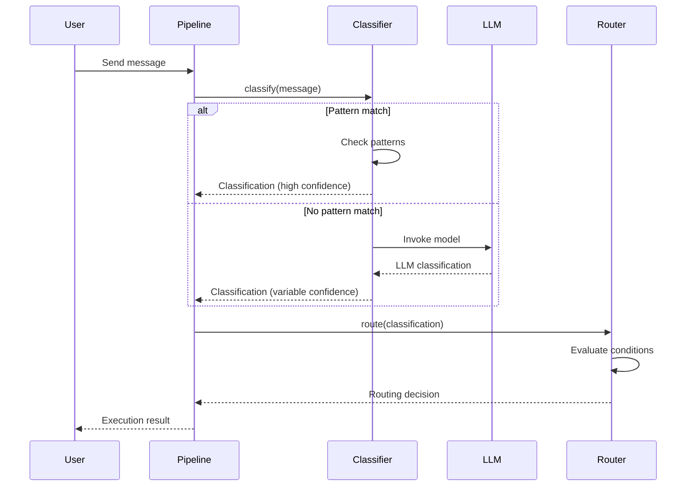
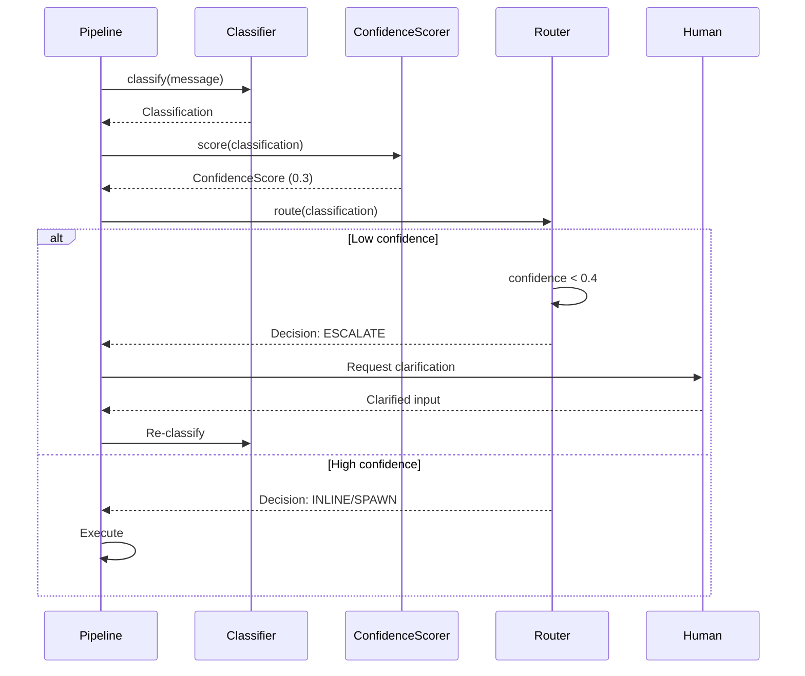
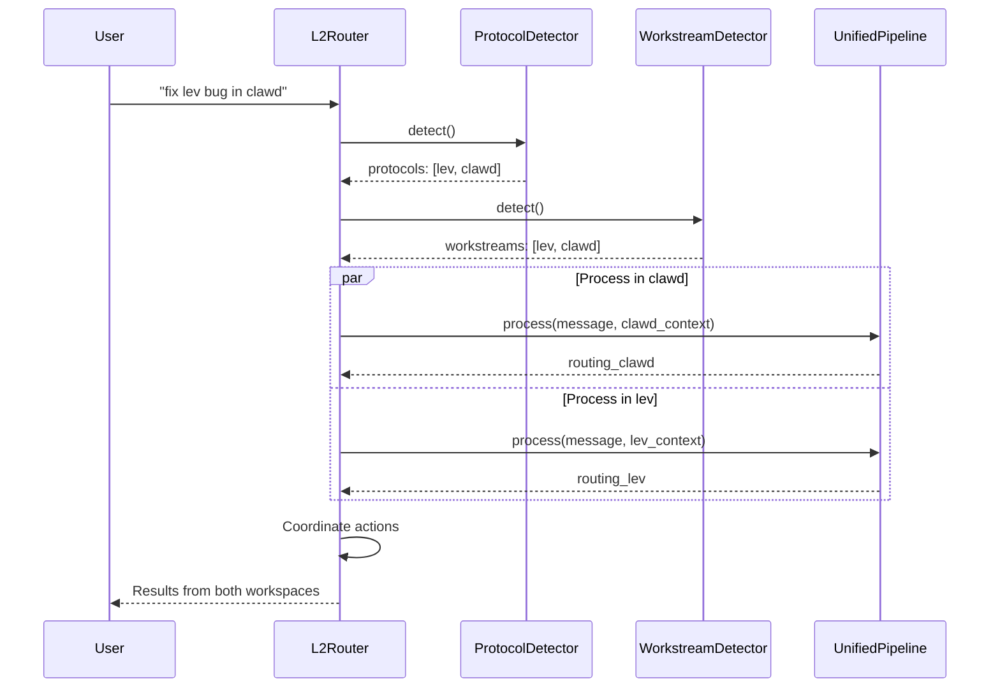

# Router Primitives Unified Specification

**Author:** Spec Writer (FlowMind Kernel CDO Team)
**Date:** 2026-01-26
**Status:** Draft
**Epic:** lev-syxn (Router/Orchestration)

---

## Executive Summary

This specification unifies four distinct router implementations found across the Lev/Clawd ecosystem into a single, composable primitives layer. The unified primitives provide classification, routing, confidence scoring, and TTL management as first-class kernel operations.

**Current Implementations:**
1. **Stream Router** (`clawd-uu8x`) - Stream-of-consciousness message routing
2. **Confidence Router** (`clawd-esx.8`) - Confidence-based decision gating
3. **Skill Router** (`clawd-7r6.7`) - Pattern-based skill delegation
4. **Claudesp Router** (`lev-pvrt`) - Multi-workspace protocol routing

**Unified Approach:** Extract common patterns into kernel primitives, implement once, reuse everywhere.

---

## 1. Core Primitives

### 1.1 Classification

**Purpose:** Convert unstructured input into structured, typed entities with confidence scores.

```typescript
interface Classifier<T = unknown> {
  /**
   * Classify input into a typed classification result.
   *
   * @param input - Raw input to classify
   * @param context - Optional context for classification
   * @returns Classification result with confidence
   */
  classify(input: Message, context?: Context): Promise<Classification<T>>;

  /**
   * Get supported types this classifier can produce.
   */
  supportedTypes(): string[];

  /**
   * Confidence threshold below which classification should escalate.
   */
  minConfidence: number;
}

interface Message {
  content: string;
  metadata?: Record<string, unknown>;
  timestamp?: Date;
  source?: string;
}

interface Context {
  conversationHistory?: Message[];
  workstream?: string;
  userPreferences?: Record<string, unknown>;
  activeEntities?: EntityReference[];
}

interface Classification<T = unknown> {
  type: string;                    // Entity type (idea, task, query, etc.)
  confidence: number;              // 0.0-1.0
  payload: T;                      // Type-specific data
  reasoning?: string;              // Why this classification
  alternatives?: Array<{           // Other possible classifications
    type: string;
    confidence: number;
  }>;
  metadata: {
    classifierUsed: string;        // deterministic | llm | hybrid
    processingTime: number;        // ms
    tokensUsed?: number;           // if LLM was used
  };
}

interface EntityReference {
  type: string;
  id: string;
}
```

**Classification Strategies:**

```typescript
/**
 * Deterministic pattern-based classification (fast, no LLM).
 */
class PatternClassifier implements Classifier {
  private rules: ClassificationRule[];

  constructor(rules: ClassificationRule[]) {
    this.rules = rules;
    this.minConfidence = 0.7;
  }

  async classify(input: Message): Promise<Classification> {
    for (const rule of this.rules) {
      const match = rule.pattern.test(input.content);
      if (match) {
        return {
          type: rule.type,
          confidence: rule.confidence,
          payload: { matched: rule.pattern.source },
          metadata: {
            classifierUsed: "deterministic",
            processingTime: 0 // sub-ms
          }
        };
      }
    }

    // No match - return unknown with low confidence
    return {
      type: "unknown",
      confidence: 0.0,
      payload: {},
      metadata: { classifierUsed: "deterministic", processingTime: 0 }
    };
  }

  supportedTypes(): string[] {
    return [...new Set(this.rules.map(r => r.type))];
  }
}

interface ClassificationRule {
  pattern: RegExp;
  type: string;
  confidence: number;
}

/**
 * LLM-based classification (slower, more flexible).
 */
class LLMClassifier implements Classifier {
  private model: string;
  private prompt: PromptTemplate;

  constructor(model = "claude-haiku", prompt?: PromptTemplate) {
    this.model = model;
    this.prompt = prompt || defaultClassificationPrompt;
    this.minConfidence = 0.4;
  }

  async classify(input: Message, context?: Context): Promise<Classification> {
    const startTime = Date.now();

    const response = await this.invokeModel({
      model: this.model,
      prompt: this.prompt.render({ message: input.content, context }),
      responseFormat: "json"
    });

    const parsed = JSON.parse(response.content);

    return {
      type: parsed.type,
      confidence: parsed.confidence,
      payload: parsed.payload || {},
      reasoning: parsed.reasoning,
      alternatives: parsed.alternatives,
      metadata: {
        classifierUsed: "llm",
        processingTime: Date.now() - startTime,
        tokensUsed: response.usage.totalTokens
      }
    };
  }

  supportedTypes(): string[] {
    return [
      "idea", "task", "query", "memory", "ephemeral",
      "url", "patch", "approval", "status"
    ];
  }
}

/**
 * Hybrid: tries deterministic first, falls back to LLM.
 */
class HybridClassifier implements Classifier {
  private patternClassifier: PatternClassifier;
  private llmClassifier: LLMClassifier;
  private fallbackThreshold: number;

  constructor(
    patterns: ClassificationRule[],
    llmModel = "claude-haiku",
    fallbackThreshold = 0.7
  ) {
    this.patternClassifier = new PatternClassifier(patterns);
    this.llmClassifier = new LLMClassifier(llmModel);
    this.fallbackThreshold = fallbackThreshold;
    this.minConfidence = 0.4;
  }

  async classify(input: Message, context?: Context): Promise<Classification> {
    // Try deterministic first
    const patternResult = await this.patternClassifier.classify(input);

    if (patternResult.confidence >= this.fallbackThreshold) {
      return patternResult;
    }

    // Fall back to LLM
    const llmResult = await this.llmClassifier.classify(input, context);

    return {
      ...llmResult,
      metadata: {
        ...llmResult.metadata,
        classifierUsed: "hybrid",
        fallbackReason: `pattern_confidence_${patternResult.confidence.toFixed(2)}`
      }
    };
  }

  supportedTypes(): string[] {
    return [
      ...this.patternClassifier.supportedTypes(),
      ...this.llmClassifier.supportedTypes()
    ];
  }
}
```

---

### 1.2 Routing

**Purpose:** Decide where and how to handle a classified message.

```typescript
interface Router<T = unknown> {
  /**
   * Route a classification to an execution decision.
   *
   * @param classification - Classified input
   * @param context - Optional routing context
   * @returns Routing decision
   */
  route(
    classification: Classification<T>,
    context?: RoutingContext
  ): Promise<RoutingDecision>;

  /**
   * Register a route handler.
   */
  registerRoute(route: Route): void;

  /**
   * Get all registered routes.
   */
  routes(): Route[];
}

interface RoutingContext {
  estimatedDuration?: number;      // ms
  currentLoad?: number;            // 0.0-1.0
  availableHandlers?: string[];
}

interface RoutingDecision {
  action: "inline" | "spawn" | "escalate" | "defer" | "drop";
  handler: string;                 // Handler ID or skill name
  priority: "high" | "normal" | "low";
  config?: Record<string, unknown>; // Handler-specific config
  reasoning?: string;              // Why this route
  ttl?: number;                    // ms until expiration
  metadata: {
    routerUsed: string;
    matchedRoute?: string;
    processingTime: number;
  };
}

interface Route {
  id: string;
  condition: RouteCondition;
  action: "inline" | "spawn" | "escalate" | "defer" | "drop";
  handler: string;
  priority?: "high" | "normal" | "low";
  config?: Record<string, unknown>;
}

type RouteCondition =
  | { type: "exact"; value: string }
  | { type: "pattern"; pattern: RegExp }
  | { type: "confidence"; min: number; max?: number }
  | { type: "function"; fn: (classification: Classification) => boolean }
  | { type: "composite"; operator: "AND" | "OR"; conditions: RouteCondition[] };
```

**Router Implementation:**

```typescript
class KernelRouter implements Router {
  private routes: Route[] = [];

  // Routing thresholds
  private readonly INLINE_THRESHOLD_MS = 5000;    // < 5s = inline
  private readonly HIGH_CONFIDENCE = 0.8;
  private readonly LOW_CONFIDENCE = 0.4;

  registerRoute(route: Route): void {
    this.routes.push(route);
    // Sort by priority (implicit: more specific conditions first)
  }

  routes(): Route[] {
    return [...this.routes];
  }

  async route(
    classification: Classification,
    context?: RoutingContext
  ): Promise<RoutingDecision> {
    const startTime = Date.now();

    // Confidence-based routing
    if (classification.confidence < this.LOW_CONFIDENCE) {
      return {
        action: "escalate",
        handler: "human-clarification",
        priority: "high",
        reasoning: `confidence_too_low_${classification.confidence.toFixed(2)}`,
        metadata: {
          routerUsed: "kernel",
          processingTime: Date.now() - startTime
        }
      };
    }

    // Duration-based routing
    if (context?.estimatedDuration) {
      if (context.estimatedDuration < this.INLINE_THRESHOLD_MS) {
        return {
          action: "inline",
          handler: this.findHandler(classification.type),
          priority: "high",
          reasoning: "fast_execution",
          metadata: {
            routerUsed: "kernel",
            processingTime: Date.now() - startTime
          }
        };
      } else {
        return {
          action: "spawn",
          handler: this.findHandler(classification.type),
          priority: "normal",
          reasoning: "long_running_task",
          metadata: {
            routerUsed: "kernel",
            processingTime: Date.now() - startTime
          }
        };
      }
    }

    // Rule-based routing
    for (const route of this.routes) {
      if (await this.matchCondition(route.condition, classification)) {
        return {
          action: route.action,
          handler: route.handler,
          priority: route.priority || "normal",
          config: route.config,
          reasoning: `matched_route_${route.id}`,
          metadata: {
            routerUsed: "kernel",
            matchedRoute: route.id,
            processingTime: Date.now() - startTime
          }
        };
      }
    }

    // Default fallback
    return {
      action: "inline",
      handler: "default",
      priority: "normal",
      reasoning: "no_route_matched",
      metadata: {
        routerUsed: "kernel",
        processingTime: Date.now() - startTime
      }
    };
  }

  private findHandler(type: string): string {
    const handlerMap: Record<string, string> = {
      "url": "lev-intake",
      "task": "bd-create",
      "idea": "lev-lifecycle",
      "query": "search",
      "memory": "memory-store",
      "patch": "bd-update",
      "approval": "inline",
      "status": "inline",
      "ephemeral": "inline"
    };
    return handlerMap[type] || "default";
  }

  private async matchCondition(
    condition: RouteCondition,
    classification: Classification
  ): Promise<boolean> {
    switch (condition.type) {
      case "exact":
        return classification.type === condition.value;

      case "pattern":
        return condition.pattern.test(classification.type);

      case "confidence":
        const inRange = classification.confidence >= condition.min;
        return condition.max
          ? inRange && classification.confidence <= condition.max
          : inRange;

      case "function":
        return condition.fn(classification);

      case "composite":
        const results = await Promise.all(
          condition.conditions.map(c => this.matchCondition(c, classification))
        );
        return condition.operator === "AND"
          ? results.every(r => r)
          : results.some(r => r);

      default:
        return false;
    }
  }
}
```

---

### 1.3 Confidence Scoring

**Purpose:** Quantify certainty of decisions and enable confidence-based gating.

```typescript
interface ConfidenceScorer {
  /**
   * Score the confidence of a decision or classification.
   *
   * @param input - Input to score
   * @param context - Scoring context
   * @returns Confidence score and factors
   */
  score(input: unknown, context?: ScoringContext): ConfidenceScore;

  /**
   * Combine multiple confidence scores.
   */
  combine(scores: ConfidenceScore[], method: CombineMethod): ConfidenceScore;
}

interface ScoringContext {
  priorScores?: ConfidenceScore[];
  historicalAccuracy?: number;     // 0.0-1.0
  domainKnowledge?: number;        // 0.0-1.0
}

interface ConfidenceScore {
  value: number;                   // 0.0-1.0
  factors: Array<{
    name: string;
    weight: number;
    contribution: number;
  }>;
  metadata: {
    method: string;
    timestamp: Date;
  };
}

type CombineMethod = "average" | "weighted" | "min" | "max" | "bayesian";

class BayesianConfidenceScorer implements ConfidenceScorer {
  score(input: unknown, context?: ScoringContext): ConfidenceScore {
    const factors: Array<{ name: string; weight: number; contribution: number }> = [];

    // Factor 1: Pattern match strength
    if (typeof input === "object" && "confidence" in input) {
      factors.push({
        name: "pattern_match",
        weight: 0.4,
        contribution: (input as any).confidence
      });
    }

    // Factor 2: Historical accuracy
    if (context?.historicalAccuracy !== undefined) {
      factors.push({
        name: "historical_accuracy",
        weight: 0.3,
        contribution: context.historicalAccuracy
      });
    }

    // Factor 3: Domain knowledge
    if (context?.domainKnowledge !== undefined) {
      factors.push({
        name: "domain_knowledge",
        weight: 0.3,
        contribution: context.domainKnowledge
      });
    }

    // Weighted average
    const totalWeight = factors.reduce((sum, f) => sum + f.weight, 0);
    const score = factors.reduce(
      (sum, f) => sum + (f.contribution * f.weight),
      0
    ) / totalWeight;

    return {
      value: Math.max(0, Math.min(1, score)),
      factors,
      metadata: {
        method: "bayesian",
        timestamp: new Date()
      }
    };
  }

  combine(scores: ConfidenceScore[], method: CombineMethod): ConfidenceScore {
    switch (method) {
      case "average":
        const avg = scores.reduce((sum, s) => sum + s.value, 0) / scores.length;
        return {
          value: avg,
          factors: [{ name: "average", weight: 1.0, contribution: avg }],
          metadata: { method: "average", timestamp: new Date() }
        };

      case "min":
        const min = Math.min(...scores.map(s => s.value));
        return {
          value: min,
          factors: [{ name: "min", weight: 1.0, contribution: min }],
          metadata: { method: "min", timestamp: new Date() }
        };

      case "max":
        const max = Math.max(...scores.map(s => s.value));
        return {
          value: max,
          factors: [{ name: "max", weight: 1.0, contribution: max }],
          metadata: { method: "max", timestamp: new Date() }
        };

      case "weighted":
        // Use first score's factors as weights
        const weighted = scores.reduce((sum, s, i) => {
          const weight = i === 0 ? 0.5 : 0.5 / (scores.length - 1);
          return sum + s.value * weight;
        }, 0);
        return {
          value: weighted,
          factors: scores.flatMap(s => s.factors),
          metadata: { method: "weighted", timestamp: new Date() }
        };

      case "bayesian":
      default:
        // Bayesian combination: P(A|B) = P(B|A) * P(A) / P(B)
        // Simplified: geometric mean
        const product = scores.reduce((prod, s) => prod * s.value, 1);
        const geoMean = Math.pow(product, 1 / scores.length);
        return {
          value: geoMean,
          factors: scores.flatMap(s => s.factors),
          metadata: { method: "bayesian", timestamp: new Date() }
        };
    }
  }
}
```

---

### 1.4 TTL (Time-To-Live) Management

**Purpose:** Manage expiration and lifecycle of routing decisions and queued items.

```typescript
interface TTLManager {
  /**
   * Set TTL for an item.
   */
  set(itemId: string, ttl: number, onExpire?: () => void): void;

  /**
   * Refresh TTL for an item (reset timer).
   */
  refresh(itemId: string): boolean;

  /**
   * Cancel TTL for an item.
   */
  cancel(itemId: string): boolean;

  /**
   * Get remaining TTL for an item.
   */
  remaining(itemId: string): number | null;

  /**
   * Check if item is expired.
   */
  isExpired(itemId: string): boolean;
}

class KernelTTLManager implements TTLManager {
  private timers = new Map<string, {
    timeoutId: NodeJS.Timeout;
    expiresAt: Date;
    onExpire?: () => void;
  }>();

  set(itemId: string, ttl: number, onExpire?: () => void): void {
    // Cancel existing timer if any
    this.cancel(itemId);

    const expiresAt = new Date(Date.now() + ttl);
    const timeoutId = setTimeout(() => {
      this.timers.delete(itemId);
      onExpire?.();
    }, ttl);

    this.timers.set(itemId, { timeoutId, expiresAt, onExpire });
  }

  refresh(itemId: string): boolean {
    const existing = this.timers.get(itemId);
    if (!existing) return false;

    const originalTTL = existing.expiresAt.getTime() - Date.now();
    if (originalTTL <= 0) return false;

    // Reset timer with original TTL
    this.set(itemId, originalTTL, existing.onExpire);
    return true;
  }

  cancel(itemId: string): boolean {
    const existing = this.timers.get(itemId);
    if (!existing) return false;

    clearTimeout(existing.timeoutId);
    this.timers.delete(itemId);
    return true;
  }

  remaining(itemId: string): number | null {
    const existing = this.timers.get(itemId);
    if (!existing) return null;

    const remaining = existing.expiresAt.getTime() - Date.now();
    return remaining > 0 ? remaining : 0;
  }

  isExpired(itemId: string): boolean {
    const remaining = this.remaining(itemId);
    return remaining === null || remaining <= 0;
  }
}
```

---

## 2. Composite Router System

**Purpose:** Combine primitives into a unified routing pipeline.

```typescript
interface RouterPipeline {
  /**
   * Process a message through the full routing pipeline.
   */
  process(message: Message, context?: Context): Promise<RoutingResult>;

  /**
   * Configure pipeline stages.
   */
  configure(config: PipelineConfig): void;
}

interface PipelineConfig {
  classifier: Classifier;
  router: Router;
  confidenceScorer?: ConfidenceScorer;
  ttlManager?: TTLManager;
  hooks?: {
    beforeClassify?: (message: Message) => Promise<void>;
    afterClassify?: (classification: Classification) => Promise<void>;
    beforeRoute?: (classification: Classification) => Promise<void>;
    afterRoute?: (decision: RoutingDecision) => Promise<void>;
  };
}

interface RoutingResult {
  classification: Classification;
  routing: RoutingDecision;
  confidence: ConfidenceScore;
  ttl?: {
    itemId: string;
    expiresAt: Date;
    remaining: number;
  };
}

class UnifiedRouterPipeline implements RouterPipeline {
  private config!: PipelineConfig;

  configure(config: PipelineConfig): void {
    this.config = {
      ...config,
      confidenceScorer: config.confidenceScorer || new BayesianConfidenceScorer(),
      ttlManager: config.ttlManager || new KernelTTLManager()
    };
  }

  async process(message: Message, context?: Context): Promise<RoutingResult> {
    // Hook: beforeClassify
    await this.config.hooks?.beforeClassify?.(message);

    // Stage 1: Classify
    const classification = await this.config.classifier.classify(message, context);

    // Hook: afterClassify
    await this.config.hooks?.afterClassify?.(classification);

    // Stage 2: Score confidence
    const confidence = this.config.confidenceScorer!.score(classification, {
      historicalAccuracy: 0.85, // TODO: track actual accuracy
      domainKnowledge: 0.9      // TODO: domain-specific
    });

    // Hook: beforeRoute
    await this.config.hooks?.beforeRoute?.(classification);

    // Stage 3: Route
    const routing = await this.config.router.route(classification, {
      estimatedDuration: this.estimateDuration(classification)
    });

    // Hook: afterRoute
    await this.config.hooks?.afterRoute?.(routing);

    // Stage 4: Set TTL if applicable
    let ttl;
    if (routing.ttl) {
      const itemId = `${classification.type}_${Date.now()}`;
      this.config.ttlManager!.set(itemId, routing.ttl);
      ttl = {
        itemId,
        expiresAt: new Date(Date.now() + routing.ttl),
        remaining: routing.ttl
      };
    }

    return {
      classification,
      routing,
      confidence,
      ttl
    };
  }

  private estimateDuration(classification: Classification): number {
    const durationMap: Record<string, number> = {
      "url": 30000,      // 30s
      "task": 120000,    // 2min
      "idea": 10000,     // 10s
      "query": 5000,     // 5s
      "memory": 1000,    // 1s
      "patch": 3000,     // 3s
      "approval": 1000,  // 1s
      "status": 2000,    // 2s
      "ephemeral": 500   // 0.5s
    };
    return durationMap[classification.type] || 5000;
  }
}
```

---

## 3. Migration Matrix

**Mapping 4 implementations → unified primitives**

| Implementation | Current Approach | Primitives Used | Migration Path |
|----------------|------------------|-----------------|----------------|
| **Stream Router** (`clawd-uu8x`) | Pattern + LLM classification → handler dispatch | Classifier (Hybrid)<br>Router (Kernel)<br>TTL (for queue) | 1. Replace pattern matching with `PatternClassifier`<br>2. Replace LLM logic with `LLMClassifier`<br>3. Use `HybridClassifier` as wrapper<br>4. Replace routing FSM with `KernelRouter` |
| **Confidence Router** (`clawd-esx.8`) | Bayesian confidence → escalate if low | ConfidenceScorer (Bayesian)<br>Router (confidence-based) | 1. Extract confidence logic to `BayesianConfidenceScorer`<br>2. Add confidence-based routes to `KernelRouter`<br>3. Use `ConfidenceScore` for gating |
| **Skill Router** (`clawd-7r6.7`) | Pattern matching → skill delegation | Classifier (Pattern)<br>Router (skill-based) | 1. Convert skill patterns to `ClassificationRule[]`<br>2. Use `PatternClassifier`<br>3. Add skill routes to `KernelRouter` |
| **Claudesp Router** (`lev-pvrt`) | Multi-workspace protocol routing | Router (protocol-based)<br>Classifier (protocol detection) | 1. Create `ProtocolClassifier` extending `PatternClassifier`<br>2. Add protocol routes to `KernelRouter`<br>3. Use `RouterPipeline` for multi-workspace coordination |

---

## 4. Integration with L2 Router (lev-syxn)

### 4.1 Kernel Validation Hooks

The unified primitives integrate with kernel validation gates:

```typescript
interface ValidationGate {
  id: string;
  hook: "classification" | "routing" | "execution";
  validator: (input: unknown) => Promise<ValidationResult>;
  severity: "CATASTROPHIC" | "CRITICAL" | "WARNING";
}

interface ValidationResult {
  passed: boolean;
  errors?: string[];
  warnings?: string[];
}

// Example: DOR validation before routing
const dorValidationGate: ValidationGate = {
  id: "dor-check",
  hook: "routing",
  severity: "CATASTROPHIC",
  async validator(routing: RoutingDecision) {
    if (routing.action === "spawn") {
      // Check DoR before spawning agent
      const dorPassed = await checkDefinitionOfReady(routing.handler);
      return {
        passed: dorPassed,
        errors: dorPassed ? [] : ["DoR validation failed"]
      };
    }
    return { passed: true };
  }
};
```

### 4.2 Event Bus Integration

Routing decisions emit events to kernel event bus:

```typescript
interface RouterEvent {
  type: "router.classification" | "router.decision" | "router.execution";
  timestamp: Date;
  payload: unknown;
}

// Emit classification event
eventBus.emit({
  type: "router.classification",
  timestamp: new Date(),
  payload: {
    classification,
    confidence,
    metadata: classification.metadata
  }
});

// Emit routing decision event
eventBus.emit({
  type: "router.decision",
  timestamp: new Date(),
  payload: {
    routing,
    metadata: routing.metadata
  }
});
```

### 4.3 L2 Router Architecture

```
┌─────────────────────────────────────────────────────┐
│                   L2 Router (lev-syxn)              │
│                                                     │
│  ┌───────────────┐  ┌───────────────┐             │
│  │ Protocol      │  │ Workstream    │             │
│  │ Detector      │  │ Detector      │             │
│  └───────┬───────┘  └───────┬───────┘             │
│          │                  │                      │
│          └────────┬─────────┘                      │
│                   │                                │
│          ┌────────▼────────┐                       │
│          │ Unified Router  │                       │
│          │ Pipeline        │                       │
│          └────────┬────────┘                       │
│                   │                                │
│     ┌─────────────┼─────────────┐                 │
│     │             │             │                 │
│ ┌───▼──┐    ┌────▼────┐   ┌───▼───┐              │
│ │Stream│    │Confidence│   │Skill  │              │
│ │Router│    │Router    │   │Router │              │
│ └──────┘    └─────────┘   └───────┘              │
│                                                     │
│          ┌─────────────────┐                       │
│          │ Validation Gates│                       │
│          │ - DoR Check     │                       │
│          │ - Policy Check  │                       │
│          │ - Auth Check    │                       │
│          └────────┬────────┘                       │
│                   │                                │
│          ┌────────▼────────┐                       │
│          │ Event Bus       │                       │
│          │ (Kernel)        │                       │
│          └─────────────────┘                       │
└─────────────────────────────────────────────────────┘
```

---

## 5. Sequence Diagrams

### 5.1 Classification Flow



### 5.2 Confidence Gating



### 5.3 Multi-Workspace Routing



---

## 6. TypeScript Interface Summary

**Core primitives to export from kernel:**

```typescript
// Classification
export interface Classifier<T = unknown> { /* ... */ }
export class PatternClassifier implements Classifier { /* ... */ }
export class LLMClassifier implements Classifier { /* ... */ }
export class HybridClassifier implements Classifier { /* ... */ }
export interface Classification<T = unknown> { /* ... */ }

// Routing
export interface Router<T = unknown> { /* ... */ }
export class KernelRouter implements Router { /* ... */ }
export interface RoutingDecision { /* ... */ }
export interface Route { /* ... */ }
export type RouteCondition = /* ... */;

// Confidence
export interface ConfidenceScorer { /* ... */ }
export class BayesianConfidenceScorer implements ConfidenceScorer { /* ... */ }
export interface ConfidenceScore { /* ... */ }

// TTL
export interface TTLManager { /* ... */ }
export class KernelTTLManager implements TTLManager { /* ... */ }

// Pipeline
export interface RouterPipeline { /* ... */ }
export class UnifiedRouterPipeline implements RouterPipeline { /* ... */ }
export interface RoutingResult { /* ... */ }

// Events
export interface RouterEvent { /* ... */ }

// Validation
export interface ValidationGate { /* ... */ }
export interface ValidationResult { /* ... */ }
```

---

## 7. Performance Requirements

| Primitive | Operation | Target Latency | Notes |
|-----------|-----------|----------------|-------|
| PatternClassifier | classify() | < 1ms | No LLM, pure regex |
| LLMClassifier | classify() | < 500ms | Haiku model |
| HybridClassifier | classify() | < 1ms (pattern) / < 500ms (LLM) | Fast path first |
| KernelRouter | route() | < 10ms | In-memory rules |
| ConfidenceScorer | score() | < 1ms | Bayesian calculation |
| TTLManager | set/get/cancel | < 1ms | Map operations |
| UnifiedPipeline | process() | < 600ms | End-to-end with LLM |

**Optimization Strategies:**
- Cache LLM classifications with TTL (5 min)
- Parallelize pattern matching with Worker threads for large rule sets
- Use lazy loading for LLM classifier (only load when needed)
- Batch route evaluations for multiple messages

---

## 8. Error Handling

```typescript
class RouterError extends Error {
  constructor(
    message: string,
    public code: RouterErrorCode,
    public context?: unknown
  ) {
    super(message);
    this.name = "RouterError";
  }
}

enum RouterErrorCode {
  CLASSIFICATION_FAILED = "CLASSIFICATION_FAILED",
  ROUTING_FAILED = "ROUTING_FAILED",
  CONFIDENCE_TOO_LOW = "CONFIDENCE_TOO_LOW",
  NO_HANDLER_FOUND = "NO_HANDLER_FOUND",
  VALIDATION_FAILED = "VALIDATION_FAILED",
  TTL_EXPIRED = "TTL_EXPIRED"
}

// Usage
try {
  const result = await pipeline.process(message);
} catch (err) {
  if (err instanceof RouterError) {
    switch (err.code) {
      case RouterErrorCode.CONFIDENCE_TOO_LOW:
        // Escalate to human
        await escalate(message, err.context);
        break;
      case RouterErrorCode.NO_HANDLER_FOUND:
        // Use default handler
        await defaultHandler.handle(message);
        break;
      default:
        // Log and rethrow
        logger.error("Router error", err);
        throw err;
    }
  }
}
```

---

## 9. Breaking Changes from Current Implementations

### Stream Router
- **Breaking:** `stream-router.yaml` schema replaced by TypeScript interfaces
- **Migration:** Convert YAML routes to `Route` objects via adapter
- **Compatibility:** Provide YAML loader that maps to new primitives

### Confidence Router
- **Breaking:** Confidence calculation moved to `ConfidenceScorer` interface
- **Migration:** Replace inline confidence logic with `BayesianConfidenceScorer`
- **Compatibility:** Existing confidence thresholds map 1:1

### Skill Router
- **Breaking:** Skill patterns no longer inline, must register with `KernelRouter`
- **Migration:** Convert skill patterns to `ClassificationRule[]`
- **Compatibility:** Pattern syntax unchanged (RegExp)

### Claudesp Router
- **Breaking:** Protocol detection separated from routing
- **Migration:** Use `ProtocolClassifier` + `KernelRouter`
- **Compatibility:** Protocol URIs unchanged (file://, bd://, etc.)

---

## 10. Implementation Roadmap

### Phase 1: Core Primitives (Week 1)
- [ ] Implement `Classifier` interface + 3 implementations
- [ ] Implement `Router` interface + `KernelRouter`
- [ ] Implement `ConfidenceScorer` + `BayesianConfidenceScorer`
- [ ] Implement `TTLManager` + `KernelTTLManager`
- [ ] Unit tests for all primitives (>90% coverage)

### Phase 2: Pipeline (Week 2)
- [ ] Implement `UnifiedRouterPipeline`
- [ ] Add validation gate integration
- [ ] Add event bus integration
- [ ] Integration tests

### Phase 3: Migration (Week 3)
- [ ] Migrate Stream Router to use primitives
- [ ] Migrate Confidence Router
- [ ] Migrate Skill Router
- [ ] Migrate Claudesp Router
- [ ] Compatibility adapters for existing YAML configs

### Phase 4: L2 Router (Week 4)
- [ ] Build L2 Router on top of primitives
- [ ] Multi-workspace coordination
- [ ] Protocol detection layer
- [ ] Workstream detection layer
- [ ] End-to-end tests

---

## 11. Trade-offs & Design Decisions

### Decision: TypeScript over YAML
**Rationale:** Type safety, better IDE support, easier testing, compile-time validation
**Trade-off:** Slightly more verbose than YAML for simple routes
**Mitigation:** Provide YAML adapter for backward compatibility

### Decision: Separate Classifier + Router
**Rationale:** Separation of concerns, easier testing, composability
**Trade-off:** Two-step process instead of one
**Mitigation:** `UnifiedPipeline` abstracts both steps

### Decision: Hybrid classifier as default
**Rationale:** Best of both worlds (fast + accurate)
**Trade-off:** More complex than single strategy
**Mitigation:** Falls back gracefully to LLM only when needed

### Decision: Confidence-based routing in kernel
**Rationale:** Universal concern across all routers
**Trade-off:** Opinionated threshold values
**Mitigation:** Thresholds configurable via `KernelRouter` constructor

### Decision: Event-driven architecture
**Rationale:** Enables observability, validation gates, audit trails
**Trade-off:** Additional complexity
**Mitigation:** Events optional, pipeline works without event bus

---

## 12. Open Questions

1. **Model selection:** Should `LLMClassifier` support runtime model switching based on message complexity?
   - *Proposal:* Add complexity detector that chooses Haiku/Sonnet/Opus

2. **Caching strategy:** Where should LLM classification cache live (memory vs Redis)?
   - *Proposal:* Start with in-memory TTL cache, add Redis adapter later

3. **Multi-classification:** Should a message be allowed to have multiple types?
   - *Example:* "Add task to track this idea" = both task + idea
   - *Proposal:* Support `alternatives` array in `Classification`, route to all

4. **Failure recovery:** What happens if a routed handler fails?
   - *Proposal:* Add retry policy to `RoutingDecision`, TTL for queue items

5. **Cross-workspace conflicts:** How to handle conflicting routing decisions from multi-workspace routing?
   - *Proposal:* Priority-based resolution (workspace priority + route priority)

---

## 13. References

- **Stream Router Schema:** `clawd/context/schemas/stream-router.yaml`
- **Entity Types Map:** `clawd/context/schemas/entity-types-map.yaml`
- **Protocol Handlers:** `clawd/context/schemas/protocol-handlers.yaml`
- **Driver Orchestrator:** `clawd/tools/driver-orchestrator.ts`
- **Agent Adapter Types:** `lev/core/agent-adapter/src/clawdbot/types.ts`
- **AGENTS.md:** Routing rules and agent personas

---

## Appendix A: Example Usage

```typescript
// Setup
const classifier = new HybridClassifier(
  [
    { pattern: /https?:\/\//, type: "url", confidence: 1.0 },
    { pattern: /\?$/, type: "query", confidence: 0.9 },
    { pattern: /^add|create/i, type: "task", confidence: 0.85 }
  ],
  "claude-haiku",
  0.7 // fallback threshold
);

const router = new KernelRouter();
router.registerRoute({
  id: "url-intake",
  condition: { type: "exact", value: "url" },
  action: "spawn",
  handler: "lev-intake",
  priority: "normal"
});

const pipeline = new UnifiedRouterPipeline();
pipeline.configure({
  classifier,
  router,
  hooks: {
    afterRoute: async (decision) => {
      console.log("Routed to:", decision.handler);
    }
  }
});

// Usage
const message = {
  content: "Check out https://example.com/article",
  metadata: { source: "whatsapp" }
};

const result = await pipeline.process(message);
console.log(result);
// {
//   classification: { type: "url", confidence: 1.0, ... },
//   routing: { action: "spawn", handler: "lev-intake", ... },
//   confidence: { value: 0.92, factors: [...], ... },
//   ttl: { itemId: "url_1737917520000", expiresAt: Date, remaining: 30000 }
// }
```

---

**End of Specification**

**Next Steps:**
1. Review with FlowMind Kernel CDO team
2. Challenge existing patterns (alternative approaches?)
3. Prototype Phase 1 in `lev/core/router/primitives/`
4. Integrate with lev-syxn epic

**Author:** Spec Writer
**Review Status:** Draft
**Implementation Target:** Q1 2026
